# JUC

## 进程，线程，协程

进程是程序的一个实例，有自己的虚拟内存空间，切换消耗最重

线程就是一个指令流，将指令流中的一条条指令以一定的顺序交给 CPU 执行，切换消耗中等

Java 中，线程是最小调度单位，进程是资源分配的最小单位。 在 windows 中，进程是不活动的，只是作为线程的容器

协程是一个线程的异步执行模式，同一个时间内只有一个协程运行，切换消耗最低且是用户态的（操作系统只能管理到线程级）。当线程正在进行IO操作等耗时任务时，它可以执行其它协程并在某一时间片上重新执行回原来的协程

并发（concurrent）是同一时间应对（dealing with）多件事情的能力，一个线程通过切换各种任务可以实现并发
并行（parallel）是同一时间动手做（doing）多件事情的能力，只有多核（多线程）CPU才能实现并行，协程不能实现并行

IO 操作不占用 cpu，但我们一般拷贝文件使用的是阻塞 IO，这时相当于线程虽然不用 cpu，但需要一直等待 IO 结束，没能充分利用线程。所以才有非阻塞 IO和异步 IO

## Java线程创建三种方式

1 继承Thread对象重写run()方法，调用`start()`方法开启线程

```java
// 创建线程对象
Thread t = new Thread() {
 public void run() {
 // 要执行的任务
    }
 };
 // 启动线程
t.start();
```

只能单继承，不能返回数据

2 实现Runnable接口实现run()方法，使用Runnable创建Thread对象，调用`start()`方法开启线程

```java
Runnable runnable = new Runnable() {
 public void run(){
 // 要执行的任务
    }
 };
 // 创建线程对象
Thread t = new Thread( runnable );
 // 启动线程
t.start(); 
```

Thread是线程对象，Runnable是线程要执行的任务，把任务和线程本身分开，设计更合理

可以实现多个接口，不能返回数据

3 实现Callable接口实现call()方法，Callable作为参数可以构造FutureTask对象，FutureTask是Runnable的子类（子接口），因此FutureTask作为参数可以构造Thread对象，调用`start()`方法开启线程，调用FutureTask的get()方法阻塞获取线程返回值

```java
// 创建任务对象
FutureTask<Integer> task3 = new FutureTask<>(() -> {
    log.debug("hello");
    return 100;
});
// 参数1 是任务对象; 参数2 是线程名字，推荐
new Thread(task3, "t3").start();
// 主线程阻塞，同步等待 task 执行完毕的结果
Integer result = task3.get();
log.debug("结果是:{}", result);
```

get()方法是阻塞调用，只有线程执行完毕返回结果才会返回

可以实现多个接口，可以返回数据

## 线程运行原理

JVM内存中由堆、栈、方法区所组成，其中栈内存是给谁线程使用的，每个线程启动后，虚拟
机就会为其分配一块栈内存。每个栈由多个栈帧（Frame）组成，对应着每次方法调用时所占用的内存。每个线程只能有一个活动栈帧（最顶层栈帧），对应着当前正在执行的那个方法

以下一些原因会导致 cpu 不再执行当前的线程，转而执行另一个线程，称为上下文切换（Context Switch）

- 线程的 cpu 时间片用完
- 垃圾回收
- 有更高优先级的线程需要运行
- 线程自己调用了 sleep、yield、wait、join、park、synchronized、lock 等方法

当 Context Switch 发生时，需要由操作系统保存当前线程的状态，并恢复另一个线程的状态，在Java中，这包括

- 程序计数器（Program Counter Register），它的作用是记住下一条 jvm 指令的执行地址，是线程私有的
- 虚拟机栈中每个栈帧的信息，如局部变量、操作数栈、返回地址等

## 线程方法

- `start()` 启动线程
- `run()` 线程实际任务，一般不自己调用，而是由线程对象调用
- `join()` 等待该线程对象执行完成，传入long参数时表示最长等待时间（ms）
- `getPriority()`/`setPriority()` 获取线程优先级，java中规定线程优先级是1~10 的整数，较大的优先级能提高该线程被操作系统调度的机率，但但它仅仅是一个提示，操作系统的线程调度器也可以忽略它
- `getState()` 获取线程状态，返回值是一个枚举类型，包括NEW, RUNNABLE, BLOCKED, WAITING, TIMED_WAITING, TERMINATED
- `interrupt()` 打断线程，`interrupted()`和 `isInterrupted()`可以判断线程是否打断，前者会清除打断标记
- `currentThread()` 获取当前正在执行的线程对象
- `sleep(long n)` 休眠当前线程一段时间，结束休眠时还需等待操作系统调度，因此实际休眠时间会略长一些
- `yield()` 放弃CPU时间片，回到可运行状态，等待下一轮调度
- `setDaemon(true)` 设置为守护线程，那么只要其它非守护线程运行结束了，即使守护线程的代码没有执行完，也会强制结束

`run()`方法作为实际的任务方法，用户直接调用时不会开启线程，而是在当前线程执行这个方法，是一个同步调用。必须由提供start()方法启动线程，让线程对象自己调用才是单独线程

`Thread.sleep()`阻塞线程一段时间，必须传入睡眠时间，没有主动唤醒的方式（除非interrupt()）

`Object.wait()`也可以阻塞线程，必须持有对象的 synchronized 锁才能调用，否则抛异常。可以不设置超时时间。调用时释放对象的synchronized 锁。调用notify(thread) / notifyAll()可以唤醒正在wait()的线程

`LockSupport.park()`也可以阻塞线程，可以不设置超时时间。调用不会释放任何锁，其它线程调用LockSupport.unpark(thread)时唤醒

`interrupt()`方法事实上并不能真正的打断线程，它的作用仅仅是设置该线程的打断标记位，被`interrupt()`的线程可以通过`interrupted()`和 `isInterrupted()`检查打断标记位，如果发现标记是true可以停止，也可以忽略。如果线程自己根本不检查打断标记位，则其它线程调用`interrupt()`毫无用处

`interrupt()`方法打断`Thread.sleep()``Thread.join()``Object.wait()`等阻塞的线程，会抛出InterruptedException，使被打断的线程立刻退出阻塞状态，并清空打断标记

`interrupt()`方法打断`LockSupport.park()`阻塞的线程，不会抛出异常，也会使被打断的线程立刻退出阻塞状态，但不清空打断标记位

早期Java版本提供主动停止某些进程的方法。但根据“一个线程不应该由其他线程来强制中断或停止，而是应该由线程自己自行停止”的原则。Thread.stop, Thread.suspend, Thread.resume 都已经被废弃了

## 线程状态

操作系统的线程有5种状态

- 初始状态：仅是在语言层面创建了线程对象，还未与操作系统线程关联
- 可运行状态（就绪状态：指该线程已经被创建（与操作系统线程关联），可以由 CPU 调度执行
- 运行状态：当前线程被调度到，正在一个CPU时间片内被某个CPU核心执行，时间片用完或调用`yield()`会进入可运行状态，调用阻塞方法会进入阻塞状态
- 阻塞状态：调用任何阻塞方法进入的状态，包括sleep()或者同步IO，阻塞结束时操作系统会唤醒指定线程为可运行状态，处于阻塞状态的线程不会被操作系统调度
- 终止状态：表示线程已经执行完毕，生命周期已经结束，不会再转换为其它状态

Java语言层面的线程有6种状态

- NEW  线程刚被创建，但是还没有调用 start() 方法
- RUNNABLE 当调用了 start() 方法之后，注意，Java API 层面的 RUNNABLE 状态涵盖了 操作系统 层面的可运行状态、运行状态和阻塞状态（只包含 BIO 导致的线程阻塞，因为其在 Java 里无法区分，仍然认为是可运行）
- BLOCKED ，WAITING ，TIMED_WAITING ，是 Java API 层面对阻塞状态的细分
- TERMINATED 当线程代码运行结束

## 共享资源和锁

对共享资源的访问，只要出现多线程中有修改共享资源的行为，就必须采用同步手段。同步手段可以是锁，原子变量，还可以是某些线程安全的类

### 锁

#### synchronized

synchronized对象锁，使用某个对象作为锁的标志。锁的标志对象和共享资源不需要有任何联系，只需要互斥的线程均使用同一个标志对象即可，这里的同一个必须是引用上的同一个（必须是==，不能只是equals()）

不要求锁的过程中对象不变，但锁的过程中修改锁对象会导致新的试图加锁的线程事实上是对新的对象加锁，导致其也进入临界区

```java
synchronized(对象) {
临界区
}
```

有一种方法上的synchronized，他是以this作为锁对象，整个方法体作为临界区的等价形式。使用时请保证你想要的锁对象一定是方法的this，不然应该自己指定锁对象

```java
class Test{
    public synchronized void test() {
    }
}
    等价于
class Test{
    public void test() {
        synchronized(this) {
        }
    }
}
```

栈区变量一定是线程安全的，通常情况下，栈区变量只能是基本类型和引用

在栈区上对新分配的堆区对象的引用，只要不逃逸到方法外部，也是安全的。当一个方法内的局部变量被方法外的线程或对象持有引用，就叫“逃逸”，可能发生逃逸的场景有：作为返回值，非局部变量持有其引用，方法内出现其它线程对其引用

JVM对于堆区对象，如果通过逃逸分析发现其并不逃逸出方法，可以选择将其分配到栈区

```java
class Test{
    // 这不是合法的Java代码，lambda的捕获只能是final
    public int func1() {
        int count = 0;
        for (int i = 0; i < 3; i++) {
            new Thread(() -> {
                count++;
            }, 
            "Thread" + i).start();
         }
    }

    // 这里的list逃逸到方法外部，此时有多个线程持有同一个堆对象引用
    public void func2() {
        final List<Integer> list = new ArrayList<>();
        for (int i = 0; i < 3; i++) {
            new Thread(() -> {
                list.add(1);
            }, "Thread" + i).start();
        }
    }
}
```

synchronized是逐步升级的

##### 轻量级锁

解决有多个线程在不同时间段无冲突的获取锁的问题

如果一个对象虽然有多线程要加锁，但加锁的时间是错开的（没有竞争），就加轻量级锁。一开始加的锁都是轻量级锁

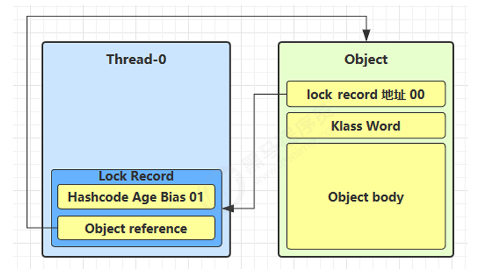

需要加锁时，线程在自己的栈帧创建锁记录（Lock Record）对象，它包括Lock Record对象的地址+00（表示状态）和锁对象引用Object reference。每个线程都的栈帧都会包含一个锁记录的结构

开始加锁时，线程设置Lock Record的Object reference为这个锁对象，并尝试用 cas 互换 Object 的 Mark Word和锁记录的 Lock Record地址+00。只要对应锁对象的Mark Word不是Lock Record地址+00的形式，就说明此时没有任何轻量级锁，加锁就成功了

失败的可能性有两种，通过检查锁对象的Lock Record地址判断。

- 一种是其它线程已经持有了该 Object 的轻量级锁，这时表明有竞争，进入锁膨胀过程
- 一种是自己执行了 synchronized 锁重入，那么Lock Record地址是一样的。那么再添加一条 Lock Record 作为重入的计数，但它的Lock Record对象的地址是null。退出 synchronized 代码块（解锁时）如果有取值为 null 的锁记录，表示有重入，这时移除这条锁记录，表示重入计数减一

##### 偏向锁

解决只有一个线程多次获取同一个锁的问题

轻量级锁在没有竞争时（只有自己这个线程），每次重入仍然需要执行 CAS 操作，尝试把锁记录Lock Record和对象的Mark Word头互换。Java 6 中引入了偏向锁来做进一步优化，只有第一次使用 CAS 将线程 ID （不再是Lock Record）设置到对象的 Mark Word 头，之后发现这个线程 ID 是自己的就表示没有竞争，不用重新 CAS。以后只要不发生竞争，这个对象就归该线程所有

一个对象创建时

- 如果开启了偏向锁（默认开启），那么对象创建后，markword 值为 0x05 即最后 3 位为 101，这时它的 thread、epoch、age 都为 0
- 偏向锁是默认是延迟的，不会在程序启动时立即生效，如果想避免延迟，可以加 VM 参数XX:BiasedLockingStartupDelay=0 来禁用延迟
- 如果没有开启偏向锁，那么对象创建后，markword 值为 0x01 即最后 3 位为 001，这时它的 hashcode、age 都为 0，第一次用到 hashcode 时才会赋值

部分情况下偏向锁会被撤销

- 调用了对象的 hashCode，会撤销并升级为轻量级锁。偏向锁需要占用对象头（Mark Word）来存储“偏向线程 ID”，而对象的 identity hashCode 也必须存储在对象头中。两者都占用 Mark Word，内存布局冲突。而轻量级锁可以在Lock Record储存hashCode，重量级锁在Monitor存储hashCode
- 当有其它线程使用偏向锁对象时，会将偏向锁升级为轻量级锁
- 调用 wait/notify是，wait/notify 的实现依赖 Monitor对象，必须把Mark Word设置为Monitor对象的地址

###### 批量重偏向

如果对象虽然被多个线程访问，但没有竞争，这时偏向了线程 T1 的对象仍有机会重新偏向 T2，（通过修改类的epoch使得旧的对象的epoch和类不一致，偏向过期）重偏向会重置对象的 Thread ID。

当撤销偏向锁阈值超过 20 次后，jvm 会认为其偏向错误，触发批量重偏向，在给这些对象加锁时重新偏向至加锁线程

###### 批量撤销

当撤销偏向锁阈值超过 40 次后，jvm 会认为这个类频繁跨线程使用，不时候偏向锁。于是将该类标记为 “不可偏向化”，删除该类所有对象的偏向标志位。整个类的所有对象都会变为不可偏向的，新建的对象也是不可偏向的

##### 重量级锁

加轻量级锁失败，其它对象持有锁时，进入锁膨胀过程，升级为重量级锁

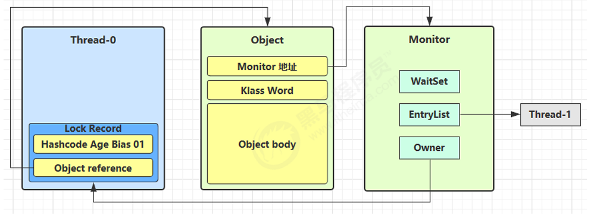

叫做重量级锁的原因是，它需要在堆区分配Monitor对象，事实上只有重量级锁才是真正锁，有在锁被占用时阻塞，在锁释放时唤醒其它线程的能力。而轻量级锁更像是给锁对象打上一个“标记”，表示这个锁已经有人使用了

它会为 Object 对象申请 Monitor 锁，让 Object原来的Mark Word区域设置为指向重量级锁地址，原来的Lock Record的地址保存Monitor对象的Owner地址，自己进入 Monitor 的 EntryList BLOCKED

当最早的加轻量级锁的线程退出同步块解锁时，会使用 cas 将 Mark Word 的值恢复给对象头，但其发现对方的Mark Word区域已经不是自己的Lock Record地址，恢复失败，说明对方加了重量级锁。这时会进入重量级解锁流程，即按照 Monitor 地址找到 Monitor 对象，设置 Owner 为 null，唤醒 EntryList 中 BLOCKED 线程

加重量级锁是有自旋优化的，也就是不能获取到重量级锁时循环多尝试几次，而不是立刻阻塞进入EntryList BLOCKED。自旋的次数是JVM动态设置的，如果对象刚刚的一次自旋操作成功过，那么认为这次自旋成功的可能性会高，就多自旋几次；反之，就少自旋甚至不自旋

### Monitor

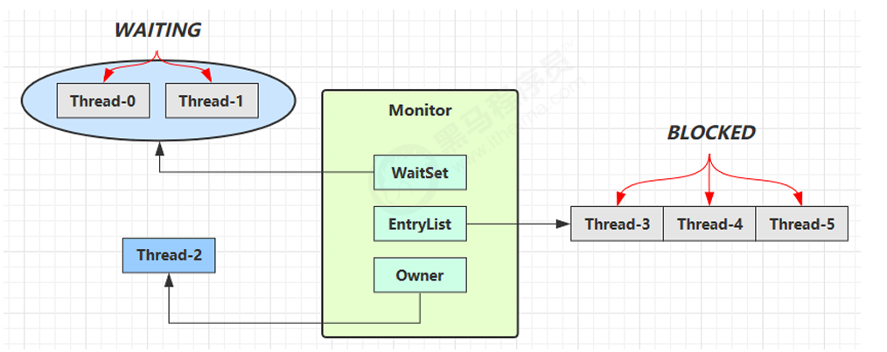

每个 Java 对象都可以关联一个 Monitor 对象，如果使用 synchronized 给对象上锁（重量级）之后，该对象头的Mark Word 中就被设置指向 Monitor 对象的指针，Monter对象包括Owner，也就是当前持有锁的线程，EntryList BLOCKED是当前等待需要锁的线程列表

- 刚开始 Monitor 中 Owner 为 null（如果是从轻量级锁膨胀来的，是加轻量级锁的那个线程）
- 当第一个线程执行 synchronized(obj) 就会将 Monitor 的所有者 Owner 置为该Thread，Monitor中只能有一个 Owner
- 在 Thread-2 上锁的过程中，如果其它线程也来执行 synchronized(obj)，就会进入 EntryList BLOCKED
- Thread-2 执行完同步代码块的内容，然后唤醒 EntryList 中等待的线程来竞争锁，竞争的时是非公平的
- 图中 WaitSet 中的 Thread-0，Thread-1 是之前获得过锁，但条件不满足进入 WAITING 状态的线程，在 wait-notify 时分析

### 锁消除和锁粗化

锁消除是指，JIT 发现某段代码中的锁根本不可能存在竞争，就直接去掉 synchronized。通过 逃逸分析判断，如果一个对象不可能被本线程之外的其他线程访问），那么其锁操作是删除的

锁粗化是指，多个小范围的 synchronized 被合并成一个更大范围的锁，因为加锁过程的CAS、mark word 操作、内存屏障等消耗性能。如果多个连续的 synchronized编译器认为它们属于同一语义操作，中间没有对共享变量的竞争危险，且使用同一个锁对象，可能触发锁粗化合并成同一个

### 线程安全的类

常见线程安全类

- String
- Integer
- StringBuffer
- Random
- Vector
- Hashtable
- java.util.concurrent 包下的类

这些类实现线程安全有两者形式，一种是使对象本身不可修改，如Integer，String，另一种是类似于加锁，它们的每个方法是原子的，但它们多个方法的组合不是原子的，需要时还是得加锁

### 条件变量Wait/Notify


是Object的方法

- obj.wait() 让当前线程到持有的锁对象object的 waitSet 等待
- obj.notify() 在 object 上正在 waitSet 等待的线程中挑一个唤醒
- obj.notifyAll() 让 object 上正在 waitSet 等待的线程全部唤醒

调用`wait()`时，必须在synchoroized内，且synchoroized的加锁对象就是调用的对象object，调用`wait()`时释放当前线程持有的object的锁

Wait/Notify和BLOCKED一样和Monitor对象关联，不同的是因抢锁被停止的线程进入EntryList BOLCKED，主动调用`wait()`的线程才进入WaitSet

BLOCKED 和 WAITING 的线程都处于阻塞状态，不占用 CPU 时间片，但BLOCKED 线程会在 Owner 线程释放锁时唤醒，而WAITING 线程只会在在 Owner 线程主动调用 notify 或 notifyAll 时唤醒，但唤醒后并不意味者立刻获得锁，仍需进入 EntryList 重新竞争

一般情况下，用while()检查资源是否拥有，没有时wait()，并等待生产者生成资源后notifyAll()

用途：

- 保护式暂停模式：用在一个线程等待另一个线程的执行结果，有一个结果需要从一个线程传递到另一个线程，让他们关联同一个 GuardedObject，如果有结果不断从一个线程到另一个线程那么可以使用消息队列（见生产者/消费者）JDK 中，join 的实现、Future 的实现，采用的就是此模式
- 生产者消费者模式：不需要产生结果和消费结果的线程一一对应。消费队列可以用来平衡生产和消费的线程资源，生产者仅负责产生结果数据，不关心数据该如何处理，而消费者专心处理结果数据

### Park/Unpark

是 LockSupport 类中的方法

park()暂停当前调用线程，unpark(Thread t)启动被暂停的线程

每个线程都有自己的一个 Parker 对象，由三部分组成

- _counter，最大值为1，调用unpark时增加1，线程从暂停到启动时或者调用park时减少1，为0时继续调用park会暂停线程
- _cond，条件变量，用于暂停线程
- _mutex，和条件变量配合使用的互斥锁

## 检测死锁

可以使用 jconsole工具，或者使用 jps 定位进程 id，再用 jstack 定位死锁

活锁是在两个线程互相改变对方的结束条件，最后谁也无法结束（并不是不可能结束，只是概率很小）

饥饿是一个线程由于优先级太低，始终得不到 CPU 调度执行，也不能够结束

## ReentrantLock

- 可中断，跳过lockInterruptibly()获取锁的阻塞过程可以被持锁线程打断
- 可以设置超时时间，tryLock()设置获取锁的最长等待时间，无参数时不等待
- 可以设置为公平锁，也就是越早等待的线程越早获取到锁
- 支持多个条件变量，通过newCondition()方法获取条件变量对象，使用条件变量对象的await()方法，等效wait()

控制多个线程执行顺序：可以用条件变量，不满足条件时进入条件变量等待

## 内存共享模型

### 可见性与volatile

在多个线程中存在的共享变量（实例变量，静态变量），不同线程访问时可能访问的是独属于自己的缓存，导致外部线程的修改对本线程不可见，使用volatile强制线程从共享内存读取变量值，保证了可见性

两阶段终止模式：

B线程想终止A线程，由B线程设置A线程的打断标记，A线程循环检查自己的打断标记，被打断就执行终止线程的相关逻辑

打断标记也可以用两者共享的volatile变量代替

```java
class TPTInterrupt {
    private Thread thread;
        public void start(){
            thread = new Thread(() -> {
                while(true) {
                    Thread current = Thread.currentThread();
                    if(current.isInterrupted()) {
                        log.debug("料理后事");
                        break;
                    }
                    try {
                        Thread.sleep(1000);
                        log.debug("将结果保存");
                    } 
                    catch (InterruptedException e) {
                        current.interrupt()
                    }
                    // 执行监控操作               
                }
            },"监控线程");
            thread.start();
        }
    public void stop() {
        thread.interrupt();
    }
}
```

Balking （犹豫）模式用在一个线程发现另一个线程或本线程已经做了某一件相同的事，那么本线程就无需再做了，直接结束返回，检查的方法也可以用volatile共享变量

#### volatile和内存屏障

内存屏障：

- 写屏障（sfence）保证在该屏障之前的，对共享变量的改动，都同步到主存当中
- 读屏障（lfence）保证在该屏障之后，对共享变量的读取，加载的是主存中最新数据

- 写屏障会确保指令重排序时，不会将写屏障之前的代码排在写屏障之后
- 读屏障会确保指令重排序时，不会将读屏障之后的代码排在读屏障之前

因此

- 对 volatile 变量的写指令后会加入写屏障
- 对 volatile 变量的读指令前会加入读屏障

```java
    public void actor1(I_Result r) {
        if(ready) {
            r.r1 = num + num;
        } 
        else {
            r.r1 = 1;
        }
    }

    public void actor2(I_Result r) {
        num = 2;
        ready = true;
    }
```

如果ready不是volatile，num = 2可能发生在ready = true之后，如果更新完ready后调度第一个线程，结果就是0

```java
public final class Singleton {
    private Singleton() { }
    private static Singleton INSTANCE = null;
    public static Singleton getInstance() {        
        if(INSTANCE == null) { // t2
        // 首次访问会同步，而之后的使用没有 synchronized
            synchronized(Singleton.class) {
                if (INSTANCE == null) { // t1
                    INSTANCE = new Singleton();
                }                
            }
        }
        return INSTANCE;
    }
}
```

可以看到同步块内仍然判断了一次INSTANCE，因为之前的那次判断没有在同步块内，可能出现：t1判断是null -> t2完成实例化，不是null了，释放锁 -> t1进入同步块，再判断发现已经不是null了

去到第一个判断也是可以的，但这样每次调用都必须竞争锁，合适的方法是：**对一个变量的条件判断+修改必须是原子性的，但在同步块之前可以先行判断一次，减少锁的竞争**

其中`INSTANCE = new Singleton();`包含多个指令，调用构造方法和赋值给 static INSTANCE是两个指令，因为它们没有先后关系（赋值后并没有使用这个INSTANCE），这两个指令可以被重排而颠倒，也就是先赋值一个未实例化的单例对象，再创建对象

多线程时，在上述重排情况下，该线程赋值完成但还没实例化，其它线程就可以拿到没有实例化的对象，出现bug

解决方法是把INSTANCE设置为volatile，禁用指令重排，本质上是写屏障让这两个指令执行完成后直接同步到内存中，而其它线程访问加入读屏障则一定读取内存最新数据

### happens-before规则

规定了对共享变量的写操作对其它线程的读操作可见，它是可见性与有序性的一套规则总结，不遵守这些规则，不能保证一个线程对共享变量的写对于其它线程对该共享变量的读可见

- 线程解锁 m 之前对变量的写，对于接下来对 m 加锁的其它线程对该变量的读可见
- 线程对 volatile 变量的写，对接下来其它线程对该变量的读可见
- 线程 start 前对变量的写，对该线程开始后对该变量的读可见
- 线程结束前对变量的写，对其它线程得知它结束后的读可见
- 线程 t1 打断 t2（interrupt）前对变量的写，对于其他线程得知 t2 被打断后对变量的读可见
- 对变量默认值（0，false，null）的写，对其它线程对该变量的读可见
- 具有传递性，x对y可见，y对z可见，则x对z可见

传递性如下

```java
volatile static int x;
static int y;
new Thread(()->{    
    y = 10;
    x = 20;
},"t1").start();
new Thread(()->{
    // x=20 对 t2 可见, 同时 y=10 也对 t2 可见
    System.out.println(x); 
},"t2").start()
```

## CAS和各种原子类

### 原子整数

AtomicInteger类是典型的CAS原子整数工具类

```java
while (true) {
    // 比如拿到了旧值 1000
    int prev = balance.get();
    // 在这个基础上 1000-10 = 990
    int next = prev - amount;
    if (balance.compareAndSet(prev, next)) {
        break;
    }
}
```

先查询再比较并设置，没有可见性问题，因为AtomicInteger内部封装的是volatile变量

原子整数类还包括AtomicBoolean，AtomicInteger，AtomicLong

### 原子引用

AtomicReference，AtomicMarkableReference，AtomicStampedReference

AtomicReference原子引用案例：取钱

```java
class DecimalAccountSafeCas implements DecimalAccount {
    AtomicReference<BigDecimal> ref;
    public DecimalAccountSafeCas(BigDecimal balance) {
        ref = new AtomicReference<>(balance);
    }

    @Override
    public BigDecimal getBalance() {
        return ref.get();
    }

    @Override
    public void withdraw(BigDecimal amount) {
        while (true) {
            BigDecimal prev = ref.get();
            BigDecimal next = prev.subtract(amount);
            if (ref.compareAndSet(prev, next)) {
                break;
            }
        }
    }
}
```

AtomicStampedReference，AtomicMarkableReference案例：ABA问题

ABA问题来源于上一个只能判断出共享变量的值与最初值 A 是否相同，不能感知到从 A 改为 B 又 改回 A 的情况。如果要求只要有其它线程动过了共享变量，那么自己的 cas 就算失败，这时，仅比较值是不够的，需要再加一个版本号

```java
static AtomicStampedReference<String> ref = new AtomicStampedReference<>("A", 0);//0是初始version
......


// 获取值 A
String prev = ref.getReference();
// 获取版本号
int stamp = ref.getStamp();
log.debug("版本 {}", stamp);
// 如果中间有其它线程干扰，发生了 ABA 现象
other();
sleep(1);
// 尝试改为 C
log.debug("change A->C {}", ref.compareAndSet(prev, "C", stamp, stamp + 1));
```

有方法`atomicRef.compareAndSet(prev, next,oldVersion, newVersion)`

如果不关心引用变量更改了几次，只是单纯的关心是否更改过，就有AtomicMarkableReference

```java
static AtomicMarkableReference<String> ref = new AtomicStampedReference<>("A", true); //true是初始标记
```

有方法`atomicRef.compareAndSet(prev, next,oldMark, newMark)`

### 原子数组

AtomicIntegerArray，AtomicLongArray，AtomicReferenceArray，因为是数组，长度通过构造器设定，是固定的

如AtomicIntegerArray有方法
    - `array.length()`获取长度
    - `array.getAndIncrement(index)`指定位置自增

- 字段更新器：AtomicReferenceFieldUpdater，AtomicIntegerFieldUpdater，AtomicLongFieldUpdater

有构造器`AtomicIntegerFieldUpdater.newUpdater(Test.class, "field")`，参数一是指定类的class，二是字段名称
使用方法`fieldUpdater.compareAndSet(test, 0, 10);`进行原子更新，参数一是指定类的实例，二是原始值，三是待更新值

### 原子累加

LongAddr，虽然AtomicLong也能作为累加器`getAndIncrement()`，但竞争大时LongAddr性能更高

使用`adder.increment()`累加一次计数

性能提高的原理是：在有竞争时，设置多个累加单元，Therad-0 累加 Cell[0]，而 Thread-1 累加Cell[1]... 最后将结果汇总。这样它们在累加时操作的不同的 Cell 变量，因此减少了 CAS 重试失败，从而提高性能

#### LongAddr源码

关键变量

```java
// 累加单元数组, 懒惰初始化
transient volatile Cell[] cells;
// 基础值, 如果没有竞争, 则用 cas 累加这个域
transient volatile long base;
// 在 cells 创建或扩容时, 置为 1, 表示加锁
transient volatile int cellsBusy;
```

CAS实现的锁，主要是利用其的`compareAndSet()`的原子性，实现加锁的原子性，设置为1后相当于锁占用，其它线程不能操作

CAS操作

```java
// 防止缓存行伪共享
@sun.misc.Contended 
static final class Cell {
    volatile long value;
    Cell(long x) { value = x; }

    // 最重要的方法, 用来 cas 方式进行累加, prev 表示旧值, next 表示新值
    final boolean cas(long prev, long next) {
        return UNSAFE.compareAndSwapLong(this, valueOffset, prev, next);
    }
    // 省略不重要代码
}
```

`@sun.misc.Contended `解析：CPU 要保证数据的一致性，如果某个 CPU 核心更改了数据，其它 CPU 核心对应的整个缓存行必须失效（缓存行大小一般是 64 byte（8 个 long））。因为 Cell 是数组形式，在内存中是连续存储的，一个 Cell 为 24 字节（16 字节的对象头和 8 字节的 value），因此缓存行可以存下 2 个的 Cell 对象，对任意一个Cell的修改都会让另一个无关Cell的缓存也失效

`@sun.misc.Contended `在使用此注解的对象或字段的前后各增加 128 字节大小的padding，使得Cell落在不同缓存行

累加操作

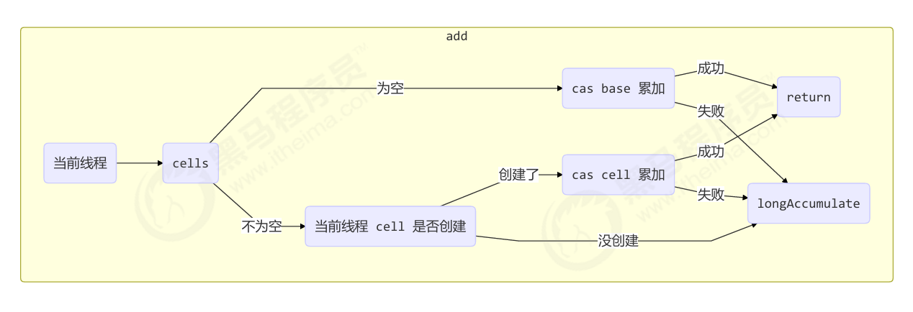

```java
public void add(long x) {
    // as 为累加单元数组
    // b 为基础值
    // x 为累加值
    Cell[] as; long b, v; int m; Cell a;
    // 进入 if 的两个条件
    // 1. as 有值, 表示已经发生过竞争, 进入 if
    // 2. cas 给 base 累加时失败了, 表示 base 发生了竞争, 进入 if
    if ((as = cells) != null || !casBase(b = base, b + x)) {
        // uncontended 表示 cell 没有竞争
        boolean uncontended = true;
        if (
            // as 还没有创建
            as == null || (m = as.length - 1) < 0 ||
            // 当前线程对应的 cell 还没有
                        (a 
            = as[getProbe() & m]) == null ||
            // cas 给当前线程的 cell 累加失败 uncontended=false ( a 为当前线程的 cell )
            !(uncontended = a.cas(v = a.value, v + x))
        ) {
            // 进入 cell 数组创建、cell 创建的流程
            longAccumulate(x, null, uncontended);
        }
    }
}
```

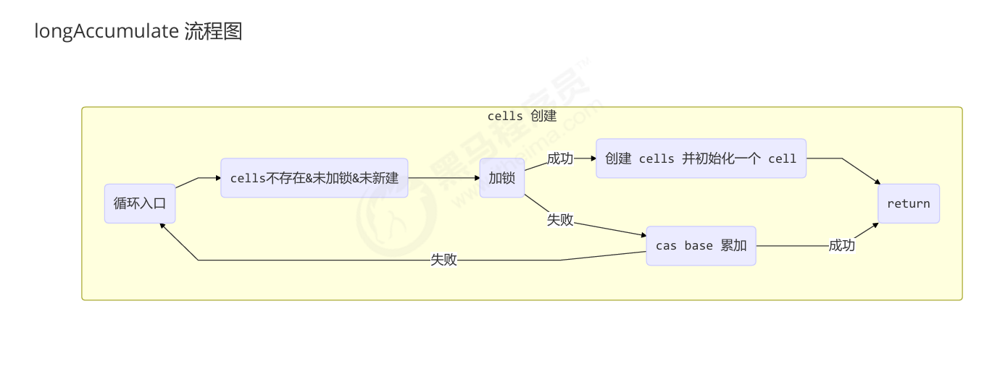
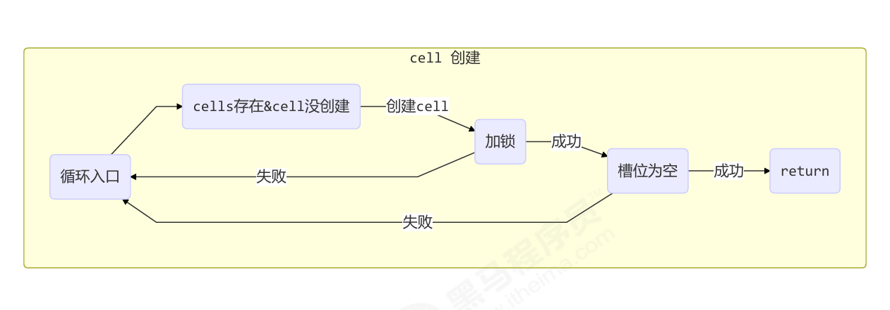
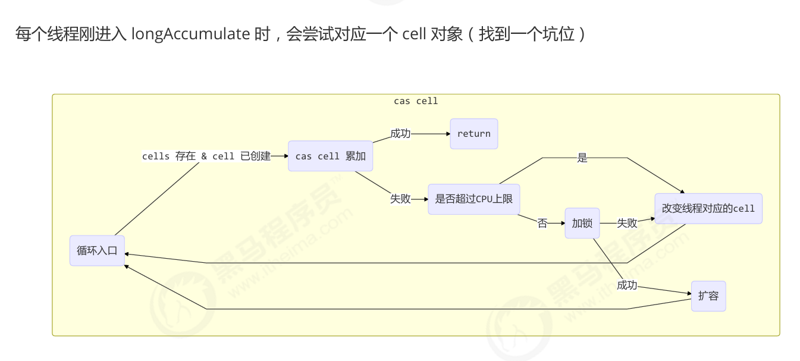

```java
final void longAccumulate(long x, LongBinaryOperator fn, boolean wasUncontended) {
    int h;
    // 当前线程还没有对应的 cell, 需要随机生成一个 h 值用来将当前线程绑定到 cell
    if ((h = getProbe()) == 0) {
        // 初始化 probe
        ThreadLocalRandom.current();
        // h 对应新的 probe 值, 用来对应 cell
        h = getProbe();
        wasUncontended = true;
    }
    // collide 为 true 表示需要扩容
    boolean collide = false;                
    for (;;) {
        Cell[] as; Cell a; int n; long v;
        // 已经有了 cells
        if ((as = cells) != null && (n = as.length) > 0) {
            // 还没有 cell
            if ((a = as[(n - 1) & h]) == null) {
                // 为 cellsBusy 加锁, 创建 cell, cell 的初始累加值为 x
                // 成功则 break, 否则继续 continue 循环
            }
            // 有竞争, 改变线程对应的 cell 来重试 cas
            else if (!wasUncontended)
                wasUncontended = true;
            // cas 尝试累加, fn 配合 LongAccumulator 不为 null, 配合 LongAdder 为 null
            else if (a.cas(v = a.value, ((fn == null) ? v + x : fn.applyAsLong(v, x))))
                break;
            // 如果 cells 长度已经超过了最大长度, 或者已经扩容, 改变线程对应的 cell 来重试 cas
            else if (n >= NCPU || cells != as)
                collide = false;
            // 确保 collide 为 false 进入此分支, 就不会进入下面的 else if 进行扩容了
            else if (!collide)
                collide = true;
            // 加锁
            else if (cellsBusy == 0 && casCellsBusy()) {
                // 加锁成功, 扩容
                continue;
            }
            // 改变线程对应的 cell
            h = advanceProbe(h);
        }
        // 还没有 cells, 尝试给 cellsBusy 加锁
        else if (cellsBusy == 0 && cells == as && casCellsBusy()) {
            // 加锁成功, 初始化 cells, 最开始长度为 2, 并填充一个 cell
            // 成功则 break;
        }
        // 上两种情况失败, 尝试给 base 累加
        else if (casBase(v = base, ((fn == null) ? v + x : fn.applyAsLong(v, x))))
            break;
    }
}
```

最后获取最终结果通过 sum 方法累加每个cell的值得到结果

### Unsafe

Unsafe 对象提供了非常底层的，操作内存、线程的private方法，因此只能反射调用

```java
public class UnsafeAccessor {
    static Unsafe unsafe;
    static {
        try {            
            Field theUnsafe = Unsafe.class.getDeclaredField("theUnsafe");
            theUnsafe.setAccessible(true);
            unsafe = (Unsafe) theUnsafe.get(null);
        } 
        catch (NoSuchFieldException | IllegalAccessException e) {
            throw new Error(e);
        }
    }
    static Unsafe getUnsafe() {
        return unsafe;
    }
}
```

方法

- `long unsafe.objectFieldOffset(Field f)` 访问属性在 DataContainer 对象中的偏移量，用于下一个方法
- `boolean unsafe.compareAndSwapInt(this, long offset, oldValue, newValue)`，参数1是改变的字段所在类实例，2是对应字段偏移量，3是要比较的字段旧值，4是设置的新值

## 不可变模式

如果一个对象在不能够修改其内部状态（属性），那么它就是线程安全的，因为不存在并发修改

不可变类的类、类中所有属性都是 final 的

- 属性用 final 修饰保证了该属性是只读的，不能修改
- 类用 final 修饰保证了该类中的方法不能被覆盖，防止子类无意间破坏不可变性

如果需要对类进行修改，只能拷贝一份内存再修改形成新的不可变类，如String的`substring()`

享元模式：要重用数量有限的同一类对象时，可以预先创建好这些对象，需要时直接使用，一般情况下只有不可变类可以使用

如Byte，Short，Integer，Long缓存的-128~127的对象，Boolean缓存的true,false对象，字符串常量池等

再比如数据库连接池，线程池等

final变量初始化后就插入了写屏障，因此它的可见性是一定保证的

## 线程池ThreadPoolExecutor

线程池是工作线程模式的体现

通常情况下，一个线程池最好只处理一种特定任务的线程，如果一个线程池之间的线程有先后关系，后面执行的线程先进入了线程池，却因为前面的任务没有完成而阻塞，前面任务的线程因线程池已满也无法加入线程池，类似于死锁

在线程池中的任务的未捕获异常，则在Future对象的get()里被捕获，封装成ExecutionException，在调用get()时抛出

### 状态

ThreadPoolExecutor 使用 int 的高 3 位来表示线程池状态，低 29 位表示线程数量

| 状态名    |高 3 位 |接收新任务 |处理阻塞队列任务 |               说明                         |
|-----------|--------|-----------|-----------------|-----------------------------------------|
| RUNNING   | 111    | Y         | Y               |                                         |
| SHUTDOWN  | 000    | N         | Y               | 不会接收新任务，但会处理阻塞队列剩余任务   |
| STOP      | 001    | N         | N               | 会中断正在执行的任务，并抛弃阻塞队列任务   |
| TIDYING   | 010    | N         | N               | 任务全执行完毕，活动线程为 0 即将进入终结  |
| TERMINATED| 011    | N         | N               | 终结状态                                |

保存在一个原子变量 ctl 中，目的是将线程池状态与线程个数合二为一，这样就可以用一次 cas 原子操作
进行赋值

```java
// c 为旧值， ctlOf 返回结果为新值
ctl.compareAndSet(c, ctlOf(targetState, workerCountOf(c))));
// rs 为高 3 位代表线程池状态， wc 为低 29 位代表线程个数，ctl 是合并它们
private static int ctlOf(int rs, int wc) { return rs | wc; }
```

### 构造

```java
public ThreadPoolExecutor(int corePoolSize,
    int maximumPoolSize,
    long keepAliveTime,
    TimeUnit unit,
    BlockingQueue<Runnable> workQueue,
    ThreadFactory threadFactory,
    RejectedExecutionHandler handler)
```

- corePoolSize 核心线程数目 (最多保留的线程数)
- maximumPoolSize 最大线程数目
- keepAliveTime 生存时间 - 针对救急线程
- unit 时间单位 - 针对救急线程
- workQueue 阻塞队列
- threadFactory 线程工厂 - 可以为线程创建时起个好名字
- handler 拒绝策略

步骤

1. 线程池中刚开始没有线程，当一个任务提交给线程池后，线程池会创建一个新线程来执行任务。
2. 当线程数达到 corePoolSize 并没有线程空闲，这时再加入任务，新加的任务会被加入workQueue 队列排
队，直到有空闲的线程。
3. 如果队列选择了有界队列，那么任务超过了队列大小时，会创建 maximumPoolSize - corePoolSize 数目的线
程来救急。
4. 如果线程到达 maximumPoolSize 仍然有新任务这时会执行拒绝策略。拒绝策略 jdk 提供了 4 种实现，其它
著名框架也提供了实现
    - AbortPolicy 让调用者抛出 RejectedExecutionException 异常，这是默认策略
    - CallerRunsPolicy 让调用者自己作为线程池外的线程运行任务
    - DiscardPolicy 放弃本次任务
    - DiscardOldestPolicy 放弃队列中最早的任务，本任务取而代之
    - Dubbo 的实现，在抛出 RejectedExecutionException 异常之前会记录日志，并 dump 线程栈信息，方
    便定位问题
    - Netty 的实现，是创建一个新线程来执行任务，类似CallerRunsPolicy
    - ActiveMQ 的实现，带超时等待（60s）尝试放入队列，类似我们之前自定义的拒绝策略
    - PinPoint 的实现，它使用了一个拒绝策略链，会逐一尝试策略链中每种拒绝策略

keepAliveTime和TimeUnit规定了救急线程最长的空闲时间，超过时销毁

### 核心线程数量

CPU 密集型运算 ：

cpu 核数 + 1 能够实现最优的 CPU 利用率，+1 是保证当线程由于页缺失故障（操作系统）或其它原因导致暂停时，额外的这个线程就能顶上去，保证 CPU 时钟周期不被浪费

I/O 密集型运算 ：

CPU 不总是处于繁忙状态，例如，当你执行业务计算时，这时候会使用 CPU 资源，但当你执行 I/O 操作时、远程RPC 调用时，包括进行数据库操作时，这时候 CPU 就闲下来了，你可以利用多线程提高它的利用率。

线程数 = 核数 \* 期望 CPU 利用率 \* 总时间(CPU计算时间+等待时间) / CPU 计算时间

例如 4 核 CPU 计算时间是 50% ，其它等待时间是 50%，期望 cpu 被 100% 利用，套用公式
4 \* 100% \* 100% / 50% = 8
例如 4 核 CPU 计算时间是 10% ，其它等待时间是 90%，期望 cpu 被 100% 利用，套用公式
4 \* 100% \* 100% / 10% = 40

### Executors提供的线程池

#### newFixedThreadPool

```java
public static ExecutorService newFixedThreadPool(int nThreads) {
    return new ThreadPoolExecutor(nThreads, nThreads, 0L, TimeUnit.MILLISECONDS, new LinkedBlockingQueue<Runnable>());
}
```

核心线程数 == 最大线程数（没有救急线程被创建），因此也无需超时时间

阻塞队列是无界的，可以放任意数量的任务

风险：**阻塞的任务过多可能OOM**

适用于任务量已知，相对耗时的任务

#### newCachedThreadPool

```java
public static ExecutorService newCachedThreadPool() {
    return new ThreadPoolExecutor(0, Integer.MAX_VALUE, 60L, TimeUnit.SECONDS, new SynchronousQueue<Runnable>());
}
```

核心线程数是 0， 最大线程数是 Integer.MAX_VALUE，救急线程的空闲生存时间是 60s，意味着全部都是救急线程（60s 后可以回收）

SynchronousQueue 没有容量，没有线程来取是放不进去的，类似Go的无缓冲channel

缺点：**线程频繁创建销毁开销大**

适合任务数比较密集，但每个任务执行时间较短的情况

#### newSingleThreadExecutor 

```java
public static ExecutorService newSingleThreadExecutor() {
    return new FinalizableDelegatedExecutorService
        (new ThreadPoolExecutor(1, 1, 0L, TimeUnit.MILLISECONDS, new LinkedBlockingQueue<Runnable>()));
}
```

使用场景：

希望多个任务排队执行。线程数固定为 1，任务数多于 1 时，会放入无界队列排队。任务执行完毕，这唯一的线程也不会被释放。

自己创建一个单线程串行执行任务，如果任务执行失败而终止那么没有任何补救措施，而线程池还会新建一个线程，保证池的正常工作

和newFixedThreadPool(1)的区别

- Executors.newSingleThreadExecutor() 线程个数始终为1，不能修改，FinalizableDelegatedExecutorService 应用的是装饰器模式，只对外暴露了 ExecutorService 接口，因此不能调用 ThreadPoolExecutor 中特有的方法
- Executors.newFixedThreadPool(1) 初始时为1，以后还可以修改，对外暴露的是 ThreadPoolExecutor 对象，可以强转后调用 setCorePoolSize 等方法进行修改


### 提交任务

```java
// 执行任务
void execute(Runnable command);
// 提交任务 task，用返回值 Future 获得任务执行结果
<T> Future<T> submit(Callable<T> task);
// 提交 tasks 中所有任务
<T> List<Future<T>> invokeAll(Collection<? extends Callable<T>> tasks)
throws InterruptedException;
// 提交 tasks 中所有任务，带超时时间
<T> List<Future<T>> invokeAll(Collection<? extends Callable<T>> tasks,
long timeout, TimeUnit unit)
throws InterruptedException;
// 同步调用，提交 tasks 中所有任务，哪个任务先成功执行完毕，返回此任务执行结果，其它任务取消
<T> T invokeAny(Collection<? extends Callable<T>> tasks)
throws InterruptedException, ExecutionException;
// 同步调用，提交 tasks 中所有任务，哪个任务先成功执行完毕，返回此任务执行结果，其它任务取消，带超时时间
<T> T invokeAny(Collection<? extends Callable<T>> tasks,
long timeout, TimeUnit unit)
throws InterruptedException, ExecutionException, TimeoutException;
```

### 关闭线程池

```java
/*
线程池状态变为 SHUTDOWN
- 不会接收新任务
- 但已提交任务会执行完
- 此方法不会阻塞调用线程的执行
*/
void shutdown(); 

/*
线程池状态变为 STOP
- 不会接收新任务
- 会将队列中的任务返回
- 并用 interrupt 的方式中断正在执行的任务
*/
List<Runnable> shutdownNow();

// 不在 RUNNING 状态的线程池，此方法就返回 true
boolean isShutdown();
// 线程池状态是否是 TERMINATED
boolean isTerminated();
// 调用 shutdown 后，由于调用线程并不会等待所有任务运行结束，因此如果它想在线程池 TERMINATED 后做些事
情，可以利用此方法等待
boolean awaitTermination(long timeout, TimeUnit unit) throws InterruptedException;
```

### 定时任务线程池ScheduledThreadPool

ScheduledThreadPool允许我们同时允许线程池数量的多个定时任务

`ScheduledExecutorService pool = Executors.newScheduledThreadPool(1);`构造函数的参数是线程池线程数量

方法

- `schedule(Runnable command, long time, TimeUnit unit);`延迟指定时间后运行任务
- `scheduleAtFixedRate(Runnable command, long initialDelay, long period, TimeUnit unit);`延迟指定时间后以一定间隔（计时器在任务开始运行时就重置）重复运行任务，如果任务执行时间超过了间隔，会等待当前任务执行完就立刻运行
- `scheduleWithFixedDelay(Runnable command, long initialDelay, long delay, TimeUnit unit);`延迟指定时间后以一定延迟（计时器在任务结束运行时才重置）重复运行任务

### Tomcat线程池

Tomcat 线程池扩展了 ThreadPoolExecutor

- LimitLatch 用来限流，可以控制最大连接个数，类似 J.U.C 中的  Semaphore 后面再讲
- Acceptor 只负责【接收新的 socket 连接】
- Poller 只负责监听 socket channel 是否有【可读的 I/O 事件】一旦可读，封装一个任务对象（socketProcessor），提交给 Executor 线程池处理
- Executor 线程池中的工作线程最终负责【处理请求】

Connector 配置

|配置项|默认值|说明|
|------|-----|----|
|acceptorThreadCount|1|acceptor 线程数量|
|pollerThreadCount|1|poller 线程数量|
|minSpareThreads|10|核心线程数，即 corePoolSize|
|maxThreads|200|最大线程数，即 maximumPoolSize|
|executor|-|Executor 名称，用来引用下面的 Executor|

Executor 线程配置

|配置项|默认值|说明|
|------|-----|----|
|threadPriority|5|线程优先级|
|daemon|true|是否守护线程|
|minSpareThreads|25|核心线程数，即 corePoolSize|
|maxThreads|200|最大线程数，即 maximumPoolSize|
|maxIdleTime|60000|线程生存时间，单位是毫秒，默认值即 1 分钟|
|maxQueueSize|Integer.MAX_VALUE|队列长度|
|prestartminSpareThreads|false|核心线程是否在服务器启动时启动|

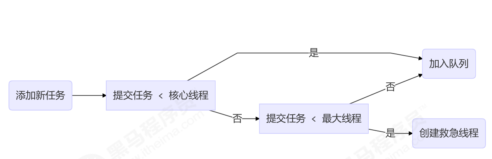

## Fork/Join

将一个大任务拆分为算法上相同的小任务，直至不能拆分可以直接求解。跟递归相关的一些计
算，如归并排序、斐波那契数列、都可以用分治思想进行求解。利用多线程加速执行，最后合并结果

Fork/Join 默认会创建与 cpu 核心数大小相同的线程池

提交给 Fork/Join 线程池的任务需要继承 RecursiveTask（有返回值）或 RecursiveAction（没有返回值），重写其中的compute方法

二分计算范围的值

```java
class AddTask3 extends RecursiveTask<Integer> {
    int begin;
    int end;
    public AddTask3(int begin, int end) {
        this.begin = begin;
        this.end = end;
    }
    @Override
    public String toString() {
        return "{" + begin + "," + end + '}';
    }
    @Override
    protected Integer compute() {
        // 5, 5
        if (begin == end) {
            log.debug("join() {}", begin);
            return begin;
        }
        // 4, 5
        if (end - begin == 1) {
            log.debug("join() {} + {} = {}", begin, end, end + begin);
            return end + begin;
        }
        // 1 5
        int mid = (end + begin) / 2; // 3
        AddTask3 t1 = new AddTask3(begin, mid); // 1,3
        t1.fork();
        AddTask3 t2 = new AddTask3(mid + 1, end); // 4,5
        t2.fork();
        log.debug("fork() {} + {} = ?", t1, t2);
        int result = t1.join() + t2.join();
        log.debug("join() {} + {} = {}", t1, t2, result);
        return result;
    }
}

public static void main(String[] args) {
    ForkJoinPool pool = new ForkJoinPool(4);
    System.out.println(pool.invoke(new AddTask3(1, 10)));
}
```

## AQS

全称是 AbstractQueuedSynchronizer，是阻塞式锁和相关的同步器工具的框架

特点：

用 state 属性来表示资源的状态（分独占模式和共享模式），子类需要定义如何维护这个状态，控制如何获取锁和释放锁
    - getState - 获取 state 状态
    - setState - 设置 state 状态
    - compareAndSetState - cas 机制设置 state 状态
    - 独占模式是只有一个线程能够访问资源，而共享模式可以允许多个线程访问资源

提供了基于 FIFO 的等待队列，类似于 Monitor 的 EntryList，因为是FIFO，所以是公平的

条件变量来实现等待、唤醒机制，支持多个条件变量，类似于 Monitor 的 WaitSet

子类需要实现这样一些方法（它自己默认抛出 UnsupportedOperationException）

- tryAcquire
- tryRelease
- tryAcquireShared
- tryReleaseShared
- isHeldExclusively

一个简单的实现类：自定义同步器，用1代表资源有线程在使用

```java
final class MySync extends AbstractQueuedSynchronizer {
    @Override
    protected boolean tryAcquire(int acquires) {
        if (acquires == 1){
            if (compareAndSetState(0, 1)) {
                setExclusiveOwnerThread(Thread.currentThread());//父类方法
                return true;
            }
        }
    return false;
    }
    @Override
    protected boolean tryRelease(int acquires) {
        if(acquires == 1) {
            if(getState() == 0) {
t               hrow new IllegalMonitorStateException();
            }
            setExclusiveOwnerThread(null);
            setState(0);
            return true;
        }
        return false;
    }
    protected Condition newCondition() {
        return new ConditionObject();
    }
    @Override
    protected boolean isHeldExclusively() {
        return getState() == 1;
    }
}
```

用AQS实现锁（不可重入）

```java
class MyLock implements Lock {
    static MySync sync = new MySync();
    @Override
    // 尝试，不成功，进入等待队列
    public void lock() {
        sync.acquire(1);
    }
    @Override
    // 尝试，不成功，进入等待队列，可打断
    public void lockInterruptibly() throws InterruptedException {
        sync.acquireInterruptibly(1);
    }
    @Override
    // 尝试一次，不成功返回，不进入队列
    public boolean tryLock() {
        return sync.tryAcquire(1);
    }
    @Override
    // 释放锁
    public void unlock() {
        sync.release(1);
    }
    @Override
    // 尝试，不成功，进入等待队列，有时限
    public boolean tryLock(long time, TimeUnit unit) throws InterruptedException {
        return sync.tryAcquireNanos(1, unit.toNanos(time));
    }
    @Override
    // 生成条件变量
    public Condition newCondition() {
        return sync.newCondition();
    }
}
```

### 目标

AQS 要实现的功能目标

- 阻塞版本获取锁 acquire 和非阻塞的版本尝试获取锁 tryAcquire
- 获取锁超时机制
- 通过打断取消机制
- 独占机制及共享机制
- 条件不满足时的等待机制

### 设计

获取锁的逻辑

```java
while(state 状态不允许获取) {
    if(队列中还没有此线程) {
        入队并阻塞
    }
}
当前线程出队
```

释放锁的逻辑

```java
if(state 状态允许了) {
    恢复阻塞的线程(s)
}
```

#### 1 state 设计

state 使用 volatile 配合 cas 保证其修改时的原子性
state 使用了 32bit int 来维护同步状态，因为当时使用 long 在很多平台下测试的结果并不理想

#### 2 阻塞恢复设计

使用 park & unpark 来实现线程的暂停和恢复，具体原理在之前讲过了，先 unpark 再 park 也没问题

park & unpark 是针对线程的，而不是针对同步器的，因此控制粒度更为精细

park 线程还可以通过 interrupt 打断

#### 3 队列设计

使用了 FIFO 先入先出队列(设计时借鉴了 CLH 队列，它是一种单向无锁队列)，并不支持优先级队列

CLH队列每个等待的线程会通过自旋访问前一个线程节点的状态，前一个节点释放锁（不是唤醒状态）之后，当前节点才可以出队列获取锁

AQS的变体CLH

- 由 自旋 优化为 自旋 + 阻塞 ：自旋操作的性能很高，但大量的自旋操作比较占用 CPU 资源，因此在 CLH 变体队列中会先通过自旋尝试获取锁，如果失败再进行阻塞等待。
- 由 单向队列 优化为 双向队列 ：在 CLH 变体队列中，会对等待的线程进行阻塞操作，当队列前边的线程释放锁之后，需要对后边的线程进行唤醒，因此增加了 next 指针，成为了双向队列

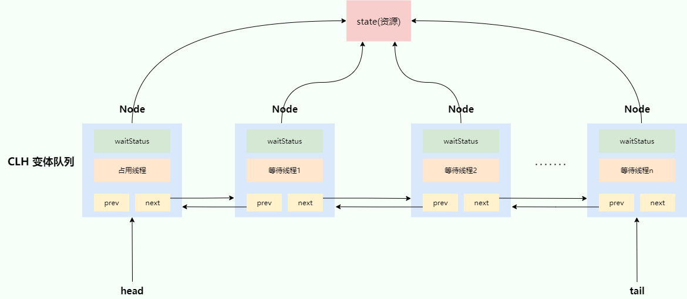

状态是SIGNAL时，该Node有后继，需要唤醒后续节点，唤醒后将SIGNAL改回0

### ReentrantLock原理

#### 锁实现

成员变量NonfairSync 继承自 AQS

state表示资源状态，0未使用，1已使用

exclusiveOwnerThread是使用资源的线程

第一个竞争

Thread-1 执行了

1. CAS 尝试将 state 由 0 改为 1，结果失败
2. 进入 tryAcquire 逻辑，这时 state 已经是1，结果仍然失败
3. 接下来进入 addWaiter 逻辑，构造 Node 队列
    - 图中黄色三角表示该 Node 的 waitStatus 状态，其中 0 为默认正常状态
    - Node 的创建是懒惰的
    - 其中第一个 Node 称为 Dummy（哑元）或哨兵，用来占位，并不关联线程

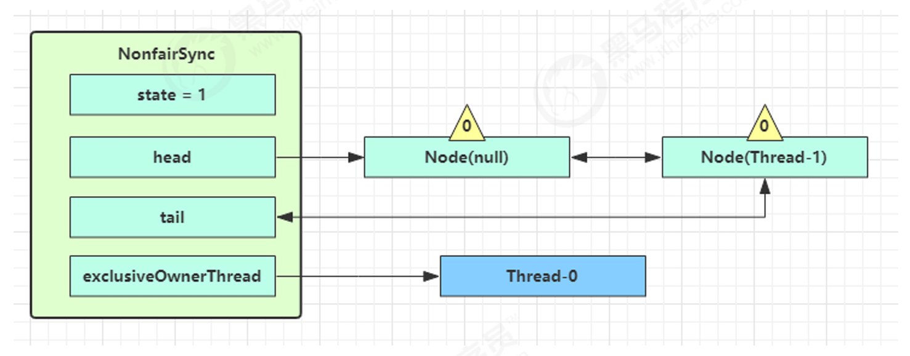

当前线程进入 acquireQueued 逻辑

1. acquireQueued 会在一个死循环中不断尝试获得锁，失败后进入 park 阻塞
2. 如果自己是紧邻着 head（排第二位），那么再次 tryAcquire 尝试获取锁，当然这时 state 仍为 1，失败；如果自己不是第二位，则直接失败加入等待队列
3. 进入 shouldParkAfterFailedAcquire 逻辑，将前驱 node，即 head 的 waitStatus 改为 -1，这次返回 false
4. shouldParkAfterFailedAcquire 执行完毕回到 acquireQueued ，再次 tryAcquire 尝试获取锁，当然这时 state 仍为 1，失败
5. 当再次进入 shouldParkAfterFailedAcquire 时，这时因为其前驱 node 的 waitStatus 已经是 -1，这次返回 true
6. 进入 parkAndCheckInterrupt， Thread-1 park（灰色表示）

以下是AQS队列里节点循环查询前驱节点的方法

```java
final boolean acquireQueued(final Node node, int arg) {
    boolean failed = true;
    try {
        boolean interrupted = false;
        for (;;) {
            final Node p = node.predecessor();
            if (p == head && tryAcquire(arg)) {
                setHead(node);
                p.next = null;
                failed = false;
                // 还是需要获得锁后, 才能返回打断状态
                return interrupted;
            }
            if (
                shouldParkAfterFailedAcquire(p, node) &&
                parkAndCheckInterrupt()
            ) {
                // 如果是因为 interrupt 被唤醒, 返回打断状态为 true
                interrupted = true;
            }
        }
    } 
    finally {
        if (failed)
            cancelAcquire(node);
    }
}
```

再次有多个线程经历上述过程竞争失败，等待队列里除了最后一个Node，其余的WaitStatus都是-1（SIGNAL）

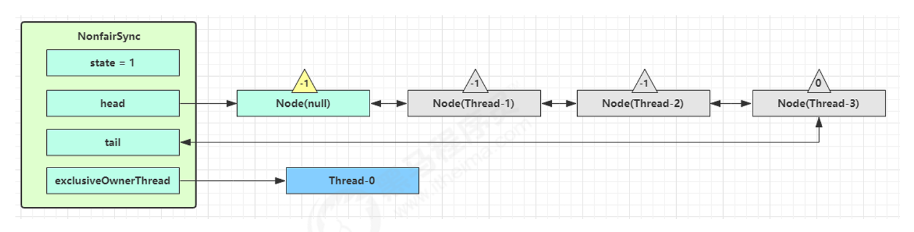

Thread-0 释放锁，进入 tryRelease 流程，如果成功，设置 exclusiveOwnerThread 为 null，state = 0

当前队列不为 null，并且 head 的 waitStatus = -1（SIGNAL），进入 unparkSuccessor 流程，找到队列中离 head 最近的一个 Node（没取消的），unpark 恢复其运行，本例中即为 Thread-1，回到 Thread-1 的 acquireQueued 流程

注意：**是否需要 unpark 是由当前节点的前驱节点的 waitStatus == Node.SIGNAL 来决定，而不是本节点的 waitStatus 决定**，唤醒了后续节点后，前驱节点的waitStatus变回0，但当前节点仍然是-1，且会变成新的Dummy

如果加锁成功（没有竞争），会

- 设置exclusiveOwnerThread 为 Thread-1，state = 1
- head 指向刚刚 Thread-1 所在的 Node，该 Node 清空 Thread，变成新的Dummy
- 原本的 head 因为从链表断开，而可被垃圾回收

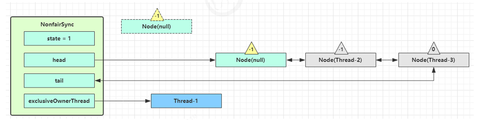

公平锁原理：默认原来如果这时候有其它线程来竞争（非公平的体现），例如这时有 Thread-4 来了，而Thread-1还没有成功加锁，两个线程同时竞争，可能Thread-4反而抢到了锁，就不是公平的了。公平锁改成新进入的线程只有在检查AQS队列没有任何节点时才开始抢锁，否则乖乖进入AQS队列等待

重入的原理是，tryAcquire()会判断自己是不是exclusiveOwnerThread，是就获取成功，并同样把state + 1，也就是state的计数就是重入次数；释放锁时 - 1，到==0时才是真正释放锁

可打断的原理是：不可打断下，队列里循环检查前驱节点失败后park()，如果中途唤醒，检查打断状态为true后，原本是记录`interrupted = true;`，然后再次尝试检查前驱节点是不是head（不是继续park），直到获取到锁才能返回interrupted打断状态。可打断把这一段改成`throw new InterruptedException();`通过抛出异常直接离开循环

#### 条件变量实现

ReentrantLock的newCondition()获得的条件变量其实就对应着一个等待队列，其实现类是 ConditionObject

##### await

1. 开始 Thread-0 持有锁，调用 await，进入 ConditionObject 的 addConditionWaiter 流程创建新的 Node 状态为 -2（Node.CONDITION），关联 Thread-0，加入等待队列尾部
2. 接下来进入 AQS 的 fullyRelease 流程，释放同步器上的锁，unpark AQS 队列中的下一个节点，竞争锁，假设没有其他竞争线程，那么 Thread-1 竞争成功
3. park 阻塞 Thread-0

##### signal

1. 假设 Thread-1 要来唤醒 Thread-0，进入 ConditionObject 的 doSignal 流程，取得等待队列中第一个 Node，即 Thread-0 所在 Node
2. 执行 transferForSignal 流程，将该 Node 加入 AQS 队列尾部
3. Thread-1 释放锁，进入 unlock 流程，Thread-0排到自己后再继续执行

唤醒条件变量上线程的线程事实上不需要持有条件变量的锁，流程是一样的

### 读写锁ReentrantReadWriteLock

读锁之间相互不互斥，读锁和写锁互斥，写锁之间互斥

```java
private ReentrantReadWriteLock rw = new ReentrantReadWriteLock();
private ReentrantReadWriteLock.ReadLock r = rw.readLock();
private ReentrantReadWriteLock.WriteLock w = rw.writeLock();
```

拿到锁后，使用方法和ReentrantLock的锁是一样的

注意

- 读锁不支持条件变量
- 重入时升级不支持：即持有读锁的情况下去获取写锁，会导致获取写锁永久等待
- 重入时降级支持：即持有写锁的情况下去获取读锁是可以获取的

#### 原理

写锁状态占了 state 的低 16 位，而读锁使用的是 state 的高 16 位

如果持有的是写锁，和正常ReentrantLock锁基本一致，但是AQS队列中等待的（除了最后一个，因为状态是用来决定下一个的）读锁会变成SHARED而不是SIGNAL

写锁被释放时，如果队列头是SHARED（读锁），那么就会出队列并持有锁，直到队列头的节点不再是SHARED

state的计数是当前占用资源的线程数，包括单个线程的重入和多个读线程的持有。归零时才能继续从队列获取新的Node

因为队列的特性，在队列中等待的锁，如果读锁前面有写锁在等待，即使当前持有的是读锁，它也不能获取资源。这种设计避免了写锁的饥饿问题

#### StampedLock

这是读写锁的一种乐观锁变体，其特性是每次加锁都生成唯一的“戳”，解锁时必须带上“戳”，这是当前锁的占用对象的标识

```java
long stamp = lock.readLock();
lock.unlockRead(stamp);

long stamp = lock.writeLock();
lock.unlockWrite(stamp);
```

主要用途是乐观读，也就是直接读取数据，在使用数据前验证“戳”，如果不变，说明仍然持有锁。如果变化了，说明锁已经不再拥有，需要作废获取的数据，重新获取读锁

```java
long stamp = lock.tryOptimisticRead();
// 验戳
if(!lock.validate(stamp)){
    // 锁升级
    long stamp = lock.readLock();
}
```

不支持条件变量，不支持重入

### Semaphore

信号量，用来限制能同时访问共享资源的线程上限，主要用于限流等操作

```java
Semaphore semaphore = new Semaphore(3);//同时只有3个线程能获取信号量

semaphore.acquire();//获取信号量

semaphore.release();//释放信号量
```

它的实现和ReentrantLock的原理大致相同，阻塞的线程都是在AQS队列里排队

不同的是，ReentrantLock的state是当前持有资源的计数。Semaphore是当前剩余资源计数，state > 0，线程可以直接获取资源并对其 - 1，state == 0时才进入AQS队列等待

### CountdownLatch

用来进行线程同步协作，等待所有线程完成倒计时。和Go的WaitGroup类似

```java
CountDownLatch latch = new CountDownLatch(3);//计数3次

latch.countDown();//消耗一次计数，一般情况下在线程完成任务才调用

latch.await();//一个阻塞调用，当计数归零时继续执行，说明所有任务都完成了
```

### CyclicBarrier

循环栅栏，用来进行线程协作，等待线程满足某个计数。构造时设置『计数个数』，每个线程执行到某个需要“同步”的时刻调用 await() 方法进行等待，当等待的线程数满足『计数个数』时，继续执行

```java
CyclicBarrier cb = new CyclicBarrier(2); // 个数为2时才会继续执行

cb.await(); // 当个数不足时，等待其它线程也调用，直到满足后继续执行
```

和CountdownLatch很像，这个做加法，CountdownLatch做减法

### java.util.concurrent.*

里面的类名称包含三类关键词：Blocking、CopyOnWrite、Concurrent

- Blocking 大部分实现基于锁，并提供用来阻塞的方法
- CopyOnWrite 之类容器默认共享资源，要修改采用写时复制保证并发安全，修改开销相对较重
- Concurrent 类型的容器
  - 内部很多操作使用 cas 优化，一般可以提供较高吞吐量
  - 弱一致性
    - 遍历时弱一致性，例如，当利用迭代器遍历时，如果容器发生修改，迭代器仍然可以继续进行遍历，这时内容是旧的
    - 求大小弱一致性，size 操作未必是 100% 准确
    - 读取弱一致性

而如果遍历时如果发生了修改，对于非安全容器来讲，使用 fail-fast 机制也就是让遍历立刻失败，抛出ConcurrentModificationException，不再继续遍历。fail-fast 机制是利用一个modifyCount记录容器修改的次数，如果遍历时发现这个次数不一样了，说明遍历过程容器发生了变化，立刻失败

#### ConcurrentHashMap

JDK1.7及之前的HashMap扩容时并发可能导致死循环，原因是HashMap链表是头插法，扩容是可能把链表接成一个环

JDK8的ConcurrentHashMap分析

1. 结构上，是Node数组+链表/红黑树的方式，只对Node加锁，因为不同Node上的修改没有并发冲突

2. 初始化是通过自旋和 CAS 操作完成的。里面需要注意的是变量 sizeCtl （sizeControl 的缩写），它的值决定着当前的初始化状态
    - -1 说明正在初始化，其他线程需要自旋等待
    - -N 说明 table 正在进行扩容，高 16 位表示扩容的标识戳，低 16 位减 1 为正在进行扩容的线程数
    - 0 表示 table 初始化大小，如果 table 没有初始化
    - >0 表示 table 扩容的阈值，如果 table 已经初始化

3. Put
    - 根据 key 计算出 hashcode
    - 判断是否需要进行初始化。即为当前 key 定位出的 Node，如果为空表示当前位置可以写入数据，利用 CAS 尝试写入，失败则自旋保证成功。如果当前位置的 hashcode == MOVED == -1,则需要进行扩容。
    - 如果都不满足，也就是桶已经有节点，也不需要扩容。则利用 synchronized 锁写入数据。如果数量大于 TREEIFY_THRESHOLD 则要执行树化方法，在 treeifyBin 中会首先判断当前数组长度 ≥64 时才会将链表转换为红黑树。

4. Get：根据 hash 值计算位置。，查找到指定位置，如果头节点就是要找的，直接返回它的 value；如果头节点 hash 值小于 0 ，说明正在扩容或者是红黑树，查找。如果是链表，遍历查找

5. Size：ConcurrentHashMap 内部维护了两个关键的计数相关字段：
    - baseCount：基础计数器，在没有竞争的情况下，直接通过 CAS 更新这个变量。可以把它理解为"主计数器"
    - counterCells：计数器数组。当多个线程竞争 baseCount 失败时，会尝试将计数增量分散到 counterCells 数组的不同位置。 每个线程根据自己的 Probe 值（可理解为线程 ID 生成的一种哈希码）映射到数组的某个槽位，优先在这个“偏向的格子”里进行累加。注意：这个格子并不是严格意义上的“线程私有”，当哈希冲突时，多个线程仍然可能映射到同一个槽位并发更新
    - Size调用时，没有counterCells就先竞争baseCount，竞争严重时创建counterCells。有counterCells就直接加到cell，如果某个cell竞争也严重就扩容counterCells。最后返回的结果累加baseCount和counterCells每个元素的值之和，因为不加锁，所以返回的只是近似值

6. 扩容：在原数组位置放置ForwardingNode，表示该位置已被迁移，其他线程访问时会被引导到新数组。对每个节点e：
    - 若e为null：新数组对应位置直接置null；
    - 若e为ForwardingNode：跳过（已被其他线程处理）；
    - 若e为链表节点：遍历链表，重新计算哈希值，根据新数组大小决定节点在新数组中的位置（因newCap=oldCap×2，哈希值的高位决定是否迁移到高位区间）；
    - 若e为红黑树节点：先转化为链表再迁移，若迁移后链表长度≥6，重新转为红黑树。

总结

- 初始化，使用 cas 来保证并发安全，懒惰初始化 table
- 树化，当 table.length < 64 时，先尝试扩容，超过 64 时，并且 bin.length > 8 时，会将链表树化，树化过程会用 synchronized 锁住链表头
- put，如果该 bin 尚未创建，只需要使用 cas 创建 bin；如果已经有了，锁住链表头进行后续 put 操作，元素添加至 bin 的尾部
- get，无锁操作，仅需要保证可见性，扩容过程中 get 操作拿到的是 ForwardingNode 它会让 get 操作在新 table 进行搜索
- 扩容，扩容时以 bin 为单位进行，需要对 bin 进行 synchronized，但这时妙的是其它竞争线程也不是无事可做，它们会帮助把其它 bin 进行扩容，扩容时平均只有 1/6 的节点会把复制到新 table 中
- size，元素个数保存在 baseCount 中，并发时的个数变动保存在 CounterCell[] 当中。最后统计数量时累加即可

JDK1.7及其之前的ConcurrentHashMap

使用16个Segment，它们指向自己独立的HashEntry数组。任何操作都必须先通过hash值得到自己的Segment位置，再访问HashEntry数组的对应Index。其中Put操作对Segment加锁，rehash只发生在Put时，不加锁。Get不加锁，用了 UNSAFE 方法保证了可见性，扩容过程中，get 先发生就从旧表取内容，get 后发生就从新表取内容。Size计算元素个数前，先不加锁计算两次，如果前后两次结果如一样，认为个数正确返回，不一样重试3次，都失败就锁住所有Segment计算，力度很大

可以理解成Hash到16个独立的带锁的HashMap

#### LinkedBlockingQueue，ConcurrentLinkedQueue

LinkedBlockingQueue用了两把锁和 dummy 节点，用两把锁，同一时刻，可以允许两个线程同时（一个生产者与一个消费者）执行

消费者与消费者线程仍然串行，生产者与生产者线程仍然串行

当节点总数大于 2 时（包括 dummy 节点），putLock 保证的是 last 节点的线程安全，takeLock 保证的是 head 节点的线程安全。两把锁保证了入队和出队没有竞争

当节点总数等于 2 时（即一个 dummy 节点，一个正常节点）这时候，仍然是两把锁锁两个对象，不会竞争

当节点总数等于 1 时（就一个 dummy 节点）这时 take 线程会被 notEmpty 条件阻塞，有竞争，会阻塞

ConcurrentLinkedQueue 的设计与 LinkedBlockingQueue 非常像，也是两把锁，只是这锁使用了 cas 来实现

#### CopyOnWriteArrayList

底层实现采用了 写入时拷贝 的思想，增删改操作会将底层数组拷贝一份，更改操作在新数组上执行，这时不影响其它线程的并发读，读写分离

写操作是不支持并发的，只能有一个线程执行写入时复制。

```java
public boolean add(E e) {
    synchronized (lock) {
        // 获取旧的数组
        Object[] es = getArray();
        int len = es.length;
        // 拷贝新的数组（这里是比较耗时的操作，但不影响其它读线程）
        es = Arrays.copyOf(es, len + 1);
        // 添加新元素
        es[len] = e;
        // 替换旧的数组
        setArray(es);
        return true;
    }
}
```

在`setArray(es);`之前的读操作在原数组执行，之后在新数组执行。读是弱一致性的
