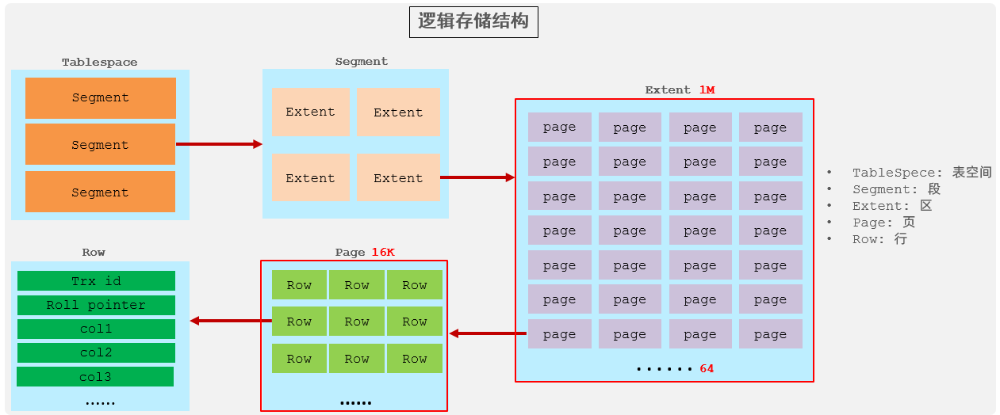
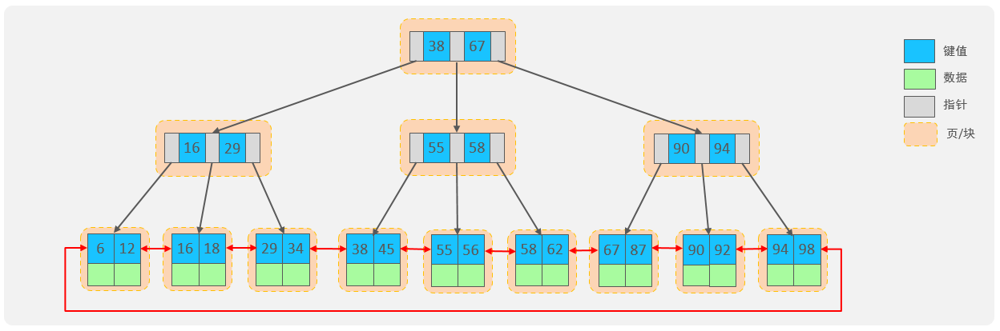

# MySQL

## MySQL基础

### DQL的执行顺序

1. FROM：先从表取数据
2. WHERE：过滤原始数据
3. GROUP BY：数据分组
4. 执行聚合函数
5. HAVING：过滤分组数据
6. SELECT：取出对应字段列表
7. ORDER BY：排序
8. LIMIT：分页

### 流程函数

- IF(value , t , f)：如果value为true，则返回t，否则返回f
- IFNULL(value1 , value2)：如果value1不为空，返回value1，否则返回value2
- CASE WHEN [ val1 ] THEN [res1] ... ELSE [ default ] END：如果val1为true，返回res1，... 否则返回default默认值
- CASE [ expr ] WHEN [ val1 ] THEN [res1] ... ELSE [ default ] END：如果expr的值等于val1，返回res1，... 否则返回default默认值

### 外键

MySQL中可以指定一个列的父表列，添加外键约束

    ALTER TABLE 表名 ADD CONSTRAINT 外键名称 FOREIGN KEY (外键字段名) REFERENCES 主表 (主表列名) ; # 添加外键约束
    ALTER TABLE 表名 DROP FOREIGN KEY 外键名称; # 去除外键约束，不是去除这个列

更新父表会受到约束，有以下几种行为

- NO ACTION：当在父表中删除/更新对应记录时，首先检查该记录是否有对应外键，如果有则不允许删除/更新。 (与 RESTRICT 一致) 默认行为
- RESTRICT：当在父表中删除/更新对应记录时，首先检查该记录是否有对应外键，如果有则不允许删除/更新。 (与 NO ACTION 一致) 默认行为
- CASCADE：当在父表中删除/更新对应记录时，首先检查该记录是否有对应外键，如果有，则也删除/更新外键在子表中的记录。
- SET NULL：当在父表中删除对应记录时，首先检查该记录是否有对应外键，如果有则设置子表中该外键值为null（这就要求该外键允许取null）。
- SET DEFAULT：父表有变更时，子表将外键列设置成一个默认的值 (Innodb不支持)

### 连接

连接就是把两张表左右拼起来，列按照ON的条件匹配

    表1 [ INNER ] JOIN 表2 ON 连接条件 ...

- [ INNER ] JOIN：内连接，只匹配ON条件成立的左表+右表的行
- LEFT [ OUTER ] JOIN：左外连接：保留左表所有行，匹配右表ON条件成立的行，如果左表的行没有对应右表行与之匹配，则右边的字段为NULL
- RIGHT [ OUTER ] JOIN：右外连接：保留右表所有行，匹配左表ON条件成立的行，如果右表的行没有对应右表行与之匹配，则左边的字段为NULL

表1和表2可以是同一张表，此时它们被视为逻辑上的两张表，为了区分必须取别名

UNION [ ALL ] 插入两条 SELECT 之间实现上下的连接，SELECT的两张表必须是同一张，列之间对齐匹配，行拼接

### 子查询

IN，NOT IN等关键字常用于子查询，XXX IN YYY，中XXX是希望匹配的字段，可以是单个，也可以()括起来用逗号隔开的多个，YYY是只有这两个字段的表

### 事务

默认MySQL的事务是自动提交的，也就是说，当执行完一条DML语句时，MySQL会立即隐式的提交事务，但有时候我们事实上需要让多条DML成为一个事务

需要手动提交事务，就需要关闭事务自动提交

    SET autocommit = 0;

使用START TRANSACTION或BEGIN开启事务

    -- 开启事务
    START TRANSACTION;

在开启之后的SQL语句都在一个事务内，使用COMMIT提交事务

注意，SQL 在你执行时就会立刻被执行（比如 INSERT、UPDATE 会立刻修改缓冲池/内存里的数据，并写入 redo/undo log），但结果不会对其他事务可见（取决于隔离级别），也不会“真正持久化”到磁盘

    -- 如果逻辑正确，提交事务
    COMMIT;

如果ROLLBACK回滚，那么这些SQL的结果不会提交，redo/undo log被恢复

    -- 如果中途有问题，撤销事务
    -- ROLLBACK;

Spring的事务机制底层就依赖数据库提供的事务功能。其本质上是对数据库事务的封装，通过 AOP 拦截方法事务方法调用，在代理类的对应方法开始时调用 JDBC 的 conn.setAutoCommit(false)（即 START TRANSACTION），结束时 COMMIT 或捕获配置的异常时 ROLLBACK

事务的四大特性，简称ACID

- 原子性（Atomicity）：事务是不可分割的最小操作单元，要么全部成功，要么全部失败。
- 一致性（Consistency）：事务完成时，必须使所有的数据都保持一致状态。
- 隔离性（Isolation）：数据库系统提供的隔离机制，保证事务在不受外部并发操作影响的独立环境下运行。
- 持久性（Durability）：事务一旦提交或回滚，它对数据库中的数据的改变就是永久的。

事务可能产生的并发问题有

- 脏读：其他事务读取到另一个事务没有提交的数据
- 不可重复读：一个事务内连续读取两次数据库，但在第一次读取后其他事务提交了对要读取的数据的修改，导致本事务第二次读取时数据不一致（针对同一行数据）
- 幻读：一个事务先查询数据时没有对应数据行，因此准备插入数据，但在插入数据前其他事务提交了相同数据的插入，导致本事务插入数据时已经存在对应数据，前面的查询没有起到作用（幻影），注意幻读是多了几行，但之前读到的行的数据是一样的

MySQL提供四种事务隔离级别，从上到下速度越慢，但安全性越高

| 隔离级别 | 脏读 | 不可重复读 | 幻读 |
| ------- | ---- | --------- | ---- |
|Read uncommitted(读未提交) | √ | √ | √ |
|Read committed(读已提交) | × | √ | √ |
|Repeatable Read(可重复读，默认) | × | × | √ |
|Serializable(串行化) | × | × | × |

对于RR，普通的SELECT是快照读，使用 MVCC，读取事务开始时的一致性视图（snapshot），此后重新使用SELECT读取行读取的是快照，无论有没有其他事务提交都不影响快照，因此解决了不可重复读和一部分的幻读问题，但如果之后又使用了SELECT UPDATE当前读，就不会读快照而是读取数据库的实际数据，因此还是会发生幻读。当前读会使用间隙锁，临键锁等防止其他事务修改查询的行

虽然RR是默认隔离级别，但RR使用了大量的锁，可能锁范围内的所有行，降低了并发。而RC通常只锁自己要改的行，锁的粒度小，性能更好，而RC的不可重复读问题通常也能靠乐观锁+版本号解决，因此部分情况下更倾向使用RC提高并发，降低死锁概率

## MySQL高级

### 体系架构

自顶向下分为四层

1. 连接层：负责客户端-服务端之间的TCP，SSL连接
2. 服务层：完成大多数的核心服务功能，如SQL接口，并完成缓存的查询，SQL的分析和优化，部分内置函数的执行。所有跨存储引擎的功能也在这一层实现，如 过程、函数等
3. 引擎层：存储引擎真正的负责了MySQL中数据的存储和提取，服务器通过API和存储引擎进行通信。索引在此层实现
4. 存储层：主要是将数据(如: redolog、undolog、数据、索引、二进制日志、错误日志、查询日志、慢查询日志等)存储在文件系统之上，并完成与存储引擎的交互

引擎层可以使用不同的存储引擎，主要有三种存储引擎 InnoDB、MyISAM、Memory，新版本MySQL 5.5 之后默认引擎是InnoDB

老版本默认引擎MyISAM只支持表锁，不支持外键，事务等功能。使用xxx.sdi：存储表结构信息，xxx.MYD: 存储数据，xxx.MYI: 存储索引

Memory引擎的表数据时存储在内存中的，一般只将这些表作为临时表或缓存使用

#### InnoDB

InnoDB是MySQL默认的引擎，特点是DML操作遵循ACID模型，支持事务，使用行级锁，提高并发访问性能，支持外键FOREIGN KEY约束，保证数据的完整性和正确性

存储文件是xxx.ibd：xxx代表的是表名，innoDB引擎的每张表都会对应这样一个表空间文件，存储该表的表结构（frm-早期的 、sdi-新版的）、数据和索引

    SHOW VARIABLES LIKE 'innodb_file_per_table';

查看innodb_file_per_table的配置，如果此项配置为ON，说明每张表都会存储为独立的idb文件，用以下命令查看文件的储存目录

    SHOW VARIABLES LIKE 'datadir';

InnoDB文件的结构如下

- 表空间 : InnoDB存储引擎逻辑结构的最高层，ibd文件其实就是表空间文件，在表空间中可以包含多个Segment段。
- 段 : 表空间是由各个段组成的， 常见的段有数据段、索引段、回滚段等。InnoDB中对于段的管理，都是引擎自身完成，不需要人为对其控制，一个段中包含多区
- 区 : 区是表空间的单元结构，每个区的大小为1M。 默认情况下， InnoDB存储引擎页大小为16K， 即一个区中一共有64个连续的页。
- 页 : 页是组成区的最小单元，页也是InnoDB 存储引擎磁盘管理的最小单元，每个页的大小默认为 16KB。为了保证页的连续性，InnoDB 存储引擎每次从磁盘申请 4-5 个区。
- 行 : InnoDB 存储引擎是面向行的，也就是说数据是按行进行存放的，在每一行中除了定义表时所指定的字段以外，还包含两个隐藏字段(后面会详细介绍)。

### 索引

对表的某个字段建立索引，MySQL就可以根据这个索引的值来使用数据结构（如B+树需要一个数字来分区）存储数据，主键一般有索引，但有索引的不一定是主键

InnoDB支持B+树索引，上层节点只存储索引，叶子节点储存索引+数据，叶子节点之间构成链表，InnoDB对叶子节点的链表进行优化，是一个双向成环的链表。一个上层索引的B+树节点占用一个页

hash索引提供O(1)的单个数据查找，不支持范围查找，Redis等key-value数据库采用类型原理。InnoDB中具有自适应hash功能，hash索引是InnoDB存储引擎根据B+Tree索引在指定条件下自动构建的

MySQL索引分为以下几类

- 主键索引：针对于表中主键创建的索引默认自动创建, 只能有一个，使用PRIMARY关键字指定
- 唯一索引：避免同一个表中某数据列中的值重复，可以有多个，使用UNIQUE指定
- 常规索引：快速定位特定数据，可以有多个
- 全文索引：全文索引查找的是文本中的关键词，而不是比较索引中的值，可以有多个，使用FULLTEXT指定

在InnoDB中索引的储存方法有两类

- 聚集索引(Clustered Index)：将数据存储与索引放到了一块，索引结构的叶子节点保存了行数据，必须有，而且只有一个，实际储存数据的B+树使用这个索引
- 二级索引(Secondary Index)：二级索引单独存储，索引结构的叶子节点关联的是对应的主键，可以存在多个，其B+树只储存对应的主键值，后靠聚簇索引查找

一张表必须有聚簇索引，选取规则是

- 如果存在主键，主键索引就是聚集索引
- 如果不存在主键，将使用第一个唯一（UNIQUE）索引作为聚集索引
- 如果表没有主键，或没有合适的唯一索引，则InnoDB会自动生成一个rowid作为隐藏的聚集索引

对一个字段新建立索引，建立的是二级索引，会生成一颗使用这个索引组织的二级索引B+树。通过二级索引查找，是二级索引中查找数据，找到主键值，然后再到聚集索引中根据主键值，获取数据，称之为回表查询

一个B+树节点占用一个页（16k），一个B+树非叶子节点n \* 8 + (n + 1) \* 6 = 16 * 1024，可解出n约为1170，也就是一个非叶子节点最多有1171个指针。假设每行占用1k，一个页也可以储存16行的叶子节点。因此对于两层B+树，最多能容纳的数据行数是1171 \* 16 = 18736，对于三层B+树，1171 \* 1171 \* 16 = 21939856，随着层数增加，能容纳的数据呈指数增长，三层B+树就可以组织百万级行的表

#### 索引SQL语句

有些字段比如年龄，薪水，商品价格等等经常用于范围查询，适合建立索引

创建索引

    CREATE [ UNIQUE | FULLTEXT ] INDEX index_name ON table_name (index_col_name,... ) ;

查看索引

    SHOW INDEX FROM table_name ;

删除索引

    DROP INDEX index_name ON table_name ;

#### 联合索引

在SELECT两个列的值并在WHERE上有这两个列的条件，之间用AND连接。这两个列都建立了索引，但MySQL只会选择一个进行索引（相当于先查出符合一个条件的数据），再回表查询其他列，用另一个条件过滤不符合要求的列（相当于用另一个条件筛选先前查出的哪些数据）。需要回表查询

可以对这两个列建立联合索引，这样MySQL就可以通过联合索引直接索引出所有符合条件的数据，不需要回表查询（只查询这两个列的情况下）

创建索引的命令中可以对多个列创建联合索引`(index_col_name,... )`，这里的列是有序的，颠倒顺序会导致行为的不同

实际使用索引中遵循**最左匹配原则**，列按照从左到右的顺序一步步筛选。比如对`(col1,col2,col3)建立索引，在SELECT时只要包含某个列，就必须包含之前的所有列，否则索引失效，反之不一定要包含之后的列（但不能跳过某个列），比如包含col3就必须包含col1，col2，但只包含col1也可以使用索引。包含越多列，使用的索引长度一般越大

联合索引中，如果某个列出现范围查询(>,<)，其右侧的列索引失效，因为(>,<)确定的开区间无法准确地找到边界并继续按照顺序扫描，而闭区间(>=,<=)就不会出现这种情况，因此**一般范围查询使用闭区间(>=,<=)**

此外，如果不同条件用OR连接，那么会每个条件都使用它们单独的索引

#### 索引失效的几种情况

- **查询条件是运算后的列而不是原始列**，比如使用SBUSTRING()函数截取字符串的一部分。因为实际建立索引的是原始列
- **字符串类型字段使用时不加引号**，比如某个字符串类型字段实际存储数字，查询条件使用数字时会隐式转化字符串但索引不会生效（当然如果字段是纯数字，更推荐使用数字类型储存）
- **字符串头部模糊查询**，LIKE '%xxx%'用于模糊查询任意开头，包含xxx，任意结尾的字符串，开头的'%'会导致索引失效，但只有尾部的'xxx%'情况下不会失效，因为索引匹配是从左向右的，左边的模糊查询会导致无法匹配
- **当OR连接的条件，左右两侧字段都有索引时，索引才会生效**，因为任意一个OR的列条件只要没有索引就必须全表扫描，需要全表扫描的情况下其他列即使有索引也没有使用的意义
- MySQL评估使用索引比全表更慢，则不使用索引，直接全表扫描。因为索引的B+树搜索也是有开销的，如果索引只能过滤少量数据速度就不如全表扫描

#### SQL提示

SQL提示可以自行指定使用的索引，写在FROM table_name之后，WHERE之前，注意指定的是索引的名称，可以用SHOW INDEX FROM table_name;查询表所有索引

    USE INDEX(index_name) # 建议MySQL使用哪一个索引完成此次查询，仅仅是建议
    IGNORE INDEX(index_name) # 忽略指定的索引
    FORCE INDEX(index_name) # 强制使用索引

#### 覆盖索引

尽量使用覆盖索引，减少SELECT *。覆盖索引是指查询使用了索引，并且需要返回的列，在该索引中已经全部能够找到

使用覆盖索引的条件下，查询对应二级索引B+树，可以直接在对应的叶子节点找到该列的值，而如果需要超出覆盖范围的列，就必须拿到主键id，在聚簇索引的B+树重新查找一遍，也就是回表查询

主键字段默认就是覆盖的，因为即使主键id不在建立的索引中，二级索引B+树也都存有对应的id值

#### 前缀索引

有的列需要索引很长的字符串，这会让索引变得很大，查询时，浪费大量的磁盘IO， 影响查询效率。此时可以只将字符串的一部分前缀，建立索引，这样可以大大节约索引空间

    CREATE INDEX index_name ON table_name(column(n)) ;

其中n是要建立索引的字符串的前缀长度，需要注意的是索引的前缀需要有选择性，如果这些字符串的前缀都类似，索引的选择性很低，就没有意义。唯一索引的选择性是1，这是最好的索引选择性，只是占用空间较大

#### 索引设计原则

- 针对于数据量较大，且查询比较频繁的表建立索引。
- 针对于常作为查询条件（where）、排序（order by）、分组（group by）操作的字段建立索引。
- 尽量选择区分度高的列作为索引，尽量建立唯一索引，区分度越高，使用索引的效率越高。
- 如果是字符串类型的字段，字段的长度较长，可以针对于字段的特点，建立前缀索引。
- 尽量使用联合索引，减少单列索引，查询时，联合索引很多时候可以覆盖索引，节省存储空间，避免回表，提高查询效率。
- 要控制索引的数量，索引并不是多多益善，索引越多，维护索引结构（B+树）的代价也就越大，会影响增删改的效率。适合对查询多增删改少的数据建立
- 如果索引列不能存储NULL值，请在创建表时使用NOT NULL约束它。当优化器知道每列是否包含NULL值时，它可以更好地确定哪个索引最有效地用于查询。

### SQL性能分析

#### 慢查询日志

通过慢查询日志，就可以定位出执行效率比较低的SQL，从而有针对性的进行优化

使用show [session|global] status 查看当前数据库的INSERT、UPDATE、DELETE、SELECT的访问频次：

    SHOW GLOBAL STATUS LIKE 'Com_______';

MySQL默认不开启慢查询日志，用以下方法查看

    SHOW VARIABLES LIKE 'slow_query_log';

可以在MySQL控制台开启，只对当前进程有效

    SET GLOBAL slow_query_log = 1; # 开启日志
    SET GLOBAL long_query_time = 2; # 设置慢查询阈值，单位是s

如果需要全局有效，需要修改MySQL的配置文件`/etc/my.cnf`

    # 开启MySQL慢日志查询开关
    slow_query_log=1
    # 设置慢日志的时间为2秒，SQL语句执行时间超过2秒，就会视为慢查询，记录慢查询日志
    long_query_time=2

日志记录在`/var/lib/mysql/localhost-slow.log`，修改配置文件的方法应该重启MySQL`systemctl restart mysqld`

#### profile

profile能够在做SQL优化时帮助我们了解时间都耗费的位置。通过have_profiling参数，能够看到当前MySQL是否支持profile操作

    SELECT @@have_profiling ; # 是否支持profiling
    SELECT @@profiling ; # 是否开启，0为未开启

通过SET设置VARIABLE profiling的值开启

    SET profiling = 1;

通过以下命令查看耗时

    -- 查看每一条SQL的耗时基本情况
    show profiles;
    -- 查看指定query_id的SQL语句各个阶段的耗时情况
    show profile for query [query_id];
    -- 查看指定query_id的SQL语句CPU的使用情况
    show profile cpu for query [query_id];

#### explain

在SELECT语句前加上EXPLAIN或DESC命令获取 MySQL 如何执行 SELECT 语句的信息

|字段 |含义|
|----|----|
|id | select查询的序列号，表示查询中执行select子句或者是操作表的顺序(id相同，执行顺序从上到下；id不同，值越大，越先执行)|
|select_type|表示 SELECT 的类型，常见的取值有 SIMPLE（简单表，即不使用表连接或者子查询）、PRIMARY（主查询，即外层的查询）、UNION（UNION 中的二个或者后面的查询语句）SUBQUERY（SELECT/WHERE之后包含了子查询）等|
|type|表示连接类型，性能由好到差的连接类型为NULL、system、const、eq_ref、ref、range、 index、all |
|possible_key |显示可能应用在这张表上的索引，一个或多个|
|key |实际使用的索引，如果为NULL，则没有使用索引|
|key_len|表示索引中使用的字节数， 该值为索引字段最大可能长度，并非实际使用长度，在不损失精确性的前提下， 长度越短越好 |
|rows|MySQL认为必须要执行查询的行数，在innodb引擎的表中，是一个估计值，可能并不总是准确的|
|filtered |表示返回结果的行数占需读取行数的百分比， filtered 的值越大越好，WHERE里的字段建立索引可能会提高此值|
|extra |其他的一些信息，比如Using filesort触发文件排序|

### SQL优化

#### 插入数据

在单条语句插入多个行的效率高于使用多条插入语句，批量插入数据使用

    INSERT INTO table_name VALUES (xxx),(xxx),(xxx)...

或者手动控制事务，完成多条语句的插入后再提交

如果使用MyBatis等操作数据库，Mapper应该提供批量插入数据的方法，使用 < foreach > 标签拼接SQL

    <insert id="function_name">
        INSERT INTO table_name (field0,field1,field2...) VALUES
        <foreach collection="collection_name" item="item_name" separator=",">
            (#{item_name.field0}, #{item_name.field1}, #{item_name.field2},...)
        </foreach>
    </insert>

对于大批量数据的插入，INSERT性能较低，可以使用LOAD

    -- 设置全局参数local_infile为1，开启从本地加载文件导入数据的开关
    SET GLOBAL local_infile = 1;
    -- 执行load指令将准备好的数据，加载到表结构中
    LOAD DATA LOCAL INFILE '/filepath/file.log' INTO TABLE tb_user FIELDS TERMINATED BY ',' LINES TERMINATED BY '\n';

其中INFILE后根要载入的文件路径，FIELDS TERMINATED BY表示不同列的字段用什么分隔（上面是','），LINES TERMINATED BY表示不同行靠上面分隔（上面是换行符'\n'）

如果主键是自行指定的情况下，根据主键的顺序插入性能高于乱序插入，因为主键本身是按顺序存储的

页分裂：发生乱序储存的情况下，如果一个页已经被行所占满，又有一条新行的主键位于这个页保存的行的范围，MySQL会向磁盘申请新页，把原页的一半数据移到新页，再找到对应位置插入新行，并调整叶子节点之间的指针。这个过程称为页分裂，比较耗费性能

页合并：一个页有的行被删除后，这个页就存在空闲的空间，而当这个页删除的行占用的空间达到MERGE_THRESHOLD（默认为页大小的50%）是，InnoDB会直接执行页合并，查找其周围（左右链表指向的页）是否有同样删除的行占用的空间达到MERGE_THRESHOLD，有就直接合并这两个页

#### 排序

MySQL的排序，有两种方式：

- Using filesort : 通过表的索引或全表扫描，读取满足条件的数据行，然后在排序缓冲区sortbuffer中完成排序操作，所有不是通过索引直接返回排序结果的排序都叫 FileSort 排序。也就是先查询，再对结果排序
- Using index : 通过有序索引顺序扫描直接返回有序数据，这种情况即为 using index，不需要额外排序，因为根据索引查出来的就是有序的

尽量使用Using index来排序，注意如果根据多个字段排序，要使用Using index这些字段必须能够覆盖索引（有建立可以覆盖的联合索引），多个字段之间也要遵循遵循最左匹配原则，只要排序的字段跳过联合索引顺序的某一字段，索引就失效，无法Using index

MySQL8之后支持降序索引，使用asc指定这个字段升序，desc指定降序

    create index idx_name on tb_user(xxx asc ,xxx desc);

此外排序的升/降序也应该和联合索引的升/降序一样，否则还是会触发Using filesort

如果不可避免的出现filesort，大数据量排序时，可以适当增大排序缓冲区大小sort_buffer_size(默认256k)

#### 分组

对无法被索引覆盖或索引失效的分组字段，分组必须依靠Using temporary

否则在分组操作时，可以通过索引来提高效率。分组操作时，索引的使用也是满足最左前缀法则

#### 分页（大分页问题）

当在进行分页查询时，比如执行 limit 2000000,10 ，此时需要MySQL查询前2000010 记录，仅仅返回 2000000 - 2000010 的记录，其他记录丢弃，查询排序的代价非常大

如果分页偏移量大但是要查询的数据量不多，可以通过覆盖索引+子查询优化，子查询通过查询limit 2000000,10的主键id，再回表通过主键id一个个查出具体的行，比直接limit性能高

    # 原始写法
    select * from tb_sku order by id limit 2000000,10
    # 优化写法
    select * from tb_sku t , (select id from tb_sku order by id limit 2000000,10) a where t.id = a.id;

直接LIMIT，由于查询的是*，无法使用索引进行范围查找，只能扫描2000010条所有行，而且必须查询所有数据，包括我们不想要的行的所有数据，而且它们被丢弃了

优化后，子查询只查询id，这是一个小结果集，只需要扫描描2000010条id而不是所有内容，比查询*速度块，查出其中的所有id，再用id回表查询。本质是因为子查询只查询id这一项而不是所有数据，查询的无效数据变少了

#### COUNT()

count(字段)，由于可能有NULL，需要逐个判断，对于不是NULL的按行累加，效率最低

count(主键 id)会取出主键，按行累加

count(1) 和 count(\*)不取值，只按行累加，效率高

count(字段) < count(主键 id) < count(1) ≈ count(\*)，所以尽量使用 count(\*)

#### 更新

更新时InnoDB会给要更新的行上锁，但如果更新条件无法索引或索引失效，就会升级为表锁，性能大幅下降

因为InnoDB的行锁是针对索引加的锁，不是针对记录加的锁 ,并且该索引不能失效，否则会从行锁升级为表锁

### 视图

视图（View）是一种虚拟存在的表。视图中的数据并不在数据库中实际存在，而是提供SELECT语句查出的观察窗口，只包含WHERE限制条件下的行（不是快照，因此会随着数据库内容变化而更改）

    CREATE [OR REPLACE] VIEW 视图名称[(列名列表)] AS SELECT语句 [ WITH [ CASCADED | LOCAL ] CHECK OPTION ]

创建完就可以当成正常的表一样SELECT查询，也可以用SHOW展示完整视图

    SHOW CREATE VIEW view_name

修改视图可以使用CREATE OR REPLACE或者ALTER

    CREATE OR REPLACE VIEW 视图名称[(列名列表)] AS SELECT语句 [ WITH [ CASCADED | LOCAL ] CHECK OPTION ]
    ALTER VIEW 视图名称 AS SELECT语句

删除视图使用DROP

    DROP VIEW [IF EXISTS] 视图名称 [,视图名称] ...

对视图的UPDATE/INSERT/DELETE的操作都会重定向到基表，但是如果操作产生的变化不会影响视图观察范围内的数据，视图的内容就不会变化

注意的是只有视图和基表存在一对一的映射时视图才是随着基表内容动态更新的。使用

- 聚合函数或窗口函数（SUM()、 MIN()、 MAX()、 COUNT()等）
- DISTINCT
- GROUP BY
- HAVING
- UNION 或者 UNION ALL

就不存在一对一的映射关系，视图就只是个快照，对这个视图进行更新或插入将会报错

一对一不是指一张视图对应一张基表，而是视图的一个数据必须在基表有对应数据存在，一个视图可以包含多个基表，仍然是一对一关系

视图主要用于简化多张表的操作，把经常多表查询的数据定义视图看起来变成一张表

#### 检查选项

使用检查选项时，会保证对视图的UPDATE/INSERT/DELETE的操作一定会对视图有影响，否则不在基表执行对应的操作

使用WITH [ CASCADED | LOCAL ] CHECK OPTION使用检查选项

- CASCADED：默认不写是这一项，对于多层的视图，会检查所有当前使用WITH CASCADED CHECK OPTION及其之前的视图的条件
- LOCAL：只检查当前WITH LOCAL CHECK OPTION视图的条件

### 过程（原始SQL函数）

过程类似于SQL中的函数，除了没有返回值，可以封装一串操作逻辑，接受参数。由于没有返回值，过程要返回任何信息都依赖对参数的修改

创建过程

    CREATE PROCEDURE 存储过程名称 ([ 参数列表 ])
    BEGIN
    -- SQL语句
    END ;

调用过程

    CALL 名称 ([ 参数 ]) ;

查看过程状态和定义

    SELECT * FROM INFORMATION_SCHEMA.ROUTINES WHERE ROUTINE_SCHEMA = 'xxx'; -- 查询指定数据库的存储过程及状态信息
    SHOW CREATE PROCEDURE 存储过程名称 ; -- 查询某个存储过程的定义

删除过程

    DROP PROCEDURE [ IF EXISTS ] 存储过程名称 ；

如果在命令行中，执行创建存储过程的SQL时，需要通过关键字 delimiter 指定SQL语句的结束符

#### 参数

创建过程可以带参数列表，一个参数由[ IN/OUT/INOUT 参数名 参数类型 ]组成，不同参数用逗号隔开

- IN 该类参数作为输入，也就是需要调用时传入值，默认
- OUT 该类参数作为输出，也就是该参数可以作为返回值
- INOUT 既可以作为输入参数，也可以作为输出参数

    CREATE PROCEDURE 存储过程名称 ([ IN/OUT/INOUT 参数名 参数类型 ])
    BEGIN
    -- SQL语句
    END ;

没有显式的返回语句，标记为OUT，INOUT的参数都将被返回，返回的指直接存入传入的变量，不是显式返回，一般IN/OUT变量都是@用户变量

#### 变量

正常的编程语言都有变量的概念，SQL也提供了变量

##### 系统变量

系统变量 是MySQL服务器提供，用户无法定义。分为全局变量（GLOBAL）、会话变量（SESSION），它们的区别是SESSION仅对当前会话有效，GLOBAL在当前MySQL进程的所以会话都有效，以@@标识的是系统变量

查看系统变量

    SHOW [ SESSION | GLOBAL ] VARIABLES ; -- 查看所有系统变量
    SHOW [ SESSION | GLOBAL ] VARIABLES LIKE '......'; -- 可以通过LIKE模糊匹配方式查找变量
    SELECT @@[SESSION | GLOBAL].系统变量名; -- 查看指定变量的值

设置系统变量

    SET [ SESSION | GLOBAL ] 系统变量名 = 值 ;
    SET @@[SESSION | GLOBAL].系统变量名 = 值 ;

MySQL进程重新启动，所有设置的系统变量变回默认值，需要永久生效的系统变量应当在/etc/my.cnf 中配置

##### 用户变量（全局）

是用户自己定义的全局变量，以@标识的是用户变量

使用SET或者SELECT INTO定义用户变量，以下四种都是对的

    SET @var_name = expr [, @var_name = expr] ... ;
    SET @var_name := expr [, @var_name := expr] ... ;
    SELECT @var_name := expr [, @var_name := expr] ... ;
    SELECT 字段名 INTO @var_name FROM 表名;

查看，用户定义的变量使用时无需对其进行声明或初始化，只不过获取到的值为NULL

    SELECT @var_name ;

##### 局部变量

类似大部分编程语言的栈区变量，不需要任何前缀标识，一般用在过程中

声明，变量类型是数据库字段类型：INT、BIGINT、CHAR、VARCHAR、DATE、TIME等

    DECLARE 变量名 变量类型 [DEFAULT ... ] ;

赋值

    SET 变量名 = 值 ;
    SET 变量名 := 值 ;
    SELECT 字段名 INTO 变量名 FROM 表名 ... ;

查看

    SELECT 变量名

和用户变量不同，局部变量使用前必须DECLARE

#### 控制

所有的控制，循环语句都有END XXX;表示结尾，分号只在其后面加

IF ... THEN ...语句用于控制，第一个IF是必须的，END IF也是必须的用于标识IF的结尾

    IF 条件1 THEN
    .....
    ELSEIF 条件2 THEN -- 可选
    .....
    ELSE -- 可选
    .....
    END IF;

CASE ... WHEN ... THEN ...类似C++提供的switch语句（CASE--switch WHEN--case: ELSE--default），也用于控制，进行条件匹配

一种用法接受switch的匹配，当case_value的值为 when_value1时，执行statement_list1，当值为 when_value2时，执行statement_list2， 否则就执行 statement_list

    CASE case_value
    WHEN when_value1 THEN statement_list1
    [ WHEN when_value2 THEN statement_list2] ...
    [ ELSE statement_list ]
    END CASE;

另一种用法不需要要匹配的项，而是直接检查条件，当条件search_condition1成立时，执行statement_list1，当条件search_condition2成立时，执行statement_list2， 否则就执行 statement_list

    CASE
    WHEN search_condition1 THEN statement_list1
    [WHEN search_condition2 THEN statement_list2] ...
    [ELSE statement_list]
    END CASE;

#### 循环

WHILE ... DO ...是有条件的循环控制语句。满足条件后，再执行循环体

    WHILE 条件 DO
    SQL逻辑...
    END WHILE;

REPEAT ... UNTIL ...也是有条件的循环控制语句, 当满足until声明的条件的时候，则退出循环，类似do while不过是条件为真的适合退出，REPEAT的SQL逻辑必然执行至少一次

    REPEAT
    SQL逻辑...
    UNTIL 条件
    END REPEAT;

LOOP ... 实现简单的循环，如果不在SQL逻辑中增加退出循环的条件，是死循环，一般配合这两个语句使用：

- LEAVE ：类似break配合循环使用，退出循环。
- ITERATE：类似continue，必须用在循环中，作用是跳过当前循环剩下的语句，直接进入下一次循环

    [begin_label:] LOOP
    SQL逻辑...
    END LOOP [end_label]; //begin_label和end_label一般是同一个，表明同一个LOOP循环

    LEAVE label; -- 退出指定标记的循环体
    ITERATE label; -- 直接进入下一次循环

#### 游标（迭代器）

游标（CURSOR）是用来存储查询结果集的数据类型，注意是存储，即使原表数据不在了游标的数据也存在, 在存储过程和函数中可以使用游标对结果集进行循环的处理，类似迭代器

创建游标

    DECLARE 游标名称 CURSOR FOR 查询语句 ;

打开游标，此时游标指向第一个记录

    OPEN 游标名称 ;

获取游标记录，按照顺序存入变量，FETCH获取一条记录后游标就指向下一个位置，如果当前位置已经没有数据（到达末尾），会报错

    FETCH 游标名称 INTO 变量 [, 变量 ] ;

关闭游标

    CLOSE 游标名称 ;

#### 条件处理（异常处理）

条件处理器像更异常处理，就像Linux中可以自定义异常处理函数并用`signal()`把某个异常的处理重定向到这个函数。条件处理定义了SQL异常时的处理逻辑，SQL执行时抛出某个状态码的异常，定义的条件处理程序捕获对应状态码的异常，执行某些操作后退出/继续原SQL的执行

定义条件处理器

    DECLARE handler_action HANDLER FOR condition_value [, condition_value] ... statement ;

handler_action 的取值：

- CONTINUE: 继续执行当前程序
- EXIT: 终止执行当前程序

condition_value 的取值：

- SQLSTATE sqlstate_value: 状态码，如 02000

还有其他的一些特殊关键字是某些状态码的别名

- SQLWARNING: 所有以01开头的SQLSTATE代码的简写
- NOT FOUND: 所有以02开头的SQLSTATE代码的简写
- SQLEXCEPTION: 所有没有被SQLWARNING 或 NOT FOUND捕获的SQLSTATE代码的简写

具体的错误状态码，可以参考官方文档：
<https://dev.mysql.com/doc/refman/8.0/en/declare-handler.html>
<https://dev.mysql.com/doc/mysql-errors/8.0/en/server-error-reference.html>

### 函数

MySQL提供了更类似函数的工具，函数是有返回值的存储过程，大部分语法和过程相同，但存储函数的参数只能是IN类型的，用显式的RETURN返回

    CREATE FUNCTION 存储函数名称 ([ 参数列表 ]) RETURNS type [characteristic ...]
    BEGIN
    -- SQL语句
    RETURN ...;
    END ;

characteristic是一个可选的特殊的标识字段，有以下几种

- DETERMINISTIC：相同的输入参数总是产生相同的结果，也就是这个函数是无状态的
- NO SQL ：这个函数不包含任何 SQL 语句
- READS SQL DATA：只包含读取数据的语句，但不包含写入数据的语句，不会对表造成更改

不过在mysql8.0版本中binlog默认是开启的，一旦开启了binlog，函数就必须有characteristic

### 触发器

触发器是与表有关的数据库对象（属于数据库，不是表），指在insert/update/delete之前(BEFORE)或之后(AFTER)，触发并执行触发器中定义的SQL语句集合，一般用来记录此类型操作的日志

创建触发器

    CREATE TRIGGER trigger_name BEFORE/AFTER INSERT/UPDATE/DELETE ON tbl_name FOR EACH ROW -- 行级触发器
    BEGIN
    trigger_stmt ; -- 触发器的逻辑
    END;

触发器是可以在其逻辑里拿到执行这个操作的数据库行的，直接用NEW/OLD来指代行对象，比如NEW.id可以拿到新行的id字段

- INSERT 型触发器：NEW 表示将要或者已经新增的数据
- UPDATE 型触发器：OLD 表示修改之前的数据 , NEW 表示将要或已经修改后的数据
- DELETE 型触发器：OLD 表示将要或者已经删除的数据

查看当前数据库所有触发器

    SHOW TRIGGERS ;

删除指定数据库下的触发器

    DROP TRIGGER [schema_name.]trigger_name ; -- 如果没有指定 schema_name，默认为当前数据库 

典型的一个记录UPDATE操作日志的实现如下，用new拿到新数据行，old拿到老数据行

    create trigger tb_user_insert_trigger after insert on tb_user for each row
    begin
    insert into user_logs(id, operation, operate_time, operate_id, operate_params)
    VALUES
    (null, 'insert', now(), new.id, concat('插入的数据内容为:
    id=',new.id,',name=',new.name, ', phone=', NEW.phone, ', email=', NEW.email, ',
    profession=', NEW.profession));
    end;

### 锁

InnoDB中的锁，按照锁的粒度分，分为以下三类：

- 全局锁：锁定数据库中的所有表。
- 表级锁：每次操作锁住整张表。
- 行级锁：每次操作锁住对应的行数据

InnoDB 的锁本质上分为：

- 读锁（S锁, Shared Lock）：允许多个事务同时读，不允许修改。
- 写锁（X锁, Exclusive Lock）：一个事务独占，其他事务不能读/写。

InnoDB的锁在执行对应的SQL语句时才尝试上锁，在事务结束时才释放，锁是针对不同事务而言的，同一个事务内的其它操作不会被本事务加上的锁阻塞

#### 全局锁（数据库锁）

将锁住整个数据库，DML，DDL，事务的提交全部阻塞，属于S锁，只查不改。通常用于数据库备份的情况，执行备份时不应该有任何数据库更新

    FLUSH TABLES WITH READ LOCK ; -- 加全局锁

    UNLOCK TABLES ;释放锁

在shell中执行数据库备份

    mysqldump -uroot –pXXXXXX itcast > itcast.sql

锁的粒度很大，对主库上锁，业务停摆，从库上锁无法同步主库binlogd导致主从延迟。

在InnoDB引擎中，我们可以在备份时加上参数 --single-transaction 参数来完成不加锁的一致性数据备份

    mysqldump --single-transaction -uroot –pXXXXXX itcast > itcast.sql
    
#### 表级锁

表级锁，每次操作锁住整张表。锁定粒度大，应用在MyISAM、InnoDB、BDB等存储引擎中

表级锁，主要分为以下三类：

- 表锁
- 元数据锁（meta data lock，MDL）
- 意向锁

##### 表锁

表锁对表加锁，READ加S锁，WRITE加X锁

    LOCK TABLES table_name... READ/WRITE ; -- 加表锁

    UNLOCK TABLES ; -- 释放锁，加锁的客户端断开连接也会释放锁

##### 元数据锁

元数据锁MDL用来给表的元数据加锁，MDL加锁过程是系统自动控制，无需显式使用，在访问一张表的时候会自动加上。MDL锁主要作用是维护表元数据的数据一致性，在表上有活动事务的时候，不可以对元数据进行写入操作

|对应SQL| 锁类型 |说明|
|-------|-------|----|
|lock tables xxx read / write|SHARED_READ_ONLY / SHARED_NO_READ_WRITE| |
|select 、select ... lock in share mode|SHARED_READ|与SHARED_READ、SHARED_WRITE兼容，与EXCLUSIVE互斥|
|insert 、update、delete、select ... for update|SHARED_WRITE|与SHARED_READ、SHARED_WRITE兼容，与EXCLUSIVE互斥|
|alter table ...| EXCLUSIVE| 与其他的MDL都互斥|

可以发现执行ALTER TABLE和所有的增删改查操作都互斥，因为表的结构在完成更改前不应当有这种操作

##### 意向锁

原来的情况下，表中有行锁就和表锁互斥，加行锁需要检查每一行是否有行锁

InnoDB中引入了意向锁，意向锁属于表，用于表示表中是否存在行锁，使得表锁不用检查每行数据是否加锁，使用意向锁来减少表锁的检查

此时，在某个客户端执行DML操作时，不仅会对涉及的行加行锁，同时也会对该表加上意向锁。其他客户端在对这张表加表锁的时候，直接根据意向锁来判定是否可以成功加表锁，无需遍历每一行

意向锁分类

- 意向共享锁(IS): 由语句select ... lock in share mode添加 。 与 表锁读锁(read)兼容，与表锁写锁(write)互斥。
- 意向排他锁(IX): 由insert、update、delete、select...for update添加 。与表锁读锁(read)及写锁(write)都互斥，意向锁之间不会互斥，因为不同的行之间的行锁本来就不会互斥

可以使用`select object_schema,object_name,index_name,lock_type,lock_mode,lock_data from performance_schema.data_locks;`查看表的意向锁及行锁的加锁情况

#### 行级锁

InnoDB的数据是基于索引组织的，行锁是通过对索引上的索引项加锁来实现的，而不是对记录加的锁。对于行级锁，主要分为以下三类：

- 行锁：锁定单个行记录的锁，防止其他事务对此行进行update和delete。在RC、RR隔离级别下都支持
- 间隙锁：锁定索引记录间隙（不含该记录），确保索引记录间隙不变，防止其他事务在这个间隙进行insert，产生幻读。在RR隔离级别下都支持
- 临键锁：行锁+间隙锁，同时锁住数据行，和前面的间隙Gap。在RR隔离级别下支持

##### 行锁

行锁对一行数据加锁，和表锁一样，同样实现了两种，读锁（共享锁）和写锁（排他锁）

没有直接给行上锁的语句，行锁是根据DML，DQL语句的类型自动添加的

|SQL |行锁类型 |说明|
|----|--------|----|
|INSERT ... |排他锁| 自动加锁|
|UPDATE ... |排他锁| 自动加锁|
|DELETE ... |排他锁| 自动加锁|
|SELECT（正常）|不加任何锁| |
|SELECT ... LOCK IN SHARE MODE|共享锁|需要手动在SELECT之后加LOCK IN SHARE MODE|
|SELECT ... FOR UPDATE |排他锁 |需要手动在SELECT之后加FOR UPDATE|

普通的SELECT使用MVCC，在事务开始时就生成表的快照，所有SELECT都只查询快照的历史版本，因此不需要任何锁

当前读SELECT ... FOR UPDATE，意图是读取最新数据并上锁防止数据被修改，因此之后的UPDATE之前的数据和查询的数据一定是一样的，主要用于一个事务内通过查询结果判断更新条件的情况，如果只是查询不应该使用当前读

对任何非快照操作

- 针对唯一索引进行检索时，对已存在的记录进行等值匹配时，将会自动优化为行锁。
- InnoDB的行锁是针对于索引加的锁，不通过索引条件检索数据，那么InnoDB将对表中的所有记录加锁，此时 就会升级为表锁

##### 间隙锁，临键锁

此类锁只出现在RR隔离级别，RC级别不加此类锁

幻读的原因是因为一个读取事务过程中发生了新的插入没有被查询到，因此是幻影行，之后才会查询到，为了避免幻读就必须阻止插入，也就是间隙锁锁定要插入的间隙。

INSERT一般只指对插入行加行X锁

UPDATE/DELETE的执行范围可能是多个行，对所有行加锁，所有行的间隙（包括边缘行的外间隙）加间隙锁，防止出现新的插入导致UPDATE/DELETE操作跳过这行

SELECT (FOR UPDATE，加X锁/LOCK IN SHARE MODE 加S锁)时，InnoDB在 RR事务隔离级别运行，InnoDB使用临键锁进行搜索和索引扫描，锁定匹配行和其前面的间隙，以防止幻读

- 索引上的等值查询/修改(使用=，并且索引是UNIQUE)，查询不存在的记录, 对这个记录的位置间隙加间隙锁（不需要对后面的间隙加锁是因为UNIQUE）
- 索引上的等值查询/修改(使用=，但索引不是UNIQUE，可能有重复索引)，向右遍历时到最后一个行满足查询需求时，next-key lock 退化为间隙锁，锁住匹配行后的间隙
- 索引上的范围查询/修改(唯一索引)--会访问到不满足条件的第一个值为止

注意，间隙锁唯一目的是防止其他事务插入间隙。因此多个间隙锁可以共存（反之，多个行X锁是互斥的），因为它们的共同目的是阻止插入，一个事务采用的间隙锁不会阻止另一个事务在同一间隙上采用间隙锁。因此间隙锁我理解为一种S锁，和其它间隙锁不互斥，但和对该间隙的INSERT操作互斥

间隙锁并不能完全解决幻读，因为锁的范围只有一部分，其它部分依然能发生插入，导致事务期间出现新的行

只使用SELECT快照读时，由于所有数据都来自不改变的快照，因此一定不发生幻读

### InnoDB引擎

InnoDB的逻辑存储结构包括

1. 表空间：表空间是InnoDB存储引擎逻辑结构的最高层， 如果用户启用了参数 innodb_file_per_table(在8.0版本中默认开启) ，则每张表都会有一个表空（xxx.ibd），一个mysql实例可以对应多个表空间，用于存储记录、索引等数据。
2. 段：分为数据段（Leaf node segment）、索引段（Non-leaf node segment）、回滚段（Rollback segment），InnoDB是索引组织表，数据段就是B+树的叶子节点， 索引段即为B+树的非叶子节点。段用来管理多个Extent（区）。
3. 区：表空间的单元结构，每个区的大小为1M。 默认情况下， InnoDB存储引擎页大小为16K， 即一个区中一共有64个连续的页。
4. 页：是InnoDB 存储引擎磁盘管理的最小单元，每个页的大小默认为 16KB。为了保证页的连续性，InnoDB 存储引擎每次从磁盘申请 4-5 个区。
5. 行：InnoDB 存储引擎数据是按行进行存放的。在行中，默认有两个隐藏字段，用于事务回滚：
    - Trx_id：每次对某条记录进行改动时，都会把对应的事务id赋值给trx_id隐藏列。
    - Roll_pointer：每次对某条引记录进行改动时，都会把旧的版本写入到undo日志中，然后这个隐藏列就相当于一个指针，可以通过它来找到该记录修改前的信息。

InnoDB的架构包括内存结构（左）和磁盘结构（右）

#### 内存结构

内存结构中，主要分为四大块

- Buffer Pool：内存缓冲池，不仅缓存了索引页和数据页，还包含了undo页、插入缓存、自适应哈希索引以及InnoDB的锁信息等，查询时先查询缓冲池，未命中才查询磁盘并缓存，修改如果缓冲有数据则直接对缓冲池操作，再以一定频率刷新到磁盘。缓冲池以Page页为单位，底层采用链表数据结构管理Page，这部分通常分配80％的物理内存。根据状态，将Page分为三种类型
  - free page：空闲page，未被使用。
  - clean page：被使用page，数据没有被修改过。
  - dirty page：脏页，被使用page，数据被修改过，需要刷新到磁盘
- Change Buffer：更改缓冲区（针对于非唯一的二级索引页），在执行DML语句时，即使这些数据Page没有在Buffer Pool中，也不会直接操作磁盘，而会将数据变更存在更改缓冲区 Change Buffer中，在未来数据被读取时，才将数据合并恢复到Buffer Pool中（不是直接到磁盘）
- Adaptive Hash Index：自适应hash索引，用于优化对Buffer Pool数据的查询，复杂度O(1)。自适应哈希索引是InnoDB根据情况自动建立的，无需人工干预
- Log Buffer：日志缓冲区，用来保存要写入到磁盘中的log日志数据（redo log 、undo log），默认大小为 16MB，日志缓冲区的日志会定期刷新到磁盘中。如果需要更新、插入或删除许多行的事务，增加日志缓冲区的大小可以节省磁盘 I/O

所有对数据库的修改操作，一定都会先修改内存缓冲区Change Buffer/Buffer Pool，再刷新回磁盘

日志缓冲区提供以下参数调整

- innodb_log_buffer_size：缓冲区大小
- innodb_flush_log_at_trx_commit：日志刷新到磁盘时机，取值主要包含以下三个：
  - 1: 日志在每次事务提交时写入并刷新到磁盘，默认值。
  - 0: 每秒将日志写入并刷新到磁盘一次。
  - 2: 日志在每次事务提交后写入，并每秒刷新到磁盘一次。

内存的各类缓冲区的主要作用是缓存数据到内存加速查询，在内存合并多个修改操作减少磁盘I/O

#### 磁盘结构

磁盘结构包括七部分

- System Tablespace

系统表空间是更改缓冲区的存储区域。如果表是在系统表空间而不是每个表文件或通用表空间中创建的，它也可能包含表和索引数据。(在MySQL5.x版本中还包含InnoDB数据字典、undolog等)，默认的文件名叫 ibdata1

- File-Per-Table Tablespaces

如果开启了innodb_file_per_table开关（默认开启），则每个表的文件表空间包含单个InnoDB表的数据和索引 ，并存储在文件系统上的单个数据文件中，可以在MySQL对应目录找到这个表的idb文件

- General Tablespaces

通用表空间，需要通过 CREATE TABLESPACE 语法创建通用表空间，在创建表时，可以指定该表空间储存表

    -- 创建表空间
    CREATE TABLESPACE ts_name ADD DATAFILE 'file_name' ENGINE = engine_name;
    -- 创建表时指定表空间
    CREATE TABLE xxx ... TABLESPACE ts_name;

- Undo Tablespaces

撤销表空间，MySQL实例在初始化时会自动创建两个默认的undo表空间（初始大小16M），用于存储undo log日志，undo log用于事务回滚时恢复原来的数据

- Temporary Tablespaces

InnoDB 使用会话临时表空间和全局临时表空间。存储用户创建的临时表等数据

- Doublewrite Buffer Files

双写缓冲区，innoDB引擎将数据页从Buffer Pool刷新到磁盘前，先将数据页写入双写缓冲区文件中，便于系统异常时恢复数据

- Redo Log

重做日志，是用来实现事务的持久性。该日志文件由两部分组成：重做日志缓冲（redo log buffer）以及重做日志文件（redo log）,前者是在内存中，后者在磁盘中。当事务提交之后会把所有修改信息都会存到该日志中, 用于在刷新脏页到磁盘时, 恰好发生错误导致还没来得及写入完。 恢复后对比redo log和磁盘数据，不一致时就重新写入这些数据

#### 后台线程

后台线程用于把内存缓冲区的数据按照一定频率持久化到磁盘中，响应IO请求等，主要分为四种

- Master Thread：核心后台线程，负责调度其他线程，还负责将缓冲池中的数据异步刷新到磁盘中, 保持数据的一致性，还包括脏页的刷新、合并插入缓存、undo页的回收
- IO Thread：在InnoDB存储引擎中大量使用了AIO来处理IO请求, 这样可以极大地提高数据库的性能，而IO Thread主要负责这些IO请求的回调，使用`show engine innodb status \G;`来显示IO Thread的信息，包括
  - Read thread， 默认4个， 负责读操作
  - Write thread， 默认4个， 负责写操作
  - Log thread， 默认1个， 负责将日志缓冲区刷新到磁盘
  - Insert buffer thread， 默认1个， 负责将写缓冲区内容刷新到磁盘
- Purge Thread：主要用于回收事务已经提交了的undo log，在事务提交之后，undo log不用了，就用它来回收
- Page Cleaner Thread：协助 Master Thread 刷新脏页到磁盘的线程，它可以减轻 Master Thread 的工作压力，减少阻塞

#### 事务原理

事务的四大特性，简称ACID

- 原子性（Atomicity）：事务是不可分割的最小操作单元，要么全部成功，要么全部失败。
- 一致性（Consistency）：事务完成时，必须使所有的数据都保持一致状态。
- 隔离性（Isolation）：数据库系统提供的隔离机制，保证事务在不受外部并发操作影响的独立环境下运行。
- 持久性（Durability）：事务一旦提交或回滚，它对数据库中的数据的改变就是永久的。

原子性、一致性、持久化，实际上是由InnoDB的redo log, undo log保证，隔离性由锁和MVCC提供一部分保证

##### redo log

重做日志，记录事务提交时数据页的物理修改（也就是修改的物理数据，属于物理日志）。正常的修改操作是面向内存缓冲区，完成内存的修改就已经成功提交事务，后台线程按照一定频率把缓冲区数据复制到磁盘。如果缓冲区数据复制到磁盘的时候发生崩溃，内存的数据就没有写到磁盘，此时就需要redo log来恢复这些需要写入磁盘的数据

redo log机制包括内存的redo log buffer和磁盘的redo log文件，事务修改数据时不仅修改内存缓冲区数据，也修改redo log buffer的数据记录数据更改，**在事务提交时，一定会先把redo log buffer的数据写到磁盘的redo log文件，才显示事务成功提交**。只要日志记录到磁盘，数据就已经持久化了，而当脏页成功刷新到磁盘 或 或者涉及到的数据已经落盘时，redo log文件记录的日志就冗余了，可以删除。实际是在两个redo log文件循环写

为什么不直接让脏页刷新磁盘再显示事务成功提交呢，因为这个过程一般是随机写入，而日志的写入是顺序写入，顺序写的速度远高于随机写。先写日志的方式，称之为 WAL

##### undo log

回滚日志，记录事务操作前的数据库，因为修改的内容可能只有一小部分，因此它是逻辑日志，也就是记录的是事务操作的反向操作（比如事务有一条INSERT，undo log就记录这条数据的DELETE），只需要记录数据库操作而不需要记录完整的数据库数据，节省了空间

理论上事务提交就不可能回滚，此时undo log就可以删除了，但事实上并不会立即删除undo log，因为这些日志可能还用于MVCC

undo log采用段的方式进行管理和记录，存放在前面介绍的 rollback segment 回滚段中，内部包含1024个undo log segment

#### MVCC

先理解快照读和当前读的概念

当前读，一定读取磁盘的最新数据，并对要读的数据加锁（RR下还可能对间隙加锁防止幻读）保证读到的数据不被修改，保证可重复读。select ... lock in share mode(共享锁)，select ...for update、update、insert、delete这些过程都要发生磁盘上的数据查询（删改操作也要先查询到要删改的位置，也有读的操作），属于当前读。当前读的情况下可以读到其它事务提交的的新数据（幻读）

快照读，在事务的某个时间段读取数据库生成快照，此后从快照读取数据，不再查询数据库，也不会对数据库加锁造成阻塞。默认的select是快照读，不同隔离级别下的生成快照的行为不同

- Read Committed：每次select，都生成一个快照读，因此还是可以查到其它事务提交的数据（幻读）
- Repeatable Read：开启事务后第一个select语句生成快照，此后从快照读取，因为快照不会改变，所以不会幻读
- Serializable：快照读直接退化为当前读

MVCC全称 Multi-Version Concurrency Control，多版本并发控制。指维护一个数据的多个版本，使得读写操作没有冲突，快照读为MySQL实现MVCC提供了一个非阻塞读功能。MVCC的具体实现，依赖于数据库记录中几个部分，包括三个隐式字段、undo log日志和readView

##### 隐藏字段

一张表除了创建表时指定的字段还有2-3个隐藏字段，分别是

- DB_TRX_ID：最近修改事务ID，记录插入这条记录或最后一次修改该记录的事务ID
- DB_ROLL_PTR：回滚指针，指向这条记录的上一个版本，用于配合undo log，指向上一个版本
- DB_ROW_ID（可选）：隐藏主键，如果表结构没有指定主键，将会生成该隐藏字段

注意，这些字段只在聚簇索引上有，二级索引是没有的

##### 再看undo log

前面提到undo log在事务结束后不一定删除，其实分两种情况：

- 当insert的时候，产生的undo log日志只是一条删除操作，旧版本是空的，因此只在回滚时需要，在事务提交后，可被立即删除
- 而update、delete的时候，产生的undo log日志不仅在回滚时需要，在快照读时也需要，不会立即被删除

任何增/删/改操作，都会修改DB_TRX_ID，用自增的最新操作事务ID来表示数据的版本，同时修改DB_ROLL_PTR，指向undo log的上一个版本

不同事务或相同事务对同一条记录进行修改，会导致该记录的undolog生成一条记录版本链表，链表的头部是最新的旧记录，链表尾部是最早的旧记录，从这一条数据的DB_ROLL_PTR范围链表头部

##### 读视图ReadView

ReadView（读视图）是 快照读 SQL执行时MVCC提取数据的依据，记录并维护系统当前活跃的事务（还未提交）的id。虽然叫读视图，它并不是复制当前的表的全部数据，而是利用四个核心字段 + undo log来以行为单位生成读视图

ReadView包含四个核心字段，它们是在生成ReadView的时候就决定了，不会动态变化

- m_ids：当前活跃的事务ID集合
- min_trx_id：最小活跃事务ID
- max_trx_id：预分配事务ID，当前最大事务ID+1（因为事务ID是自增的）
- creator_trx_id：ReadView创建者的事务ID

版本链数据的访问规则，其中trx_id 代表当前undolog版本链对应事务ID

|条件| 是否可以访问| 说明|
|----|------------|----|
|trx_id == creator_trx_id |可以访问该版本| 说明数据是当前这个事务更改的，事务的更改一定要对本事务可见|
|trx_id < min_trx_id |可以访问该版本 |id比任何活跃事务的id都小，说明数据已经提交了|
|trx_id > max_trx_id |不可以访问该版本|说明该事务是在ReadView生成后才开启的|
|min_trx_id <= trx_id <= max_trx_id|如果trx_id不在m_ids中，是可以访问该版本的|虽然再它前面的事务还没有提交，但它不属于当前存在的活跃事务，说明这个事务的数据已经提交|

ReadView的规则保证了其只能访问到生成的瞬间已经提交的事务的数据。ReadView生成后即使有新的事务提交，其结果也是不可见的

在这条规则下，读取的数据行是在当前数据行->undo log历史版本行的链表从头到尾匹配的，不匹配就访问链表的下一个版本，直到可以匹配为止。一条某个版本的因为事务ID自增，数据只有从不可访问->可访问的变化，反过来是不可能的。因此对于一个ReadView，第一个可以访问的undo log保留，其后面的链表部分都可以删除，因为只要访问这个节点就一定可以访问

不同隔离级别生成ReadView的规则不同，在一个事务内，

- RC：每次SELECT都生成，规则保证了RC级别下一定读到的是其它事务已经提交的数据，但不保证同一个事务之后的读不会读到新的行
- RR：仅在第一次SELECT生成，后续复用该ReadView，因为ReadView只生成一次，不仅只能读到已经提交的数据，同一个事务之后的读也不会读到新的行（读的是同一个ReadView，匹配规则一致，如果链表头插入了新的行其版本也一定大于max_trx_id，不会匹配，因此只要ReadView一致，读到的数据一定一致）

只用快照读，读的是同一个ReadView，自然不会幻读。只有使用当前读是，由于间隙锁，临键锁能锁住的索引范围有限，才可能导致事务存在期间有新的插入，重新当前读才会读到新的数据

对于二级索引，没有版本链表，需要查找版本必须回表查询。因此二级索引页的头部有一个 page_max_trx_id 表示修改过该页的最大事务id。执行select时命中该页，如果 ReadView 的 min_trx_id 比该页的 page_max_trx_id 大，说明这个二级索引页修改的事务已经提交，该页的所有记录对本事务的本次查询可见，直接返回。否则，就要对“在二级索引页找到的匹配条件的记录”进行回表操作，在聚簇索引对应的记录中按照之前所说的规则找到可见版本，此时

### MySQL管理

MySQL自带4个系统数据库

- mysql：存储MySQL服务器正常运行所需要的各种信息 （时区、主从、用户、权限等）
- information_schema：提供了访问数据库元数据的各种表和视图，包含数据库、表、字段类型及访问权限等
- performance_schema：为MySQL服务器运行时状态提供了一个底层监控功能，主要用于收集数据库服务器性能参数
- sys：包含了一系列方便 DBA 和开发人员利用 performance_schema性能数据库进行性能调优和诊断的视图

#### MySQL工具

1. mysql客户端工具，-uname 等价于 --user=name，后面的也一样

    语法 ：
    mysql [options] [database]
    选项 ：
    -u, --user=name #指定用户名
    -p, --password[=name] #指定密码
    -h, --host=name #指定服务器IP或域名
    -P, --port=port #指定连接端口
    -e, --execute=name #执行SQL语句并退出，自动根据前几个参数连接到MySQL执行完退出，直接在shell执行即可

2. mysqladmin是一个执行管理操作的客户端程序。可以用它来检查服务器的配置和当前状态、创建并删除数据库等

    语法:
    mysqladmin [options] command ...
    选项:
    -u, --user=name #指定用户名
    -p, --password[=name] #指定密码
    -h, --host=name #指定服务器IP或域名
    -P, --port=port #指定连接端口
    command可以通过mysqladmin --help来查看

3. mysqlbinlog日志管理工具，服务器生成的二进制日志文件以二进制格式保存，用于检查这些文本的文本格式

    语法 ：
    mysqlbinlog [options] log-files1 log-files2 ...
    选项 ：
    -d, --database=name 指定数据库名称，只列出指定的数据库相关操作。
    -o, --offset=# 忽略掉日志中的前n行命令。
    -r,--result-file=name 将输出的文本格式日志输出到指定文件。
    -s, --short-form 显示简单格式， 省略掉一些信息。
    --start-datatime=date1 --stop-datetime=date2 指定日期间隔内的所有日志。
    --start-position=pos1 --stop-position=pos2 指定位置间隔内的所有日志。

4. mysqlshow 客户端对象查找工具，用来很快地查找存在哪些数据库、数据库中的表、表中的列或者索引

    语法 ：
    mysqlshow [options] [db_name [table_name [col_name]]]
    选项 ：
    --count 显示数据库及表的统计信息（数据库，表 均可以不指定）
    -i 显示指定数据库或者指定表的状态信息
    示例：
    #查询test库中每个表中的字段数，及行数
    mysqlshow -uroot -p2143 test --count
    #查询test库中book表的详细情况
    mysqlshow -uroot -p2143 test book --count

5. mysqldump 客户端工具用来备份数据库或在不同数据库之间进行数据迁移。包含创建表及插入表的SQL语句

    语法 ：
    mysqldump [options] db_name [tables]
    mysqldump [options] --database/-B db1 [db2 db3...] 备份多个数据库
    mysqldump [options] --all-databases/-A 备份所有数据库
    连接选项 ：
    -u, --user=name 指定用户名
    -p, --password[=name] 指定密码
    -h, --host=name 指定服务器ip或域名
    -P, --port=# 指定连接端口
    输出选项：
    --add-drop-database 在每个数据库创建语句前加上 drop database 语句
    --add-drop-table 在每个表创建语句前加上 drop table 语句 , 默认开启 ; 不开启 (--skip-add-drop-table)
    -n, --no-create-db 不包含数据库的创建语句
    -t, --no-create-info 不包含数据表的创建语句
    -d --no-data 不包含数据
    -T, --tab=name 自动生成两个文件：一个.sql文件，创建表结构的语句；一个.txt文件，数据文件，其后跟两个参数，第一个是路径，第二个是两个文件的文件名，路径必须是MySQL信任的目录，可以查看系统变量 secure_file_priv获得

6. mysqlimport/source

mysqlimport 是客户端数据导入工具，用来导入mysqldump 加 -T 参数后导出的文本文件。

    语法 ：
    mysqlimport [options] db_name textfile1 [textfile2...]
    示例 ：
    mysqlimport -uroot -p2143 test /tmp/city.txt

如果需要导入sql文件,不通过mysqlimport客户端，而是连接到mysql服务端后使用source 指令 :

    语法 ：
    source /root/xxxxx.sql
