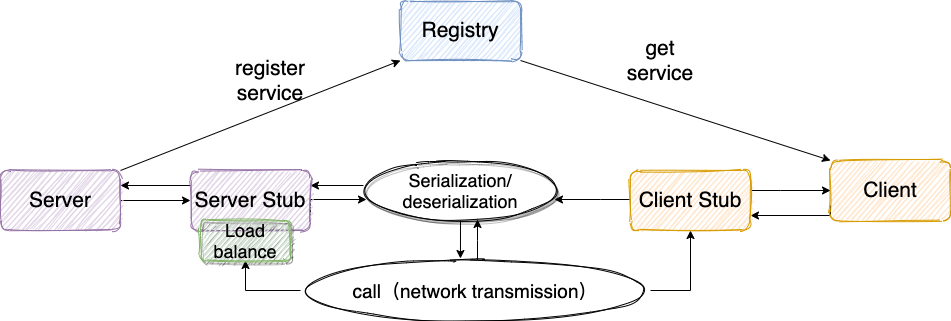

# RPC

## 组成

1. 注册中心 ：注册中心负责服务地址的注册与查找，相当于目录服务。
2. 网络传输 ：既然我们要调用远程的方法，就要发送网络请求来传递目标类和方法的信息以及方法的参数等数据到服务提供端。
3. 序列化和反序列化 ：要在网络传输数据就要涉及到序列化。
4. 动态代理 ：屏蔽远程方法调用的底层细节。
5. 负载均衡 ： 避免单个服务器响应同一请求，容易造成服务器宕机、崩溃等问题。
6. 传输协议 ：这个协议是客户端（服务消费方）和服务端（服务提供方）交流的基础。

技术选型：Zookeeper + Netty + Kryo

### 结构



- Provider： 暴露服务的服务提供方
- Consumer： 调用远程服务的服务消费方
- Registry： 服务注册与发现的注册中心
- Monitor（可选）： 统计服务的调用次数和调用时间的监控中心
- Container（可选）： 服务运行容器

流程

1. 服务容器负责启动，加载，运行服务提供者。
2. 服务提供者在启动时，向注册中心注册自己提供的服务。
3. 服务消费者在启动时，向注册中心订阅自己所需的服务。
4. 注册中心返回服务提供者地址列表给消费者，如果有变更，注册中心将基于长连接推送变更数据给消费者。
5. 服务消费者，从提供者地址列表中，基于软负载均衡算法，选一台提供者进行调用，如果调用失败，再选另一台调用。
6. 服务消费者和提供者，在内存中累计调用次数和调用时间，定时每分钟发送一次统计数据到监控中心。

注册中心可以使用Zookeeper，Nacos，Redis等，这里选用Zookeeper

### 通信，序列化，协议

Socket 是 Java 中最原始、最基础的网络通信方式。但是，Socket 是阻塞 IO、性能低并且功能单一

使用同步非阻塞的 I/O 模型 NIO，Netty 是一个基于 NIO 的 client-server(客户端服务器)框架，使用它可以快速简单地开发网络应用程序

对象信息转换成网络传输的二进制数据叫序列化，常用序列化协议有kryo、protostuff等

RPC 协议规定我们通信的格式，一些标准的 RPC 协议包含下面这些内容：

- 魔数 ： 通常是 4 个字节。这个魔数主要是为了筛选来到服务端的数据包，有了这个魔数之后，服务端首先取出前面四个字节进行比对，能够在第一时间识别出这个数据包并非是遵循自定义协议的，也就是无效数据包，为了安全考虑可以直接关闭连接以节省资源。
- 序列化器编号 ：标识序列化的方式，比如是使用 Java 自带的序列化，还是 json，kryo 等序列化方式。
- 消息体长度 ： 运行时计算出来。

### 代理

我们调用远程方法像调用本地方法一样简单，我们不需要关心远程方法调用的细节比如网络传输。

怎样才能屏蔽远程方法调用的底层细节呢？

使用动态代理。简单来说，当你调用远程方法的时候，实际会通过代理对象来传输网络请求，不然的话，怎么可能直接就调用到远程方法

## 使用Kryo序列化

依赖

```xml
<dependency>
    <groupId>com.esotericsoftware</groupId>
    <artifactId>kryo</artifactId>
    <version>5.6.2</version>
</dependency>
```

定义序列化类接口和Kryo序列化器，有序列化/反序列化方法

```java
@SPI
public interface Serializer {

    /**
     * 序列化
     * @param obj 等待序列化对象
     * @return 序列化后字节流
     */
    byte[] serialize(Object obj);

    /**
     * 反序列化
     * @param bytes 等待反序列化字节流
     * @param clazz 目标类
     * @return 反序列化对象
     * @param <T> 目标类类型
     */
    <T> T deserialize(byte[] bytes, Class<T> clazz);
}
```

```java
public class KyroSerializer implements Serializer {

    //Kryo不是线程安全的，使用ThreadLocal解决并发安全性
    //Kryo is not thread-safe, use ThreadLocal
    private final ThreadLocal<Kryo> kyroThreadLocal = ThreadLocal.withInitial(() -> {
        Kryo kryo = new Kryo();
        kryo.register(RpcRequest.class);
        kryo.register(RpcResponse.class);
        kryo.register(java.lang.Class[].class);//kryo递归所有类，所以要注册其字段的类型
        kryo.register(java.lang.Class.class);
        kryo.register(java.lang.Object[].class);
        return kryo;
    });

    //序列化
    @Override
    public byte[] serialize(Object obj) {
        try (ByteArrayOutputStream byteArrayOutputStream = new ByteArrayOutputStream();
            Output output = new Output(byteArrayOutputStream)) {
            Kryo kryo = kyroThreadLocal.get();
            kryo.writeObject(output, obj);
            kyroThreadLocal.remove();
            output.flush();
            return byteArrayOutputStream.toByteArray();
        } catch (IOException e) {
            throw new SerializeException("Serialize failed");
        }
    }

    //反序列化
    @Override
    public <T> T deserialize(byte[] bytes, Class<T> clazz) {
        try (ByteArrayInputStream byteArrayInputStream = new ByteArrayInputStream(bytes);
             Input input = new Input(byteArrayInputStream)) {
            Kryo kryo = kyroThreadLocal.get();
            Object o = kryo.readObject(input, clazz);
            kyroThreadLocal.remove();
            return clazz.cast(o);
        } catch (IOException e) {
            throw new SerializeException("Deserialize failed");
        }
    }
}
```

## 使用Netty进行网络连接

Netty客户端

```java
public class NettyClient {
    private static final Logger logger = LoggerFactory.getLogger(NettyClient.class);
    private final String host;
    private final int port;
    private static final Bootstrap b;

    public NettyClient(String host, int port) {
        this.host = host;
        this.port = port;
    }

    // 初始化相关资源比如 EventLoopGroup, Bootstrap
    static {
        EventLoopGroup eventLoopGroup = new NioEventLoopGroup();
        b = new Bootstrap();
        KryoSerializer kryoSerializer = new KryoSerializer();
        b.group(eventLoopGroup)
                .channel(NioSocketChannel.class)
                .handler(new LoggingHandler(LogLevel.INFO))
                // 连接的超时时间，超过这个时间还是建立不上的话则代表连接失败
                //  如果 15 秒之内没有发送数据给服务端的话，就发送一次心跳请求
                .option(ChannelOption.CONNECT_TIMEOUT_MILLIS, 5000)
                .handler(new ChannelInitializer<SocketChannel>() {
                    @Override
                    protected void initChannel(SocketChannel ch) {
                        /*
                         自定义序列化编解码器
                         */
                        // RpcResponse -> ByteBuf
                        ch.pipeline().addLast(new NettyKryoDecoder(kryoSerializer, RpcResponse.class));
                        // ByteBuf -> RpcRequest
                        ch.pipeline().addLast(new NettyKryoEncoder(kryoSerializer, RpcRequest.class));
                        ch.pipeline().addLast(new NettyClientHandler());
                    }
                });
    }

    public RpcResponse sendMessage(RpcRequest rpcRequest) {
        try {
            ChannelFuture f = b.connect(host, port).sync();
            logger.info("client connect  {}", host + ":" + port);
            Channel futureChannel = f.channel();
            logger.info("send message");
            if (futureChannel != null) {
                futureChannel.writeAndFlush(rpcRequest).addListener(future -> {
                    if (future.isSuccess()) {
                        logger.info("client send message: [{}]", rpcRequest.toString());
                    } else {
                        logger.error("Send failed:", future.cause());
                    }
                });
               //阻塞等待 ，直到Channel关闭
                futureChannel.closeFuture().sync();
               // 将服务端返回的数据也就是RpcResponse对象取出
                AttributeKey<RpcResponse> key = AttributeKey.valueOf("rpcResponse");
                return futureChannel.attr(key).get();
            }
        } catch (InterruptedException e) {
            logger.error("occur exception when connect server:", e);
        }
        return null;
    }
}
```

sendMessage()方法分析：

1. 首先初始化了一个 Bootstrap
2. 通过 Bootstrap 对象连接服务端
3. 通过 Channel 向服务端发送消息RpcRequest
4. 发送成功后，阻塞等待 ，直到Channel关闭
5. 拿到服务端返回的结果 RpcResponse

其中返回的`futureChannel.attr(key).get();`是在`NettyClientHandler`保存的，`NettyClientHandler`用于读取服务端发送过来的 RpcResponse 消息对象，并将 RpcResponse 消息对象保存到 AttributeMap 上，AttributeMap 可以看作是一个Channel的共享数据源

```java
public class NettyClientHandler extends ChannelInboundHandlerAdapter {
    private static final Logger logger = LoggerFactory.getLogger(NettyClientHandler.class);

    @Override
    public void channelRead(ChannelHandlerContext ctx, Object msg) {
        try {
            RpcResponse rpcResponse = (RpcResponse) msg;
            logger.info("client receive msg: [{}]", rpcResponse.toString());
            // 声明一个 AttributeKey 对象
            AttributeKey<RpcResponse> key = AttributeKey.valueOf("rpcResponse");
            // 将服务端的返回结果保存到 AttributeMap 上，AttributeMap 可以看作是一个Channel的共享数据源
            // AttributeMap的key是AttributeKey，value是Attribute
            ctx.channel().attr(key).set(rpcResponse);
            ctx.channel().close();
        } finally {
            ReferenceCountUtil.release(msg);
        }
    }

    @Override
    public void exceptionCaught(ChannelHandlerContext ctx, Throwable cause) {
        logger.error("client caught exception", cause);
        ctx.close();
    }
}
```

Netty服务端，主要是绑定端口

```java
public class NettyServer {
    private static final Logger logger = LoggerFactory.getLogger(NettyServer.class);
    private final int port;

    private NettyServer(int port) {
        this.port = port;
    }

    private void run() {
        EventLoopGroup bossGroup = new NioEventLoopGroup();
        EventLoopGroup workerGroup = new NioEventLoopGroup();
        KryoSerializer kryoSerializer = new KryoSerializer();
        try {
            ServerBootstrap b = new ServerBootstrap();
            b.group(bossGroup, workerGroup)
                    .channel(NioServerSocketChannel.class)
                    // TCP默认开启了 Nagle 算法，该算法的作用是尽可能的发送大数据快，减少网络传输。TCP_NODELAY 参数的作用就是控制是否启用 Nagle 算法。
                    .childOption(ChannelOption.TCP_NODELAY, true)
                    // 是否开启 TCP 底层心跳机制
                    .childOption(ChannelOption.SO_KEEPALIVE, true)
                    //表示系统用于临时存放已完成三次握手的请求的队列的最大长度,如果连接建立频繁，服务器处理创建新连接较慢，可以适当调大这个参数
                    .option(ChannelOption.SO_BACKLOG, 128)
                    .handler(new LoggingHandler(LogLevel.INFO))
                    .childHandler(new ChannelInitializer<SocketChannel>() {
                        @Override
                        protected void initChannel(SocketChannel ch) {
                            ch.pipeline().addLast(new NettyKryoDecoder(kryoSerializer, RpcRequest.class));
                            ch.pipeline().addLast(new NettyKryoEncoder(kryoSerializer, RpcResponse.class));
                            ch.pipeline().addLast(new NettyServerHandler());
                        }
                    });

            // 绑定端口，同步等待绑定成功
            ChannelFuture f = b.bind(port).sync();
            // 等待服务端监听端口关闭
            f.channel().closeFuture().sync();
        } catch (InterruptedException e) {
            logger.error("occur exception when start server:", e);
        } finally {
            bossGroup.shutdownGracefully();
            workerGroup.shutdownGracefully();
        }
    }

}
```

定义接受客户端消息`msg`后的返回行为，这里是返回字符串`"message from server"`

```java
public class NettyServerHandler extends ChannelInboundHandlerAdapter {

    private static final Logger logger = LoggerFactory.getLogger(NettyServerHandler.class);
    private static final AtomicInteger atomicInteger = new AtomicInteger(1);

    @Override
    public void channelRead(ChannelHandlerContext ctx, Object msg) {
        try {
            RpcRequest rpcRequest = (RpcRequest) msg;
            logger.info("server receive msg: [{}] ,times:[{}]", rpcRequest, atomicInteger.getAndIncrement());
            RpcResponse messageFromServer = RpcResponse.builder().message("message from server").build();
            ChannelFuture f = ctx.writeAndFlush(messageFromServer);
            f.addListener(ChannelFutureListener.CLOSE);
        } finally {
            ReferenceCountUtil.release(msg);
        }
    }

    @Override
    public void exceptionCaught(ChannelHandlerContext ctx, Throwable cause) throws Exception {
        logger.error("server catch exception",cause);
        ctx.close();
    }
}
```

在两个`b.group()`里添加的handler都有设定自定义的编解码器`NettyKryoDecoder`和`NettyKryoEncoder`，通信双方的编解码器必须一致

编码器使用之前实现的Kryo序列化，编码内容直接是内容长度（int固定4字节）+序列化内容

```java
@AllArgsConstructor
public class NettyKryoEncoder extends MessageToByteEncoder<Object> {
    private final Serializer serializer;
    private final Class<?> genericClass;

    /**
     * 将对象转换为字节码然后写入到 ByteBuf 对象中
     */
    @Override
    protected void encode(ChannelHandlerContext channelHandlerContext, Object o, ByteBuf byteBuf) {
        if (genericClass.isInstance(o)) {
            // 1. 将对象转换为byte
            byte[] body = serializer.serialize(o);
            // 2. 读取消息的长度
            int dataLength = body.length;
            // 3.写入消息对应的字节数组长度,writerIndex 加 4
            byteBuf.writeInt(dataLength);
            //4.将字节数组写入 ByteBuf 对象中
            byteBuf.writeBytes(body);
        }
    }
}
```

解码器先读头的消息长度，根据长度判断消息是否完整，完整再进行解码

```java
@AllArgsConstructor
@Slf4j
public class NettyKryoDecoder extends ByteToMessageDecoder {

    private final Serializer serializer;
    private final Class<?> genericClass;

    /**
     * Netty传输的消息长度也就是对象序列化后对应的字节数组的大小，存储在 ByteBuf 头部
     */
    private static final int BODY_LENGTH = 4;

    /**
     * 解码 ByteBuf 对象
     *
     * @param ctx 解码器关联的 ChannelHandlerContext 对象
     * @param in  "入站"数据，也就是 ByteBuf 对象
     * @param out 解码之后的数据对象需要添加到 out 对象里面
     */
    @Override
    protected void decode(ChannelHandlerContext ctx, ByteBuf in, List<Object> out) {

        //1.byteBuf中写入的消息长度所占的字节数已经是4了，所以 byteBuf 的可读字节必须大于 4，
        if (in.readableBytes() >= BODY_LENGTH) {
            //2.标记当前readIndex的位置，以便后面重置readIndex 的时候使用
            in.markReaderIndex();
            //3.读取消息的长度
            //注意： 消息长度是encode的时候我们自己写入的，参见 NettyKryoEncoder 的encode方法
            int dataLength = in.readInt();
            //4.遇到不合理的情况直接 return
            if (dataLength < 0 || in.readableBytes() < 0) {
                log.error("data length or byteBuf readableBytes is not valid");
                return;
            }
            //5.如果可读字节数小于消息长度的话，说明是不完整的消息，重置readIndex
            if (in.readableBytes() < dataLength) {
                in.resetReaderIndex();
                return;
            }
            // 6.走到这里说明没什么问题了，可以序列化了
            byte[] body = new byte[dataLength];
            in.readBytes(body);
            // 将bytes数组转换为我们需要的对象
            Object obj = serializer.deserialize(body, genericClass);
            out.add(obj);
            log.info("successful decode ByteBuf to Object");
        }
    }
}
```

## 动态代理

### JDK动态代理

使用Proxy.newInstance()获取代理类，需要自定义增强逻辑，以InvocationHandler传入

InvocationHandler的invoke()方法，JDK动态代理给他传入的proxy对象是代理类，没什么用。我们一般需要调用原始类方法+补充自己的增强逻辑，原始类的实例可以用lambda捕获外部变量，自己新建一个类的话原始类实例可以通过构造方法传入

```java
public class JdkProxyFactory {
    public static Object getProxy(Object target) {
        return Proxy.newProxyInstance(
                target.getClass().getClassLoader(), // 目标类的类加载
                target.getClass().getInterfaces(),  // 代理需要实现的接口，可指定多个
                // 代理对象对应的自定义 InvocationHandler, 这里直接用的Lambda，也可以自己新建一个实现 InvocationHandler 的类
                (proxy, method, args) -> {
                    //调用方法之前，我们可以添加自己的操作
                    System.out.println("before method " + method.getName());
                    Object result = method.invoke(target, args);
                    //调用方法之后，我们同样可以添加自己的操作
                    System.out.println("after method " + method.getName());
                    return result;
                }
        );
    }
}
```

获取的动态代理类，不存在这个代理类的原始java文件，但运行时会生成对应的class字节码

只有实现了接口的类才能通过JDK动态代理获取代理类，代理能够实现的核心是因为代理类和原始类对外暴露了相同的接口

### CGLIB/ByteBuddy字节码代理

CGLIB目前已经停止维护，其网站上推荐使用ByteBuddy，它们的本质都是通过动态生成原始类的子类class字节码来进行动态代理。final类没有子类，无法采用这种方法动态代理

依赖

```xml
<dependency>
    <groupId>net.bytebuddy</groupId>
    <artifactId>byte-buddy</artifactId>
    <version>LATEST</version>
</dependency>
```

以下是一个通过ByteBuddy获取动态代理类的工具类，使用默认构造函数进行父类创建，只代理public方法，需要传入InvocationHandler的自定义代理逻辑

```java
public class ByteBuddyProxyFactory {

    private ByteBuddy byteBuddy = new ByteBuddy();

    /**
     * 动态创建代理类
     * @param beanInstance 被代理的原始类
     * @param handler 动态代理的拦截器，包含代理类需要执行的逻辑
     * @return 生成的代理类
     */
    public <T> T createProxy(Object beanInstance, InvocationHandler handler) {
        Class<?> originalClass = beanInstance.getClass();
        //生成代理类字节码class文件
        Class<?> proxyClass = byteBuddy
                .subclass(originalClass, ConstructorStrategy.Default.DEFAULT_CONSTRUCTOR) // 代理类有原始类的子类，子类实例化默认调用无参构造器
                .method(ElementMatchers.isPublic()) // 只拦截public方法
                .intercept(InvocationHandlerAdapter.of((proxy, method, args) ->
                        handler.invoke(beanInstance, method, args))) // 执行具体拦截器逻辑
                .make() // 生成字节码
                .load(originalClass.getClassLoader()) // 加载字节码
                .getLoaded();
        //创建代理类实例
        Object proxyInstance;
        try {
            proxyInstance = proxyClass.getConstructor().newInstance();
        } catch (Exception e) {
            throw new RuntimeException(e);
        }
        return (T) proxyInstance;
    }
}
```

## Zookeeper及其Java客户端Curator

### Zookeeper

docker运行Zookeeper

```bash
docker run -d --name zookeeper -p 2181:2181 zookeeper:3.8.5
```

进入容器

```bash
docker exec -it zookeeper /bin/bash
```

连接到Zookeeper

```bash
cd bin
./zkCli.sh -server 127.0.0.1:2181
```

`create`创建节点并设置内容，节点是一个目录，内容可以是字符串，数字等，所有节点使用前必须先创建。一个目录自己是一个节点，也可以在这个目录下继续创建新的节点，称为这个节点的子节点

```bash
create /node1 “node1” # 在根目录创建了 node1 节点，与它关联的是字符串"node1"
```

节点有如下分类

- 持久（PERSISTENT）节点 ：一旦创建就一直存在即使 ZooKeeper 集群宕机，直到将其删除。
- 临时（EPHEMERAL）节点 ：临时节点的生命周期是与 客户端会话（session） 绑定的，会话消失则节点消失 。并且，临时节点 只能做叶子节点 ，不能创建子节点。
- 持久顺序（PERSISTENT_SEQUENTIAL）节点 ：除了具有持久（PERSISTENT）节点的特性之外， 子节点的名称还具有顺序性。比如 /node1/app0000000001 、/node1/app0000000002 。
- 临时顺序（EPHEMERAL_SEQUENTIAL）节点 ：除了具备临时（EPHEMERAL）节点的特性之外，子节点的名称还具有顺序性

`set`更新节点数据

```bash
set /node1 "set node1" # 设置 node1 节点的内容是字符串"set node1"
```

`get`查看节点数据，包括内容和状态信息

```bash
get /node1
```

命令的格式都是 命令 + 节点路径 + 内容（可选）

还有以下其它命令

- `ls`查看一个目录下所有节点
- `stat`查看当前节点状态
- `ls2`相当于`ls`+`stat`一起执行
- `delete`删除节点，不能递归删除，必须没有子节点

### Curator

依赖

```xml
<dependency>
    <groupId>org.apache.curator</groupId>
    <artifactId>curator-framework</artifactId>
    <version>4.2.0</version>
</dependency>
<dependency>
    <groupId>org.apache.curator</groupId>
    <artifactId>curator-recipes</artifactId>
    <version>4.2.0</version>
</dependency>
```

新建客户端，采用builder，`connectString()`设置连接地址，`retryPolicy()`设置重试策略。创建好客户端后`start()`启动连接

```java
private static final int BASE_SLEEP_TIME = 1000;
private static final int MAX_RETRIES = 3;

// Retry strategy. Retry 3 times, and will increase the sleep time between retries.
RetryPolicy retryPolicy = new ExponentialBackoffRetry(BASE_SLEEP_TIME, MAX_RETRIES);
CuratorFramework zkClient = CuratorFrameworkFactory.builder()
    // the server to connect to (can be a server list)
    .connectString("127.0.0.1:2181")
    .retryPolicy(retryPolicy)
    .build();
zkClient.start();
```

create：创建节点

```java
zkClient.create().creatingParentsIfNeeded().withMode(CreateMode.PERSISTENT).forPath("/node1/00001", "java".getBytes());
```

- `creatingParentsIfNeeded()`如果要创建的节点的父节点没有创建，就顺便创建
- `withMode()`指定节点模式
- `forPath()`节点的路径和内容，第二个参数内容可以不指定

检查节点是否存在

```java
zkClient.checkExists().forPath("/node1/00001");//不为null的话，说明节点创建成功
```

delete：删除节点

```java
zkClient.delete().deletingChildrenIfNeeded().forPath("/node1");
```

- `deletingChildrenIfNeeded()`加上此项，执行递归删除，即使有子节点也会一柄删除

get/set：获取/设置节点内容，

```java
zkClient.getData().forPath("/node1/00001");//获取节点的数据内容
zkClient.setData().forPath("/node1/00001","c++".getBytes());//更新节点数据内
```

ls：获取所有子节点路径

```java
List<String> childrenPaths = zkClient.getChildren().forPath("/node1");
```

#### 注册子节点监听器

用于检测某个节点的子节点的变化操作（不包括它自己），包括增删改

```java
String path = "/node1";
PathChildrenCache pathChildrenCache = new PathChildrenCache(zkClient, path, true);
PathChildrenCacheListener pathChildrenCacheListener = (curatorFramework, pathChildrenCacheEvent) -> {
    // 事件触发后回调的方法
    pathChildrenCacheEvent.getType()// 例如获取子节点事件类型
};
pathChildrenCache.getListenable().addListener(pathChildrenCacheListener);
pathChildrenCache.start();
```

事件类型有

```java
public static enum Type {
    CHILD_ADDED,//子节点增加
    CHILD_UPDATED,//子节点更新
    CHILD_REMOVED,//子节点被删除
    CONNECTION_SUSPENDED,
    CONNECTION_RECONNECTED,
    CONNECTION_LOST,
    INITIALIZED;

    private Type() {
    }
}
```

## 基础架构部分

### 可见性封装Holder

就是一个volatile变量的封装

```java
public class Holder<T> {
    private volatile T value;

    public T get() {
        return value;
    }

    public void set(T value) {
        this.value = value;
    }
}
```

### 单例工厂

通过class来获取程序唯一的class实例，使用ConcurrentHashMap保存实例

```java
public final class SingletonFactory {
    private static final Map<String, Holder<Object>> OBJECT_MAP = new ConcurrentHashMap<>();//保存唯一实例
    private static final Object lock = new Object();//并发锁对象

    private SingletonFactory() {
    }

    //方法......
}
```

`getInstance(Class<T> c)`方法，事实上，对任意一次读取，我们先尝试从OBJECT_MAP读取，读不到再利用反射创建实例并放入OBJECT_MAP，虽然OBJECT_MAP是并发安全的，但依然推荐在创建实例时加锁防止重复的创建过程

```java
public static <T> T getInstance(Class<T> clazz) {
    if (clazz == null) {
        throw new IllegalArgumentException("clazz must not be null");
    }
    String key = clazz.getName();

    Holder<Object> holder = OBJECT_MAP.get(key);
    if (holder != null && holder.get() != null) {
        return clazz.cast(holder.get());
    }

    synchronized (lock) {
        //锁范围内再查一次，防止其它线程已经创建
        holder = OBJECT_MAP.computeIfAbsent(key, k -> new Holder<>());
        if (holder.get() == null) {
            try {
                Constructor<T> constructor = clazz.getDeclaredConstructor();
                constructor.setAccessible(true);
                T instance = constructor.newInstance();
                holder.set(instance);//不用put回去，因为本来就是从map查出来的
            } catch (Exception e) {
                throw new RuntimeException("创建实例失败",e);
            }
        }
    }
    
    return clazz.cast(holder.get());//在之前已经被替换为map查出来的对象
}
```

**双锁检测**，注意加锁后的原子性，查询不到实例和创建实例应该是一起的，而我们之前查询的那次并没有在锁范围内，因此重新查询一次

接下来的此方法和上面的区别仅仅在于使用`supplier.get()`创建实例而不是反射调用构造函数

```java
public static <T> T getInstance(Supplier<T> supplier, Class<T> clazz) {
    if (clazz == null) {
        throw new IllegalArgumentException("clazz must not be null");
    }
    String key = clazz.getName();

    Holder<Object> holder = OBJECT_MAP.get(key);
    if (holder != null && holder.get() != null) {
        return clazz.cast(holder.get());
    }

    synchronized (lock) {
        //锁范围内再查一次，防止其它线程已经创建
        holder = OBJECT_MAP.computeIfAbsent(key, k -> new Holder<>());
        if (holder.get() == null) {
            try {
                T instance = supplier.get();//使用生产者创建
                holder.set(instance);//不用put回去，因为本来就是从map查出来的
            } catch (Exception e) {
                throw new RuntimeException("创建实例失败",e);
            }
        }
    }

    return clazz.cast(holder.get());//在之前已经被替换为map查出来的对象
}
```

接下来的此方法和上面的区别仅仅在于额外使用消费者`holder.set(instance)`接收实例

```java
public static <T> T getInstance(Supplier<T> supplier, Class<T> clazz) {
    if (clazz == null) {
        throw new IllegalArgumentException("clazz must not be null");
    }
    String key = clazz.getName();

    Holder<Object> holder = OBJECT_MAP.get(key);
    if (holder != null && holder.get() != null) {
        return clazz.cast(holder.get());
    }

    synchronized (lock) {
        //锁范围内再查一次，防止其它线程已经创建
        holder = OBJECT_MAP.computeIfAbsent(key, k -> new Holder<>());
        if (holder.get() == null) {
            try {
                T instance = supplier.get();//使用生产者创建
                holder.set(instance);//不用put回去，因为本来就是从map查出来的
            } catch (Exception e) {
                throw new RuntimeException("创建实例失败",e);
            }
        }
    }

    return clazz.cast(holder.get());//在之前已经被替换为map查出来的对象
}
```

### SPI机制

Java的SPI机制，通过`ServiceLoader.load(Class<?> c);`来加载`META-INF/services/{接口全名}`下对应文件配置的实现类。SPI 全称为 Service Provider Interface，是一种服务发现机制。SPI 的本质是将接口实现类的全限定名配置在文件中，并由服务加载器读取配置文件，加载实现类

我们加载的目录`extensions`和Java的SPI不一样，参考Dubbo的SPI机制，我们自己实现一个类似`ServiceLoader`的`ExtensionLoader`

这样可以在运行时，动态为接口替换实现类。这样做，我们就可以通过`META-INF/extensions`下的配置文件直接进行实现类的配置，需要更换实现时也只需要修改配置文件即可

我们利用SPI动态加载ServiceDiscovery（服务发现）类这种需要通过配置文件才能加载的实现类，通过修改配置文件替换不同注册中心，甚至是更换注册中心的类型

ExtensionLoader提供为某个扩展接口提供“按名加载实现类”的能力：通过读取 `META-INF/extensions/{接口全名}` 的配置文件，把 name=实现类全名 映射成实例化的实现类。同时利用缓存机制，每个扩展接口只创建一个 ExtensionLoader（EXTENSION_LOADERS）

```java
public class ExtensionLoader<T> {

    private static final String SERVICE_DIRECTORY = "META-INF/extensions/";

    /**
     * 扩展类加载器的缓存，每一个类都有一个扩展类加载器。
     * 需要考虑多线程的问题
     * */
    private static final Map<Class<?>, ExtensionLoader<?>> EXTENSION_LOADERS = new ConcurrentHashMap<>();


    private final Class<?> type;

    /**
     * 实例缓存，根据名字进行缓存
     * 保证可见性的 Holder。
     * */
    private final Map<String, Holder<Object>> cachedInstances = new ConcurrentHashMap<>();

    /**
     * 类缓存，根据名称进行缓存，从文件中进行读取的key，value
     * */
    private final Holder<Map<String, Class<?>>> cachedClasses = new Holder<>();

    private ExtensionLoader(Class<?> type) {
        this.type = type;
    }

    //方法......
}
```

构造函数设置为private，因为我们强制使用工厂方法来获取某个类对应的类扩展加载器。我们要求能够使用扩展类加载器进行类加载的类必须满足要求

- 是接口类型：这样我们才能顺利的通过文件的配置来为其替换为不同实现类
- 被@SPI注解

使用缓存机制实现扩展类加载器的单例

```java
//获取类加载器的工厂方法
public static <S> ExtensionLoader<S> getExtensionLoader(Class<S> clazz) {
    if (clazz == null) {
        throw new IllegalArgumentException("Extension type should not be null.");
    }
    if (!clazz.isInterface()) {
        // 需要是接口
        throw new IllegalArgumentException("Extension type must be an interface.");
    }
    if (clazz.getAnnotation(SPI.class) == null) {
        // 类上需要包含SPI注解
        throw new IllegalArgumentException("Extension type must be annotated by @SPI");
    }
    ExtensionLoader<S> extensionLoader = (ExtensionLoader<S>) EXTENSION_LOADERS.get(clazz);
    if (extensionLoader == null) {
        EXTENSION_LOADERS.putIfAbsent(clazz, new ExtensionLoader<>(clazz));
        extensionLoader = (ExtensionLoader<S>) EXTENSION_LOADERS.get(clazz);
    }
    return extensionLoader;
}
```

获取扩展类，同样先查缓存，没有再创建

```java
public T getExtension(String name) {
    if (StringUtil.isBlank(name)) {
        throw new IllegalArgumentException("Extension name should not be null or empty.");
    }
    Holder<Object> holder = cachedInstances.get(name);
    //没有就先创建Holder对象
    if (holder == null) {
        cachedInstances.putIfAbsent(name, new Holder<>());
        holder = cachedInstances.get(name);
    }
    //单例模式创建工厂对象
    Object instance = holder.get();
    if (instance == null) {
        synchronized (holder) {
            instance = holder.get();
            if (instance == null) {
                instance = createExtension(name);
                holder.set(instance);
            }
        }
    }
    
    return (T) instance;
}
```

查询，根据名字在cachedClasses查找扩展类的class并获取其单例并返回

```java
//创建扩展类实例
private T createExtension(String name) {
    Class<?> clazz = getExtensionClasses().get(name);
    if (clazz == null) {
        throw new RuntimeException("Extension class " + name + " not found.");
    }
    //获取class后，利用工厂类创建单例
    return (T) SingletonFactory.getInstance(clazz);
}

//获取该扩展类加载器配置的所有class的Map，如果没有，读取文件并加载
private Map<String, Class<?>> getExtensionClasses() {
    Map<String, Class<?>> classes = cachedClasses.get();
    if (classes == null) {
        //没有扩展类，就加锁并从配置文件文件加载出扩展类
        synchronized (cachedClasses) {
            classes = cachedClasses.get();
            if (classes == null) {
                classes = new HashMap<>();
                loadDirectory(classes);//从配置文件文件加载出扩展类，放入Map
                cachedClasses.set(classes);
            }
        }
    }
    return classes;
}
```

IO操作，在cachedClass还没有加载的情况下，从当前扩展类加载器所属的配置文件读取配置并保存到cachedClass

```java
//拼接文件地址并读取文件
private void loadDirectory(Map<String, Class<?>> extensionClasses) {
    //配置文件路径
    String fileName = SERVICE_DIRECTORY + type.getName();
    try {
        //加载配置文件
        ClassLoader classLoader = ExtensionLoader.class.getClassLoader();
        Enumeration<URL> urls = classLoader.getResources(fileName);//获取配置文件路径
        if (urls != null) {
            while (urls.hasMoreElements()) {
                URL url = urls.nextElement();
                loadResource(extensionClasses,classLoader,url);//从配置文件路径加载配置
            }
        }
    } catch (IOException e) {
        log.error(e.getMessage());
    }
}

//读取文件内容并放入扩展类加载中的class的Map
private void loadResource(Map<String, Class<?>> extensionClasses, ClassLoader classLoader, URL url) {
    try (BufferedReader reader = new BufferedReader(new InputStreamReader(url.openStream(), StandardCharsets.UTF_8))) {
        String line;
        while ((line = reader.readLine()) != null) {
            //去掉‘#’后的注释部分
            int commentIndex = line.indexOf('#');
            if (commentIndex >= 0) {
                line = line.substring(0, commentIndex);
            }
            //去掉首尾空格
            line = line.trim();
            if (!StringUtil.isBlank(line)) {
                try {
                    //解析名字和扩展类的实现类名字
                    int equalsIndex = line.indexOf('=');
                    String name = line.substring(0, equalsIndex).trim();
                    String className = line.substring(equalsIndex + 1).trim();
                    if (!StringUtil.isBlank(name) && !StringUtil.isBlank(className)) {
                        Class<?> clazz = classLoader.loadClass(className);
                        extensionClasses.put(name, clazz);
                    }
                } catch (ClassNotFoundException e) {
                    log.error(e.getMessage());
                }
            }
        }
    } catch (IOException e) {
        log.error(e.getMessage());
    }
}
```

## 网络传输部分remote

### 协议设计

```java
 *   0     1     2     3     4        5     6     7     8         9          10      11     12  13  14   15 16
 *   +-----+-----+-----+-----+--------+----+----+----+------+-----------+-------+----- --+-----+-----+-------+
 *   |   magic   code        |version | full length         | messageType| codec|compress|    RequestId       |
 *   +-----------------------+--------+---------------------+-----------+-----------+-----------+------------+
 *   |                                                                                                       |
 *   |                                         body                                                          |
 *   |                                                                                                       |
 *   |                                        ... ...                                                        |
 *   +-------------------------------------------------------------------------------------------------------+
 * 4B  magic code（魔法数）   1B version（版本）   4B full length（消息长度）    1B messageType（消息类型）
 * 1B compress（压缩类型） 1B codec（序列化类型）    4B  requestId（请求的Id）
```

- 魔法数 ： 通常是 4 个字节。这个魔数主要是为了筛选来到服务端的数据包，有了这个魔数之后，服务端首先取出前面四个字节进行比对，能够在第一时间识别出这个数据包并非是遵循自定义协议的，也就是无效数据包，为了安全考虑可以直接关闭连接以节省资源。
- 序列化器类型 ：标识序列化的方式，比如是使用 Java 自带的序列化，还是 json，kyro 等序列化方式。
- 消息长度 ： 运行时计算出来
- 消息体：只有四种类型，请求`RpcRequest`，响应`RpcResponse`，心跳请求，心跳响应

messageType和之后的部分，我们封装成一个类`RpcMessage`

```java
@AllArgsConstructor
@NoArgsConstructor
@Data
@Builder
@ToString
public class RpcMessage {
    /**
     * rpc message type
     */
    private byte messageType;
    /**
     * serialization type
     */
    private byte codec;
    /**
     * compress type
     */
    private byte compress;
    /**
     * request id
     */
    private int requestId;
    /**
     * request data
     */
    private Object data;
}
```

另外，我们还封装了RPC请求类和RPC响应类。所有RPC请求信息封装成`RpcRequest`，收到的信息是`RpcResponse`，它们将作为`RpcMessage`的data部分

不要弄混`RpcMessage`的requestId和这两个类的`RequestId`，`RpcMessage`的requestId是编码时编码器自己生成（也就是构造`RpcMessage`时不需要传入requestId），解码时自动解析的。而`RpcRequest`的requestId是要手动传入的，与之对应的`RpcResponse`必须和`RpcRequest`相同的requestId。也就是说，两种requestId没有任何关联，更不是一样的

请求不需要携带很多内容，只需要执行的方法所需要的内容即可，包括

- 方法名称
- 接口名称
- 参数，参数类型数组

其他通用部分如requestId，version

```java
@AllArgsConstructor
@NoArgsConstructor
@Getter
@Builder
@ToString
public class RpcRequest implements Serializable {

    private static final long serialVersionUID = 1905122041950251207L;
    private String requestId;
    private String interfaceName;
    private String methodName;
    private Object[] parameters;
    private Class<?>[] paramTypes;
    private String version;
    private String group;

    public String getRpcServiceName() {
        return this.getInterfaceName() + this.getGroup() + this.getVersion();
    }
}
```

响应除了通用部分，还需要

- code：状态码，表示执行结果
- data: 响应的内容

```java
@NoArgsConstructor
@AllArgsConstructor
@Data
@Builder
@ToString
public class RpcResponse<T> implements Serializable {
    private static final long serialVersionUID = 715745410605631233L;
    private String requestId;
    private Integer code;
    private String message;
    private T data;

    public static <T> RpcResponse<T> success(T data, String requestId) {
        RpcResponse<T> response = new RpcResponse<>();
        response.setRequestId(requestId);
        response.setCode(RpcResponseCodeEnum.SUCCESS.getCode());
        response.setMessage(RpcResponseCodeEnum.SUCCESS.getMessage());
        if (data != null) {
            response.setData(data);
        }
        return response;
    }

    public static <T> RpcResponse<T> fail(RpcResponseCodeEnum code) {
        RpcResponse<T> response = new RpcResponse<>();
        response.setCode(code.getCode());
        response.setMessage(code.getMessage());
        return response;
    }
}
```

### 序列化器

之前已经定义了序列化器接口`Serializer`以及实现类`KryoSerializer`，通过扩展类加载器可以获取对应Kryo实现类

```java
ExtensionLoader.getExtensionLoader(Serializer.class).getExtension("kryo");
```

在extensions目录下创建一个名称为Serializer全限定名称的文件，内容写入`kyro=github.{KryoSerializer全限定名}`即可

如果想要配置多种实现类，就以相同的`{name}={fullClassName}`另外起新的行，`getExtension()`时使用对应的名字即可获取对应实现类

### 压缩器

定义压缩器接口`Compress`

```java
@SPI
public interface Compress {

    byte[] compress(byte[] bytes);


    byte[] decompress(byte[] bytes);
}
```

使用GZIP压缩算法实现

```java
public class GzipCompress implements Compress {

    private static final int BUFFER_SIZE = 1024 * 4;

    @Override
    public byte[] compress(byte[] bytes) {
        if (bytes == null) {
            throw new NullPointerException("bytes is null");
        }
        try (ByteArrayOutputStream out = new ByteArrayOutputStream();
             GZIPOutputStream gzip = new GZIPOutputStream(out)) {
            gzip.write(bytes);
            gzip.flush();
            gzip.finish();
            return out.toByteArray();
        } catch (IOException e) {
            throw new RuntimeException("gzip compress error", e);
        }
    }

    @Override
    public byte[] decompress(byte[] bytes) {
        if (bytes == null) {
            throw new NullPointerException("bytes is null");
        }
        try (ByteArrayOutputStream out = new ByteArrayOutputStream();
             GZIPInputStream gunzip = new GZIPInputStream(new ByteArrayInputStream(bytes))) {
            byte[] buffer = new byte[BUFFER_SIZE];
            int n;
            while ((n = gunzip.read(buffer)) > -1) {
                out.write(buffer, 0, n);
            }
            return out.toByteArray();
        } catch (IOException e) {
            throw new RuntimeException("gzip decompress error", e);
        }
    }
}
```

### 编解码器

自定义编码器`RpcMessageEncoder`。负责处理"出站"消息，将消息格式转换字节数组然后写入到字节数据的容器 ByteBuf 对象中

根据定义的各种常量写入消息头，记得预留fullLength位置

从`RpcMessage`里获取序列化器和压缩算法类型，利用`ExtensionLoader`动态获取对应实现类，把原始数据序列化再压缩，作为消息体。记得最后算出fullLength并回到消息头写入

记得我们是**发**消息，使用传入的RpcMessage是没有requestId的，我们自己用一个原子计数器作为消息的id

```java
@Slf4j
public class RpcMessageEncoder extends MessageToByteEncoder<RpcMessage> {

    //as the global request id
    private static final AtomicInteger ATOMIC_INTEGER = new AtomicInteger(0);

    @Override
    protected void encode(ChannelHandlerContext ctx, RpcMessage rpcMessage, ByteBuf out) throws Exception {
        try {
            //构建消息头
            out.writeBytes(RpcConstants.MAGIC_NUMBER);
            out.writeByte(RpcConstants.VERSION);
            //移动writeIndex，预留fullLength的空间
            out.writerIndex(out.writerIndex() + 4);
            byte messageType = rpcMessage.getMessageType();
            out.writeByte(messageType);
            out.writeByte(rpcMessage.getCodec());
            out.writeByte(CompressTypeEnum.GZIP.getCode());
            out.writeInt(ATOMIC_INTEGER.getAndIncrement());

            //构建消息体
            byte[] body = null;
            int fullLength = RpcConstants.HEAD_LENGTH;//现在只有开头的长度
            //不是心跳类消息才有消息体
            if (messageType != RpcConstants.HEARTBEAT_REQUEST_TYPE && messageType != RpcConstants.HEARTBEAT_RESPONSE_TYPE) {
                //根据请求内容获取序列化器并序列化
                String codecName = SerializationTypeEnum.getName(rpcMessage.getCodec());
                log.info("use codec :{}", codecName);
                Serializer serializer = ExtensionLoader.getExtensionLoader(Serializer.class).getExtension(codecName);
                body = serializer.serialize(rpcMessage.getData());
                //根据请求内容获取压缩器并压缩
                String compressName = CompressTypeEnum.getName(rpcMessage.getCompress());
                log.info("use compress :{}", compressName);
                Compress compress = ExtensionLoader.getExtensionLoader(Compress.class).getExtension(compressName);
                body = compress.compress(body);
                //修改fullLength
                fullLength += body.length;
            }
            if (body != null) {
                out.writeBytes(body);
            }

            //重新写入开头的fullLength
            int writerIndex = out.writerIndex();
            out.writerIndex(RpcConstants.MAGIC_NUMBER.length + 1);
            out.writeInt(fullLength);
            out.writerIndex(writerIndex);//重新置到末尾
        } catch (Exception e) {
            log.error("Encode request error!", e);
        }
    }
}
```

自定义解码器`RpcMessageDecoder`，它继承了`LengthFieldBasedFrameDecoder`，调用父类构造函数

```java
public RpcMessageDecoder(int maxFrameLength, int lengthFieldOffset, int lengthFieldLength, int lengthAdjustment, int initialBytesToStrip) {
    super(maxFrameLength, lengthFieldOffset, lengthFieldLength, lengthAdjustment, initialBytesToStrip);
}
```

其中

- maxFrameLength：单个数据帧允许的最大长度（超过会触发异常，防止粘包异常或恶意大包）。
- lengthFieldOffset：长度字段在整个帧中的起始偏移量（从帧起始字节算起），我们是5
- lengthFieldLength：长度字段本身占用的字节数（常见为 1、2、4、8），我们是4
- lengthAdjustment：对长度字段值做的修正值，用于把“协议里定义的长度”换算成 Netty 需要的实际帧长度，frameLength = {长度字段的值} + lengthAdjustment + lengthFieldOffset + lengthFieldLength，我们的帧长度就是字段里的值，因此修正量就是-(5 + 4) = -9
- initialBytesToStrip：解码后要从帧头剥离的字节数（例如剥离协议头和长度字段，只把业务体传下去），我们不剥离任何部分，是0

我们是**收**消息，因此消息头的所有内容都必须从收到的网络帧读取，记得判断魔数和版本号是否一致，同时根据messageType采取不同的解析data方式

- HEARTBEAT_XXX：心跳类不会有有效data，设置成"ping"/"pong"
- REQUEST_TYPE：反序列化成`RpcRequest`
- RESPONSE_TYPE：反序列化成`RpcResponse`

```java
@Slf4j
public class RpcMessageDecoder extends LengthFieldBasedFrameDecoder {

    public RpcMessageDecoder(int maxFrameLength, int lengthFieldOffset, int lengthFieldLength, int lengthAdjustment, int initialBytesToStrip) {
        super(maxFrameLength, lengthFieldOffset, lengthFieldLength, lengthAdjustment, initialBytesToStrip);
    }

    public RpcMessageDecoder() {
        super(RpcConstants.MAX_FRAME_LENGTH, 5, 4, -9, 0);
    }

    @Override
    protected Object decode(ChannelHandlerContext ctx, ByteBuf in) throws Exception {
        Object decode = super.decode(ctx, in);
        if (decode instanceof ByteBuf) {
            ByteBuf buf = (ByteBuf) decode;
            //只有大于协议头长度的才是有效网络包
            if (buf.readableBytes() >= RpcConstants.TOTAL_LENGTH) {
                try {
                    return decodeBuf(buf);
                } catch (Exception e) {
                    log.error("Decode frame error!");
                    throw e;
                } finally {
                    buf.release();
                }
            }
        }
        return decode;
    }

    private Object decodeBuf(ByteBuf in) {
        //检查魔数和协议版本
        byte[] magicNumber = new byte[RpcConstants.MAGIC_NUMBER.length];
        in.readBytes(magicNumber);
        checkMagicNumber(magicNumber);
        byte version = in.readByte();
        checkVersion(version);
        //解析协议头其他部分
        int fullLength = in.readInt();
        byte messageType = in.readByte();
        byte codecType = in.readByte();
        byte compressType = in.readByte();
        int requestId = in.readInt();
        RpcMessage rpcMessage = RpcMessage.builder().messageType(messageType).codec(codecType).compress(compressType).requestId(requestId).build();
        //检查是不是心跳类消息
        if (messageType == RpcConstants.HEARTBEAT_REQUEST_TYPE) {
            rpcMessage.setData(RpcConstants.PING);
            return rpcMessage;
        }
        if (messageType == RpcConstants.HEARTBEAT_RESPONSE_TYPE) {
            rpcMessage.setData(RpcConstants.PONG);
            return rpcMessage;
        }
        //是有内容的消息
        int bodyLength = fullLength - RpcConstants.HEAD_LENGTH;
        if (bodyLength > 0) {
            byte[] body = new byte[bodyLength];
            in.readBytes(body);
            //按照发消息的顺序反过来，先解压缩
            String compressName = CompressTypeEnum.getName(compressType);
            log.info("use compress: {}", compressName);
            Compress compress = ExtensionLoader.getExtensionLoader(Compress.class).getExtension(compressName);
            body = compress.decompress(body);
            //再反序列化
            String codecName = SerializationTypeEnum.getName(codecType);
            log.info("use codec: {}", codecName);
            Serializer serializer = ExtensionLoader.getExtensionLoader(Serializer.class).getExtension(codecName);
            //因为序列化的内容可能是请求，也有可能是响应
            if (messageType == RpcConstants.REQUEST_TYPE) {
                RpcRequest request = serializer.deserialize(body, RpcRequest.class);
                rpcMessage.setData(request);
            } else {//是响应
                RpcResponse response = serializer.deserialize(body, RpcResponse.class);
                rpcMessage.setData(response);
            }
        }
        return rpcMessage;
    }

    private void checkMagicNumber(byte[] magicNumber) {
        int len = RpcConstants.MAGIC_NUMBER.length;
        for (int i = 0; i < len; i++) {
            if (RpcConstants.MAGIC_NUMBER[i] != magicNumber[i]) {
                throw new IllegalArgumentException("Invalid magic number :" + Arrays.toString(magicNumber));
            }
        }
    }

    private void checkVersion(byte version) {
        if (version != RpcConstants.VERSION) {
            throw new IllegalArgumentException("Invalid version :" + version);
        }
    }
}
```

RpcMessageFrameDecoder是只解析到Netty帧的Decoder简化版本，而上面的完整版本解析出内容

```java
public class RpcMessageFrameDecoder extends LengthFieldBasedFrameDecoder {
    public RpcMessageFrameDecoder() {
        super(RpcConstants.MAX_FRAME_LENGTH, 5, 4, -9, 0);
    }
}
```

RpcMessageCodec是Encoder和Decoder的结合版本，区别是它继承的方法不再返回，而是把返回值存入参数的List，同时，`decode()`不需要调用父类的`decode()`，而是直接解码参数的ButeBuf

```java
@Slf4j
public class RpcMessageCodec extends MessageToMessageCodec<ByteBuf, RpcMessage> {

    //as the global request id
    private static final AtomicInteger ATOMIC_INTEGER = new AtomicInteger(0);

    @Override
    protected void encode(ChannelHandlerContext ctx, RpcMessage rpcMessage, List<Object> list) throws Exception {
        ByteBuf out = ctx.alloc().buffer();
        try {
            //构建消息头
            out.writeBytes(RpcConstants.MAGIC_NUMBER);
            out.writeByte(RpcConstants.VERSION);
            //移动writeIndex，预留fullLength的空间
            out.writerIndex(out.writerIndex() + 4);
            byte messageType = rpcMessage.getMessageType();
            out.writeByte(messageType);
            out.writeByte(rpcMessage.getCodec());
            out.writeByte(CompressTypeEnum.GZIP.getCode());
            out.writeInt(ATOMIC_INTEGER.getAndIncrement());

            //构建消息体
            byte[] body = null;
            int fullLength = RpcConstants.HEAD_LENGTH;//现在只有开头的长度
            //不是心跳类消息才有消息体
            if (messageType != RpcConstants.HEARTBEAT_REQUEST_TYPE && messageType != RpcConstants.HEARTBEAT_RESPONSE_TYPE) {
                //根据请求内容获取序列化器并序列化
                String codecName = SerializationTypeEnum.getName(rpcMessage.getCodec());
                log.info("use codec :{}", codecName);
                Serializer serializer = ExtensionLoader.getExtensionLoader(Serializer.class).getExtension(codecName);
                body = serializer.serialize(rpcMessage.getData());
                //根据请求内容获取压缩器并压缩
                String compressName = CompressTypeEnum.getName(rpcMessage.getCompress());
                log.info("use compress :{}", compressName);
                Compress compress = ExtensionLoader.getExtensionLoader(Compress.class).getExtension(compressName);
                body = compress.compress(body);
                //修改fullLength
                fullLength += body.length;
            }
            if (body != null) {
                out.writeBytes(body);
            }

            //重新写入开头的fullLength
            int writerIndex = out.writerIndex();
            out.writerIndex(RpcConstants.MAGIC_NUMBER.length + 1);
            out.writeInt(fullLength);
            out.writerIndex(writerIndex);//重新置到末尾

            list.add(out);
        } catch (Exception e) {
            log.error("Encode request error!", e);
        }
    }

    @Override
    protected void decode(ChannelHandlerContext ctx, ByteBuf in, List<Object> list) throws Exception {
        //只有大于协议头长度的才是有效网络包
        if (in.readableBytes() >= RpcConstants.TOTAL_LENGTH) {
            list.add(decodeBuf(in));
        }
    }

    private Object decodeBuf(ByteBuf in) {
        //检查魔数和协议版本
        byte[] magicNumber = new byte[RpcConstants.MAGIC_NUMBER.length];
        in.readBytes(magicNumber);
        checkMagicNumber(magicNumber);
        byte version = in.readByte();
        checkVersion(version);
        //解析协议头其他部分
        int fullLength = in.readInt();
        byte messageType = in.readByte();
        byte codecType = in.readByte();
        byte compressType = in.readByte();
        int requestId = in.readInt();
        RpcMessage rpcMessage = RpcMessage.builder().messageType(messageType).codec(codecType).compress(compressType).requestId(requestId).build();
        //检查是不是心跳类消息
        if (messageType == RpcConstants.HEARTBEAT_REQUEST_TYPE) {
            rpcMessage.setData(RpcConstants.PING);
            return rpcMessage;
        }
        if (messageType == RpcConstants.HEARTBEAT_RESPONSE_TYPE) {
            rpcMessage.setData(RpcConstants.PONG);
            return rpcMessage;
        }
        //是有内容的消息
        int bodyLength = fullLength - RpcConstants.HEAD_LENGTH;
        if (bodyLength > 0) {
            byte[] body = new byte[bodyLength];
            in.readBytes(body);
            //按照发消息的顺序反过来，先解压缩
            String compressName = CompressTypeEnum.getName(compressType);
            log.info("use compress: {}", compressName);
            Compress compress = ExtensionLoader.getExtensionLoader(Compress.class).getExtension(compressName);
            body = compress.decompress(body);
            //再反序列化
            String codecName = SerializationTypeEnum.getName(codecType);
            log.info("use codec: {}", codecName);
            Serializer serializer = ExtensionLoader.getExtensionLoader(Serializer.class).getExtension(codecName);
            //因为序列化的内容可能是请求，也有可能是响应
            if (messageType == RpcConstants.REQUEST_TYPE) {
                RpcRequest request = serializer.deserialize(body, RpcRequest.class);
                rpcMessage.setData(request);
            } else {//是响应
                RpcResponse response = serializer.deserialize(body, RpcResponse.class);
                rpcMessage.setData(response);
            }
        }
        return rpcMessage;
    }

    private void checkMagicNumber(byte[] magicNumber) {
        int len = RpcConstants.MAGIC_NUMBER.length;
        for (int i = 0; i < len; i++) {
            if (RpcConstants.MAGIC_NUMBER[i] != magicNumber[i]) {
                throw new IllegalArgumentException("Invalid magic number :" + Arrays.toString(magicNumber));
            }
        }
    }

    private void checkVersion(byte version) {
        if (version != RpcConstants.VERSION) {
            throw new IllegalArgumentException("Invalid version :" + version);
        }
    }
}
```

### Netty客户端/服务端

#### 客户端

发送RPC消息部分，先定义接口

```java
public interface RpcRequestTransport {
    /**
     * send rpc request to server and get result
     *
     * @param rpcRequest message body
     * @return data from server
     */
    Object sendRpcRequest(RpcRequest rpcRequest);
}
```

对于Netty传输的客户端，提供方法

- doConnect() :用于连接服务端（目标方法所在的服务器）并返回对应的 Channel。当我们知道了服务端的地址之后，我们就可以通过 NettyClient 成功连接服务端了。（有了 Channel 之后就能发送数据到服务端了）
- sendRpcRequest() : 用于传输 rpc 请求(RpcRequest) 到服务端（接口方法的实现）

因为我们发送消息的线程，发送完成后，发送的线程`sendRpcRequest()`并不知道什么时候能获取到结果，因此我们使用CompletableFuture等待结果。当Netty客户端收到消息时，对应的handler使用其它线程解析运算结果并调用`complete()`，线程`sendRpcRequest()`才能继续执行获取到结果

工具类`UnprocessedRequests`，为了找到哪个requestId对应哪个CompletableFuture，使用一个Map保存

```java
public class UnprocessedRequests {
    //save the requests which was waiting the result
    private static final Map<String, CompletableFuture<RpcResponse<Object>>> UNPROCESSED_REQUEST_FUTURES = new ConcurrentHashMap<>();

    public void put(String requestId, CompletableFuture<RpcResponse<Object>> future) {
        UNPROCESSED_REQUEST_FUTURES.put(requestId, future);
    }

    public void complete(RpcResponse<Object> response) {
        CompletableFuture<RpcResponse<Object>> future = UNPROCESSED_REQUEST_FUTURES.remove(response.getRequestId());
        if (future != null) {
            future.complete(response);
        } else {
            throw new IllegalStateException("Unprocessed request id " + response.getRequestId() + " not found");
        }
    }
}
```

`ChannelProvider`用于缓存信道，Netty的Channel信道频繁开启关闭会影响性能，我们使用一个Map缓存信道，需要相同的信道时从Map获取而不是重新创建一个

```java
public class ChannelProvider {

    private final Map<String, Channel> channelMap = new ConcurrentHashMap<>();

    public Channel get(InetSocketAddress remoteAddress) {
        String key = remoteAddress.toString();
        if (channelMap.containsKey(key)) {
            Channel channel = channelMap.get(key);
            if (channel != null && channel.isActive()) {
                return channel;
            } else {
                channelMap.remove(key);//Map存在但不活跃，是无效的channel，移除缓存
            }
        }
        return null;
    }

    public void set(InetSocketAddress remoteAddress, Channel channel) {
        String key = remoteAddress.toString();
        channelMap.put(key, channel);
    }
    
    public void remove(InetSocketAddress remoteAddress) {
        String key = remoteAddress.toString();
        channelMap.remove(key);
    }
    
}
```

`NettyRpcClientHandler`定义了Netty客户端触发某些情况下执行的行为，包括

- channelRead():收到服务端消息的行为，应该是用获取的RpcResponse调用对应requestId的complete()
- userEventTriggered():定时任务触发，我们在Netty客户端空闲时间隔向服务端发送心跳，因此要构造对应的RpcRequest

```java
@Slf4j
public class NettyRpcClientHandler extends ChannelInboundHandlerAdapter {

    private final UnprocessedRequests unprocessedRequests;
    private final NettyRpcClient nettyRpcClient;

    public NettyRpcClientHandler() {
        this.unprocessedRequests = SingletonFactory.getInstance(UnprocessedRequests.class);
        this.nettyRpcClient = SingletonFactory.getInstance(NettyRpcClient.class);
    }

    //收到消息的回调函数
    @Override
    public void channelRead(ChannelHandlerContext ctx, Object msg) throws Exception {
        try {
            log.info("Client receive message [{}]", msg);
            if (msg instanceof RpcMessage rpcMessage) {
                byte messageType = rpcMessage.getMessageType();
                if (messageType == RpcConstants.HEARTBEAT_RESPONSE_TYPE) {
                    log.info("Heartbeat [{}]", rpcMessage.getData());
                } else if (messageType == RpcConstants.RESPONSE_TYPE) {
                    log.info("Response [{}]", rpcMessage.getData());
                    //收到内容调用对应消息的CompletableFuture
                    RpcResponse<Object> rpcResponse = (RpcResponse<Object>) rpcMessage.getData();
                    unprocessedRequests.complete(rpcResponse);
                }
            }
        } finally {
            ReferenceCountUtil.release(msg);
        }
    }

    //用户定时器触发函数，定时触发心跳发送
    @Override
    public void userEventTriggered(ChannelHandlerContext ctx, Object evt) throws Exception {
        if (evt instanceof IdleStateEvent idleStateEvent) {
            IdleState state = idleStateEvent.state();
            if (IdleState.WRITER_IDLE.equals(state)) {
                log.info("Writer idle happened [{}]", ctx.channel().remoteAddress());
                Channel channel = nettyRpcClient.getChannel((InetSocketAddress) ctx.channel().remoteAddress()); //mark:直接ctx.channel ?
                RpcMessage rpcMessage = RpcMessage.builder()
                        .codec(SerializationTypeEnum.KRYO.getCode())
                        .compress(CompressTypeEnum.GZIP.getCode())
                        .messageType(RpcConstants.HEARTBEAT_REQUEST_TYPE)
                        .data(RpcConstants.PING).build();
                channel.writeAndFlush(rpcMessage).addListener(ChannelFutureListener.CLOSE_ON_FAILURE);
            }
        } else {
            super.userEventTriggered(ctx, evt);
        }
    }

    @Override
    public void exceptionCaught(ChannelHandlerContext ctx, Throwable cause) throws Exception {
        log.error("Client exception caught [{}]", cause.getMessage(), cause);
        ctx.close();
    }
}
```

`NettyRpcClient`是实际的客户端

```java
public class NettyRpcClient {

    private final ServiceDiscovery serviceDiscovery;
    private final UnprocessedRequests unprocessedRequests;
    private final ChannelProvider channelProvider;

    //Netty核心部分
    private final EventLoopGroup eventLoopGroup;
    private final Bootstrap bootstrap;

    //方法......
}
```

构造函数就是Netty的写法，其他的部分用SPI或者单例工厂加载。编解码器，handler回调方法用pipeline注册

- eventLoopGroup = new NioEventLoopGroup();
     用于客户端 I/O 线程池，负责连接、读写、事件分发。
     Netty 客户端启动器，后续所有连接参数都挂在它上面。
- .group(eventLoopGroup)（client/NettyRpcClient.java:52）
     把这个线程池绑定给客户端连接。
- .channel(NioSocketChannel.class)（client/NettyRpcClient.java:53）
     指定使用 NIO 的 TCP Channel 实现。
- .option(ChannelOption.CONNECT_TIMEOUT_MILLIS, 5000)（client/NettyRpcClient.java:57）
     连接超时 5 秒；超时仍未建立连接则失败。
- .handler(new ChannelInitializer<\SocketChannel>() {...})（client/NettyRpcClient.java:58）
     为每条新连接初始化 pipeline。里面依次添加：
  - IdleStateHandler(0, 5, 0, TimeUnit.SECONDS)（client/NettyRpcClient.java:63）
     5 秒没有写出数据，触发 WRITER_IDLE 事件（用于发心跳）。
  - RpcMessageFrameDecoder（client/NettyRpcClient.java:65）
     先做帧解码，解决拆包/粘包问题。
  - RpcMessageCodec（client/NettyRpcClient.java:66）
     RPC 消息编解码（序列化、压缩等协议字段处理）。
  - NettyRpcClientHandler（client/NettyRpcClient.java:67）
     业务处理器：处理响应、心跳响应、异常等

Netty 本质是“事件流处理链”，ChannelPipeline 就是把多个处理步骤串成责任链，解耦且可组合。加入pipeline的顺序非常重要，而且会直接影响行为：入站事件（channelRead）按 addLast 顺序从前到后走。通常是：先帧解码，再协议解码，再业务 handler。就是 RpcMessageFrameDecoder -> RpcMessageCodec -> NettyRpcClientHandler

加入了`RpcMessageCodec`，因此当调用`writeAndFlush(RpcMessage)`时，触发`RpcMessageCodec`的`encode()`加工为`ByteBuf`。当收到`ByteBuf`时，触发`decode()`解析为`RpcMessage`

```java
public NettyRpcClient() {
    this.serviceDiscovery = ExtensionLoader.getExtensionLoader(ServiceDiscovery.class).getExtension(ServiceDiscoveryEnum.ZK.getName());//使用Zookeeper作为注册中心
    this.unprocessedRequests = SingletonFactory.getInstance(UnprocessedRequests.class);
    this.channelProvider = SingletonFactory.getInstance(ChannelProvider.class);

    RpcMessageCodec codec = new RpcMessageCodec();//有状态的类不要用单例

    this.eventLoopGroup = new NioEventLoopGroup();
    this.bootstrap = new Bootstrap();

    this.bootstrap.group(eventLoopGroup)
            .channel(NioSocketChannel.class) // TCP连接
            .option(ChannelOption.CONNECT_TIMEOUT_MILLIS, 5000)
            .handler(new ChannelInitializer<SocketChannel>() {
                @Override
                protected void initChannel(SocketChannel socketChannel) throws Exception {
                    ChannelPipeline p = socketChannel.pipeline();
                    //流水线工艺顺序不能调换
                    p.addLast(new IdleStateHandler(0, 5, 5));//每5s触发WRITER_IDLE
                    p.addLast(new RpcMessageFrameDecoder());//帧解码
                    p.addLast(new RpcMessageCodec());//协议解码
                    p.addLast(new NettyRpcClientHandler());//回调方法
                }
            });
}
```

核心方法，发送RPC请求

连接地址通过服务发现类获取，获取信道利用`getChannel()`创建并缓存

利用CompletableFuture等待调用结果，存入unprocessedRequests

发送消息到信道后，记得添加回调函数处理失败的情况，因为调用成功时可以通过handler来complete对应项，但失败不行，就必须在回调函数里移除

```java
@Override
public Object sendRpcRequest(RpcRequest rpcRequest) {

    //获取连接
    InetSocketAddress address = this.serviceDiscovery.lookupService(rpcRequest);
    Channel channel = this.getChannel(address);

    CompletableFuture<RpcResponse<Object>> future = new CompletableFuture<>();
    if (channel != null && channel.isActive()) {
        unprocessedRequests.put(rpcRequest.getRequestId(), future);
        RpcMessage rpcMessage = RpcMessage.builder()
                .messageType(RpcConstants.REQUEST_TYPE)
                .codec(SerializationTypeEnum.KRYO.getCode())
                .compress(CompressTypeEnum.GZIP.getCode())
                .data(rpcRequest).build();
        channel.writeAndFlush(rpcMessage).addListener((ChannelFutureListener) f -> {
            //回调的主要作用是在失败时能够移除unprocessedRequests的对应项
            if (f.isSuccess()) {
                log.info("Client send message: [{}]", rpcMessage);
            } else {
                f.channel().close();
                future.completeExceptionally(f.cause());
                log.error("Send failed:", f.cause());
            }
        });
    } else {
        throw new IllegalStateException();
    }

    //获取结果
    try {
        return future.get();
    } catch (Exception e) {
        throw new RuntimeException("rpc请求失败," + e.getMessage());
    }
}
```

`getChannel()`获取/缓存信道

```java
//建立channel并缓存
public Channel getChannel(InetSocketAddress remoteAddress) {
    Channel channel = channelProvider.get(remoteAddress);
    if (channel == null) {
        channel = doConnect(remoteAddress);
        channelProvider.set(remoteAddress, channel);
    }
    return channel;
}
```

连接创建信道，把Netty客户端连接到某个地址获取其channel

```java
public Channel doConnect(InetSocketAddress address) {
    CompletableFuture<Channel> future = new CompletableFuture<>();
    this.bootstrap.connect(address).addListener((ChannelFutureListener) f -> {
        if (f.isSuccess()) {
            log.info("The client has connected [{}] successful!", address.toString());
            future.complete(f.channel());
        } else {
            throw new RuntimeException("The client has failed to connect [" + address.toString() + "]!");
        }
    });
    try {
        return future.get();
    } catch (Exception e) {
        throw new RuntimeException(e);
    }
}
```

#### 服务端

`NettyServerHandler`服务端事件处理类，事件触发时有线程执行处理逻辑

- channelRead()：服务端收到消息时，判断类型HEARTBEAT/实际请求，HEARTBEAT就直接返回心跳响应，实际请求就调用`rpcRequestHandler.handle()`阻塞处理请求，并用结果和requestId构造RpcResponse，最后把构造的RpcMessage写到channel
- userEventTriggered()：服务端的事件触发器，服务端每空闲30s就触发一次READER_IDLE事件，表示空闲超过一段事件就关闭连接

```java
@Slf4j
public class NettyRpcServerHandler extends ChannelInboundHandlerAdapter {

    private RpcRequestHandler rpcRequestHandler;

    @Override
    public void channelRead(ChannelHandlerContext ctx, Object msg) throws Exception {
        try {
            if (msg instanceof RpcMessage requestMessage) {
                log.info("server receive msg: [{}] ", msg);
                byte messageType = requestMessage.getMessageType();
                RpcMessage rpcMessage = RpcMessage.builder()
                        .codec(SerializationTypeEnum.KRYO.getCode())
                        .compress(CompressTypeEnum.GZIP.getCode()).build();//RpcMessage发送是不构造requestId
                if (messageType == RpcConstants.HEARTBEAT_REQUEST_TYPE) {
                    //是心跳请求
                    rpcMessage.setMessageType(RpcConstants.HEARTBEAT_RESPONSE_TYPE);
                    rpcMessage.setData(RpcConstants.PONG);
                } else {
                    //是普通请求
                    RpcRequest rpcRequest = (RpcRequest) requestMessage.getData();
                    rpcMessage.setMessageType(RpcConstants.RESPONSE_TYPE);
                    Object result = rpcRequestHandler.handle(rpcRequest);
                    log.info("server get result: : [{}] ", result);
                    if (ctx.channel().isActive() && ctx.channel().isWritable()) {
                        //使用request的id构造对应的response
                        RpcResponse<Object> rpcResponse = RpcResponse.success(result, rpcRequest.getRequestId());
                        rpcMessage.setData(rpcResponse);
                    } else {
                        log.error("server write fail: [{}] ", rpcRequest);
                        RpcResponse<Object> rpcResponse = RpcResponse.fail(RpcResponseCodeEnum.FAIL);
                        rpcMessage.setData(rpcResponse);
                    }
                }
                ctx.writeAndFlush(rpcMessage).addListener(ChannelFutureListener.CLOSE_ON_FAILURE);
            }
        } finally {
            ReferenceCountUtil.release(msg);
        }
    }

    @Override
    public void userEventTriggered(ChannelHandlerContext ctx, Object evt) throws Exception {
        if (evt instanceof IdleStateEvent idleStateEvent) {
            IdleState state = idleStateEvent.state();
            if (IdleState.READER_IDLE.equals(state)) {
                //30s空闲计时器触发，关闭连接
                log.info("Idle check happen, close the connection: [{}]", state);
                ctx.close();
            }
        } else {
            super.userEventTriggered(ctx, evt);
        }
    }

    @Override
    public void exceptionCaught(ChannelHandlerContext ctx, Throwable cause) throws Exception {
        log.error("Server exception caught: [{}]", cause.getMessage(), cause);
        ctx.close();
    }
}
```

Netty5中，此方法`addLast(EventExecutorGroup group, ChannelHandler... handlers);`是用于把handler的执行交给指定线程池的方法被废弃，推荐手动把业务执行投递到指定的共享线程池，因此有了Netty5的写法`Netty5RpcServerHandler`

```java
@Slf4j
public class Netty5RpcServerHandler extends ChannelInboundHandlerAdapter {

    private final RpcRequestHandler rpcRequestHandler;
    private final ExecutorService executor;

    public Netty5RpcServerHandler(EventExecutorGroup executor) {
        this.rpcRequestHandler = SingletonFactory.getInstance(RpcRequestHandler.class);
        this.executor = executor;
    }

    @Override
    public void channelRead(ChannelHandlerContext ctx, Object msg) throws Exception {
        if (!(msg instanceof RpcMessage)) {
            return;
        }
        ReferenceCountUtil.retain(msg); //引用计数+1防止进入其它线程后对象被GC
        //使用独立线程池执行业务，不阻塞netty的IO
        this.executor.submit(() -> {
            try {
                RpcMessage requestMessage = (RpcMessage) msg;
                log.info("server receive msg: [{}] ", msg);
                byte messageType = requestMessage.getMessageType();
                RpcMessage rpcMessage = RpcMessage.builder()
                        .codec(SerializationTypeEnum.KRYO.getCode())
                        .compress(CompressTypeEnum.GZIP.getCode()).build();//RpcMessage发送是不构造requestId
                if (messageType == RpcConstants.HEARTBEAT_REQUEST_TYPE) {
                    //是心跳请求
                    rpcMessage.setMessageType(RpcConstants.HEARTBEAT_RESPONSE_TYPE);
                    rpcMessage.setData(RpcConstants.PONG);
                } else {
                    //是普通请求
                    RpcRequest rpcRequest = (RpcRequest) requestMessage.getData();
                    rpcMessage.setMessageType(RpcConstants.RESPONSE_TYPE);
                    Object result = rpcRequestHandler.handle(rpcRequest);
                    log.info("server get result: : [{}] ", result);
                    if (ctx.channel().isActive() && ctx.channel().isWritable()) {
                        //使用request的id构造对应的response
                        RpcResponse<Object> rpcResponse = RpcResponse.success(result, rpcRequest.getRequestId());
                        rpcMessage.setData(rpcResponse);
                    } else {
                        log.error("server write fail: [{}] ", rpcRequest);
                        RpcResponse<Object> rpcResponse = RpcResponse.fail(RpcResponseCodeEnum.FAIL);
                        rpcMessage.setData(rpcResponse);
                    }
                }
                ctx.writeAndFlush(rpcMessage).addListener(ChannelFutureListener.CLOSE_ON_FAILURE);
            } finally {
                ReferenceCountUtil.release(msg);
            }
        });
    }

    @Override
    public void userEventTriggered(ChannelHandlerContext ctx, Object evt) throws Exception {
        if (evt instanceof IdleStateEvent idleStateEvent) {
            IdleState state = idleStateEvent.state();
            if (IdleState.READER_IDLE.equals(state)) {
                //30s空闲计时器触发，关闭连接
                log.info("Idle check happen, close the connection: [{}]", state);
                ctx.close();
            }
        } else {
            super.userEventTriggered(ctx, evt);
        }
    }

    @Override
    public void exceptionCaught(ChannelHandlerContext ctx, Throwable cause) throws Exception {
        log.error("Server exception caught: [{}]", cause.getMessage(), cause);
        ctx.close();
    }
}
```

只有`channelRead()`因为业务执行比较长才需要使用独立线程池执行，其它简单的行为不需要

注意：使用独立的线程池前，应该先调用`ReferenceCountUtil.retain(msg);`防止msg对象被回收

示例：使用其它线程池执行业务的稳妥写法

```java
ReferenceCountUtil.retain(msg);
    businessExecutor.submit(() -> {
        try {
            processRequestAndWrite(ctx, (RpcMessage) msg);
        } finally {
            ReferenceCountUtil.release(msg);
        }
    });
```

最后，按照Netty服务端的写法创建服务端即可，注意父channel是监听channel，子channel是和客户端通信的channel

```java
@Slf4j
@Component // AOP
public class NettyRpcServer {

    private static final int PORT = 9998;

    private final ServiceProvider serviceProvider = SingletonFactory.getInstance(ZookeeperServiceProviderImpl.class);

    public void registerService(RpcServiceConfig rpcServiceConfig) {
        this.serviceProvider.publishService(rpcServiceConfig);
    }

    public void start() {
        try {
            //对象准备
            CustomShutdownHook.getCustomShutdownHook().clearAll();//在程序关闭时清理连接资源
            String host = InetAddress.getLocalHost().getHostAddress();
            EventLoopGroup bossGroup = new NioEventLoopGroup();
            EventLoopGroup workerGroup = new NioEventLoopGroup();
            DefaultEventExecutorGroup serviceHandlerGroup = new DefaultEventExecutorGroup(
                    Runtime.getRuntime().availableProcessors() * 2 /*cpu核心数目 * 2*/,
                    ThreadPoolFactoryUtil.createThreadFactory("service-handler-group", false)
            );
            //创建bootstrap
            try {
                ServerBootstrap bootstrap = new ServerBootstrap();
                bootstrap.group(bossGroup, workerGroup)
                        .channel(NioServerSocketChannel.class)//TCP
                        .childOption(ChannelOption.TCP_NODELAY, true)// 开启 Nagle 算法尽可能的发送大数据快，减少网络传输
                        .childOption(ChannelOption.SO_KEEPALIVE, true)// 开启 TCP 底层心跳机制
                        .option(ChannelOption.SO_BACKLOG, 128) //用于临时存放已完成三次握手的请求的队列的最大长度
                        .handler(new LoggingHandler(LogLevel.INFO))
                        .childHandler(new ChannelInitializer<SocketChannel>() {

                            @Override
                            protected void initChannel(SocketChannel socketChannel) throws Exception {
                                ChannelPipeline p = socketChannel.pipeline();
                                p.addLast(new IdleStateHandler(30, 0, 0, TimeUnit.SECONDS));
                                p.addLast(new RpcMessageFrameDecoder());
                                p.addLast(new RpcMessageCodec());
                                //p.addLast(serviceHandlerGroup, new NettyRpcServerHandler()); // 可共享的 serverHandler
                                p.addLast(new Netty5RpcServerHandler(serviceHandlerGroup));//Netty5 写法
                            }
                        });
                // 绑定端口，同步等待绑定成
                ChannelFuture f = bootstrap.bind(host,PORT).sync();
                // 等待服务端监听端口关闭
                f.channel().closeFuture().sync();
            } catch (InterruptedException e) {
                log.error("Occur exception when start server:", e);
            } finally {
                log.info("Shutdown bossGroup and workerGroup");
                bossGroup.shutdownGracefully();
                workerGroup.shutdownGracefully();
                serviceHandlerGroup.shutdownGracefully();
            }
        } catch (UnknownHostException e) {
            throw new RuntimeException(e);
        }
    }
}
```

`CustomShutdownHook`是用于注册关闭钩子的相关类，因为JVM关闭时我们要进行对应的资源释放，这包括Zookeeper的客户端Curator的资源释放

```java
@Slf4j
public class CustomShutdownHook {

    private static final CustomShutdownHook CUSTOM_SHUTDOWN_HOOK = new CustomShutdownHook();

    public static CustomShutdownHook getCustomShutdownHook() {
        return CUSTOM_SHUTDOWN_HOOK;
    }
    
    public void clearAll() {
        log.info("addShutdownHook for clearAll");
        Runtime.getRuntime().addShutdownHook(new Thread(() -> {
            try {
                InetSocketAddress inetSocketAddress = new InetSocketAddress(InetAddress.getLocalHost().getHostAddress(), NettyRpcServer.PORT);
                CuratorUtil.clearRegistry(CuratorUtil.getZkClient(), inetSocketAddress);
            } catch (UnknownHostException ignored) {
            }
            ThreadPoolFactoryUtil.shutDownAllThreadPool();
        }));
    }
}
```

## 注册中心registry

一个根节点（rpcServiceName）可能会对应多个服务地址（相同服务被部署多份的情况）。

如果我们要获得某个服务对应的地址的话，就直接根据完整的服务名称来获取到其下的所有子节点，然后通过具体的负载均衡策略取出一个就可以了

定义服务发现，服务注册行为的接口

```java
public interface ServiceDiscovery {
    /**
     * return the net address of service
     * @param request RPC request object
     * @return the net address of service
     */
    InetSocketAddress lookupService(RpcRequest request);
}

@SPI
public interface ServiceRegistry {
    /**
     * register service
     *
     * @param rpcServiceName    rpc service name
     * @param inetSocketAddress service address
     */
    void registerService(String rpcServiceName, InetSocketAddress inetSocketAddress);

}
```

定义服务配置信息的实体类

```java
@AllArgsConstructor
@NoArgsConstructor
@Getter
@Setter
@Builder
@ToString
public class RpcServiceConfig {
    /**
     * service version
     */
    private String version = "";
    /**
     * when the interface has multiple implementation classes, distinguish by group
     */
    private String group = "";

    /**
     * target service
     */
    private Object service;

    public String getRpcServiceName() {
        return this.getServiceName() + this.getGroup() + this.getVersion();
    }

    public String getServiceName() {
        return this.service.getClass().getInterfaces()[0].getCanonicalName();
    }
}
```

注意：如果是同一个服务`getRpcServiceName()`方法返回的服务名称应该和`RpcRequest`的同名方法是一样的，都是(接口名称 + group + version)

### 负载均衡

新建负载均衡类接口

```java
@SPI
public interface LoadBalance {
    /**
     * Choose one from the list of existing service addresses list
     *
     * @param serviceUrlList Service address list
     * @param rpcRequest
     * @return target service address
     */
    String selectServiceAddress(List<String> serviceUrlList, RpcRequest rpcRequest);
}
```

先进行简单情况的判断，如没有地址和只有1个地址的情况

```java
public abstract class AbstractLoadBalance implements LoadBalance {
    @Override
    public String selectServiceAddress(List<String> serviceUrlList, RpcRequest rpcRequest) {
        //先进行简单处理，没有地址时返回null
        if (CollectionUtil.isEmpty(serviceUrlList)) {
            return null;
        }
        //只有一个地址返回这个地址
        if (serviceUrlList.size() == 1) {
            return serviceUrlList.get(0);
        }
        //多个地址调用负载均衡算法
        return doSelect(serviceUrlList, rpcRequest);
    }

    protected abstract String doSelect(List<String> serviceUrlList, RpcRequest rpcRequest);
}
```

使用一致性哈希算法实现负载均衡，一致性哈希（Consistent Hashing）的核心思想是把节点和数据键都映射到同一个哈希环（通常是 0 ~ 2^32-1）上：

1. 对节点做哈希，放到环上。
2. 对数据 key 做哈希，也放到环上。
3. 数据归属规则：从 key 的位置沿顺时针找到的第一个节点（第一个hash大于给定hash值的Node），就是它的存储节点。

实际工程中通常配合虚拟节点（一个物理节点映射多个环位置）来改善负载均衡和热点问题，要让虚拟节点在哈希环上“尽量均匀”，核心是用高质量哈希函数和虚拟节点 key 的生成要“去相关”

我们取MD5哈希的前64位作为哈希函数，抽取接口方便更换实现

```java
public interface HashFunction {
    long hash(String key);
}

public static class MD5HashFunction implements HashFunction {
    @Override
    public long hash(String key) {
        try {
            MessageDigest md5 = MessageDigest.getInstance("MD5");
            byte[] digest = md5.digest(key.getBytes());

            // 取前8字节作为long类型的哈希值
            return ((long) (digest[0] & 0xFF) << 56) |
                    ((long) (digest[1] & 0xFF) << 48) |
                    ((long) (digest[2] & 0xFF) << 40) |
                    ((long) (digest[3] & 0xFF) << 32) |
                    ((long) (digest[4] & 0xFF) << 24) |
                    ((long) (digest[5] & 0xFF) << 16) |
                    ((long) (digest[6] & 0xFF) << 8) |
                    (digest[7] & 0xFF);
        } catch (NoSuchAlgorithmException e) {
            throw new RuntimeException(e);
        }
    }
}
```

内部类`ConsistentHashingLoadBalancer`用于构建一致性哈希环并提供对应的操作方法，包括增加，减少，选择节点等

```java
static class ConsistentHashingLoadBalancer {
    /**
     * 哈希环定义部分：使用TreeMap存储虚拟节点的哈希值到物理节点的映射
     * 1. 虚拟结点
     * 2. hash函数
     * 3. TreeMap存储结点
     * 4. 物理结点列表
     * */
    //虚拟节点hash到物理节点的映射，找到第一个大于...，用TreeMap方便
    private final TreeMap<Long, String> virtualNodes = new TreeMap<>();
    //物理节点集合
    private final Set<String> physicalNodes = new HashSet<>();
    //每个物理节点配备几个虚拟节点
    private final int virtualNodeCount;
    //哈希函数
    private final HashFunction hashFunction;
    /**
     * 防止使用了没有初始化完成的选择器
     * */
    private volatile boolean initFlag = false;

    //哈希函数部分前面有，省略

    public ConsistentHashingLoadBalancer(List<String> address, int virtualNodeCount, HashFunction hashFunction) {
        log.info("创建一致性哈希选择器");
        this.initFlag = false;
        this.virtualNodeCount = virtualNodeCount;
        this.hashFunction = hashFunction;
        //构建hash环
        for (String addr : address) {
            this.addNode(addr);
        }
        this.initFlag = true;
    }

    /**
     * 一致性哈希环算法选择节点
     */
    public String selectNode(String key) {
        //确保可用性
        while (!initFlag) {
            //自旋等待
        }
        //空节点检查
        if (this.virtualNodes.isEmpty()) {
            log.error("当前没有任何虚拟节点创建，选择失败");
            return null;
        }
        long hashKey = hashFunction.hash(key);
        Map.Entry<Long, String> entry = this.virtualNodes.ceilingEntry(hashKey);
        //没有更大的entry说明回到哈希环的开头
        if (entry == null) {
            entry = this.virtualNodes.firstEntry();
        }
        return entry.getValue();
    }

    /**
     * 添加新物理节点
     */
    private void addNode(String node) {
        if (physicalNodes.contains(node)) {
            return;
        }
        physicalNodes.add(node);
        //创建对应数量虚拟节点
        for (int i = 0; i < virtualNodeCount; i++) {
            String virtualNode = node + "#" + i;
            virtualNodes.put(hashFunction.hash(virtualNode), node);
        }
    }

    /**
     * 移除物理节点
     */
    private void removeNode(String node) {
        if (!physicalNodes.contains(node)) {
            return;
        }
        physicalNodes.remove(node);

        //移除该物理节点对应的所有虚拟节点
        for (int i = 0; i < virtualNodeCount; i++) {
            String virtualNodeName = node + "#" + i;
            virtualNodes.remove(hashFunction.hash(virtualNodeName));
        }
    }

    /**
     * 获取所有物理节点
     */
    public List<String> getAllNodes() {
        while (!initFlag) {
            //自旋等待，不要上下文切换
        }
        //不应当修改
        return Collections.unmodifiableList(new ArrayList<>(virtualNodes.values()));
    }

    /**
     * 判断地址列表有没有变化
     */
    public boolean hasChanged(List<String> address) {
        if (address.size() != this.physicalNodes.size()) {
            return true;
        }
        for (String node : address) {
            if (!this.physicalNodes.contains(node)) {
                return true;
            }
        }
        return false;
    }

    /**
     * 根据新的地址列表重建哈希环
     */
    public synchronized void rebuild(List<String> address) {
        //修改标记表示当前状态不可用
        this.initFlag = false;
        if (!hasChanged(address)) {
            this.initFlag = true;
            return;
        }

        log.info("重构服务的选择器");
        List<String> removedNodes = new ArrayList<>();
        List<String> addedNodes = new ArrayList<>();
        Set<String> oldNodes = new HashSet<>(this.physicalNodes);
        Set<String> newNodes = new HashSet<>(address);
        for (String node : newNodes) {
            if (!oldNodes.contains(node)) {
                addedNodes.add(node);
            }
        }
        for (String node : oldNodes) {
            if (!newNodes.contains(node)) {
                removedNodes.add(node);
            }
        }

        //移除，新增对应节点
        for (String node : removedNodes) {
            this.removeNode(node);
        }
        for (String node : addedNodes) {
            this.addNode(node);
        }

        this.initFlag = true;
        log.info("重新构建的列表大小:{}", this.physicalNodes.size());
    }
}
```

最后构建整个一致性哈希负载均衡的实现，因为一种服务只能在同一种服务器之前进行负载均衡，因此每个服务名称都有自己的负载均衡器，用Map保存

选择服务的节点时，先查看有没有负载均衡器，如果没有就新建，如果有但是服务的物理节点发生变化就重建。最后拿着合法的负载均衡器选择节点

```java
@Slf4j
public class ConsistentHashLoadBalance extends AbstractLoadBalance {

    private final ConcurrentHashMap<String, ConsistentHashingLoadBalancer> selectors = new ConcurrentHashMap<>();

    @Override
    protected String doSelect(List<String> address, RpcRequest rpcRequest) {
        String rpcServiceName = rpcRequest.getRpcServiceName();
        ConsistentHashingLoadBalancer selector = selectors.get(rpcServiceName);

        if (selector == null) {
            //还没有自己的选择器就构造一个
            selector = SingletonFactory.getInstance(() -> new ConsistentHashingLoadBalancer(
                    address,160,new ConsistentHashingLoadBalancer.MD5HashFunction()
            ), ConsistentHashingLoadBalancer.class);
            selectors.put(rpcServiceName, selector);
        } else if (selector.hasChanged(address)) {
            //地址发生变化就重建hash环
            selector.rebuild(address);
        }
        //使用请求的uuid进行hash
        return selector.selectNode(rpcServiceName + rpcRequest.getRequestId());
    }

    static class ConsistentHashingLoadBalancer {
        //......
    }
}
```

### Curator客户端

注册中心需要和Zookeeper打交道，我们编写对应的`CuratorUtil`工具类，提供以下功能

- 从配置文件`rpc.properties`读取配置项`rpc.zookeeper.address`获取Zookeeper连接地址（没有就用默认地址127.0.0.1:2181）连接到Zookeeper并创建对应Curator客户端
- 创建对应路径的临时/永久节点
- 移除对应路径的临时节点
- 移除指定IP（主机）对应的Zookeeper节点
- watcher机制同步主机变化到`SERVICE_ADDRESS_MAP`

在Zookeeper中，我们一个服务主机的名称的格式是`/my-rpc/{服务名称}/{服务地址}`，例如`/my-rpc/helloService/127.0.0.1:9999`，一个服务有多个服务主机，因此服务主机地址是服务名称的子节点

为了不让每次RPC调用都需要去注册中心查找可用的服务器，我们查一次后就缓存地址，在这个类我们还维护`SERVICE_ADDRESS_MAP`，是服务名称-服务的主机地址集合的键值对

为了及时更新缓存，通过watcher机制监听Zookeeper指定节点的子节点变化来同步变化

```java
@Slf4j
@NoArgsConstructor
public class CuratorUtil {

    private static final int BASE_SLEEP_TIME = 1000;
    private static final int MAX_RETRIES = 10;
    private static final int MAX_SLEEP_TIME = 30000;
    private static final int SESSION_TIMEOUT = 60000;
    private static final int CONNECTION_TIMEOUT = 15000;
    public static final String ZK_REGISTER_ROOT_PATH = "/my-rpc";

    private static final Map<String, List<String>> SERVICE_ADDRESS_MAP = new ConcurrentHashMap<>();
    private static final Map<String, CuratorCache> SERVICE_WATCHER_MAP = new ConcurrentHashMap<>();
    private static final Set<String> REGISTERED_PATH_SET = ConcurrentHashMap.newKeySet();
    private static CuratorFramework zkClient;
    private static final String DEFAULT_ZOOKEEPER_ADDRESS = "127.0.0.1:2181";

    public static void bindConnectionStateListener(CuratorFramework zkClient) {
        zkClient.getConnectionStateListenable().addListener((client, newState) -> {
            switch (newState) {
                case LOST -> {
                    // 会话丢失：缓存立即失效
                    SERVICE_ADDRESS_MAP.clear();
                    log.warn("ZK state LOST, local service cache invalidated");
                }
                case SUSPENDED -> log.warn("ZK state SUSPENDED");
                default -> {
                }
            }
        });
    }

    public static CuratorFramework getZkClient() {
        // check if user has set zk address
        // 获取rpc.properties的配置
        Properties properties = PropertiesFileUtil.readPropertiesFile(RpcConfigEnum.RPC_CONFIG_PATH.getPropertyValue());
        String zookeeperAddress = properties != null &&
                properties.getProperty(RpcConfigEnum.ZK_ADDRESS.getPropertyValue() /*rpc.zookeeper.address*/) != null
                ? properties.getProperty(RpcConfigEnum.ZK_ADDRESS.getPropertyValue()) : DEFAULT_ZOOKEEPER_ADDRESS;
        // if zkClient has been started, return directly
        if (zkClient != null && zkClient.getState() == CuratorFrameworkState.STARTED) {
            return zkClient;
        }
        // Retry strategy. Retry 3 times, and will increase the sleep time between retries.
        RetryPolicy retryPolicy = new ExponentialBackoffRetry(BASE_SLEEP_TIME, MAX_RETRIES, MAX_SLEEP_TIME);
        zkClient = CuratorFrameworkFactory.builder()
                // the server to connect to (can be a server list)
                .connectString(zookeeperAddress)
                .sessionTimeoutMs(SESSION_TIMEOUT)
                .connectionTimeoutMs(CONNECTION_TIMEOUT)
                .retryPolicy(retryPolicy)
                .build();
        bindConnectionStateListener(zkClient);
        zkClient.start();
        try {
            // wait 30s until connect to the zookeeper
            if (!zkClient.blockUntilConnected(30, TimeUnit.SECONDS)) {
                throw new RuntimeException("Time out waiting to connect to ZK!");
            }
        } catch (InterruptedException e) {
            log.error("Exception while connecting to ZK!");
        }
        return zkClient;
    }

    /**
     * 创建Zookeeper永久节点
     * @param zkClient Curator客户端
     * @param path 节点路径
     */
    public static void createPersistentNode(CuratorFramework zkClient, String path) {
        try {
            if (REGISTERED_PATH_SET.contains(path) || zkClient.checkExists().forPath(path) != null) {
                log.info("The node already exists. The node is:[{}]", path);
            } else {
                //创建Zookeeper永久节点
                //eg: /my-rpc/helloService/127.0.0.1:9999 三部分 /my-rpc/{服务名称}/{服务地址}
                zkClient.create().creatingParentsIfNeeded().withMode(CreateMode.PERSISTENT).forPath(path);
                log.info("The node was created successfully. The node is:[{}]", path);
            }
        } catch (Exception e) {
            log.error("Create persistent node for path [{}] fail", path);
        }
    }

    /**
     * 删除对应IP的节点
     * @param zkClient Curator客户端
     * @param inetSocketAddress 要删除的节点的IP
     */
    public static void clearRegistry(CuratorFramework zkClient, InetSocketAddress inetSocketAddress) {
        //并行的add必须线程安全
        final Set<String> removePathSet = ConcurrentHashMap.newKeySet();
        REGISTERED_PATH_SET.stream().parallel().forEach(p -> {
            try {
                if (p.endsWith(inetSocketAddress.toString())) {
                    zkClient.delete().forPath(p);
                    removePathSet.add(p);
                }
            } catch (Exception e) {
                log.error("clear registry for path [{}] fail", p);
            }
        });
        //清除已经移除的节点路径
        REGISTERED_PATH_SET.removeAll(removePathSet);
        log.info("All registered services on the server are cleared:[{}]", REGISTERED_PATH_SET);
    }
    /**
     * 创建Zookeeper临时节点
     * @param zkClient Curator客户端
     * @param path 节点路径
     * */
    public static void createEphemeralNode(CuratorFramework zkClient, String path) {
        try {
            zkClient.create().creatingParentsIfNeeded()
                    .withMode(CreateMode.EPHEMERAL)
                    .withACL(Ids.OPEN_ACL_UNSAFE)//开放权限
                    .forPath(path, "status:ok".getBytes());
        } catch (Exception e) {
            log.error("创建临时结点失败!", e);
        }
    }
    /**
     * 删除临时节点
     */
    public static void deleteEphemeralNode(CuratorFramework zkClient, String path) {
        // 方法2：强制删除节点（无论是否有子节点）
        try {
            zkClient.delete().deletingChildrenIfNeeded().forPath(path);
        } catch (Exception e) {
            log.error("删除临时结点：{}失败", path);
        }
    }

    /**
     * 获取一个节点下的所有子节点
     * @param rpcServiceName rpc service 名称，也是节点的路径
     * @return 路径下所有子节点
     */
    public static List<String> getChildrenNodes(CuratorFramework zkClient, String rpcServiceName) {

        if (SERVICE_ADDRESS_MAP.containsKey(rpcServiceName)) {
            return SERVICE_ADDRESS_MAP.get(rpcServiceName);
        }

        List<String> cached = SERVICE_ADDRESS_MAP.get(rpcServiceName);

        List<String> result = null;
        String servicePath = ZK_REGISTER_ROOT_PATH + "/" + rpcServiceName;
        try {
            result = zkClient.getChildren().forPath(servicePath);
            SERVICE_ADDRESS_MAP.put(rpcServiceName, result);
            //不使用watcher
            //注册watcher监控子节点变化情况
            registerWatcher(zkClient, rpcServiceName);
        } catch (Exception e) {
            log.error("Get children nodes for path [{}] fail", servicePath);

            return cached;

        }
        return result;
    }

    /**
     * 为某个节点注册watcher检测子节点变化
     * @param rpcServiceName rpc service name eg:github.javaguide.HelloServicetest2version
     */
    private static void registerWatcher(CuratorFramework zkClient, String rpcServiceName) {
        String servicePath = ZK_REGISTER_ROOT_PATH + "/" + rpcServiceName;
        //缓存watcher防止重复注册
        SERVICE_WATCHER_MAP.computeIfAbsent(servicePath, key -> {
            CuratorCache cache = CuratorCache.build(zkClient, key);
            CuratorCacheListener listener = CuratorCacheListener.builder()//所有子节点更新内容都执行对应回调
                    .forCreates(childData -> refreshServiceAddresses(zkClient, rpcServiceName, key))
                    .forDeletes(childData -> refreshServiceAddresses(zkClient, rpcServiceName, key))
                    .forChanges((oldNode, childData) -> refreshServiceAddresses(zkClient, rpcServiceName, key))
                    .forInitialized(() -> refreshServiceAddresses(zkClient, rpcServiceName, key))
                    .build();
            cache.listenable().addListener(listener);
            cache.start();
            return cache;
        });
    }
    //修改map里服务名称对应的子节点内容
    private static void refreshServiceAddresses(CuratorFramework zkClient, String rpcServiceName, String servicePath) {
        try {
            List<String> serviceAddresses = zkClient.getChildren().forPath(servicePath);
            SERVICE_ADDRESS_MAP.put(rpcServiceName, serviceAddresses);
        } catch (Exception e) {
            log.error("refresh service addresses for path [{}] fail", servicePath, e);
        }
    }
}
```

### Zookeeper服务发现实现

服务发现的流程是

1. 查询Zookeeper，查找对应服务名字的所有服务器地址
2. 负载均衡算法选取一个地址
3. 构造`InetSocketAddress`返回

```java
@Slf4j
public class ZookeeperServiceDiscoveryImpl implements ServiceDiscovery {

    private final LoadBalance loadBalance;

    public ZookeeperServiceDiscoveryImpl() {
        this.loadBalance = ExtensionLoader.getExtensionLoader(LoadBalance.class).getExtension(LoadBalanceEnum.LOADBALANCE.getName());
    }

    @Override
    public InetSocketAddress lookupService(RpcRequest rpcRequest) {
        //获取服务名称
        String rpcServiceName = rpcRequest.getRpcServiceName();
        //获取Zookeeper客户端
        CuratorFramework zkClient = CuratorUtil.getZkClient();
        //获取服务的所有节点地址
        List<String> serviceUrlList = CuratorUtil.getChildrenNodes(zkClient, rpcServiceName);
        if (CollectionUtil.isEmpty(serviceUrlList)) {
            throw new RpcException(RpcErrorMessageEnum.SERVICE_CAN_NOT_BE_FOUND, rpcServiceName);
        }
        //负载均衡算法选择一个服务主机地址
        String targetServiceUrl = loadBalance.selectServiceAddress(serviceUrlList, rpcRequest);
        log.info("Successfully found the service address:[{}]", targetServiceUrl);
        //拆分地址为主机+端口，返回InetSocketAddress
        String[] socketAddressArray = targetServiceUrl.split(":");
        String host = socketAddressArray[0];
        int port = Integer.parseInt(socketAddressArray[1]);
        return new InetSocketAddress(host, port);
    }
}
```

### Zookeeper服务注册实现

直接向Zookeeper插入服务名称节点对应的子节点即可

服务主机在Zookeeper的节点应该是临时节点，这种情况下请求创建节点的客户端将和Zookeeper以心跳连接，让Zookeeper获取节点状态，在节点下线时及时移除，因此这个方法的inetSocketAddress必须是调用者所在主机的地址

```java
public class ZookeeperServiceRegistryImpl implements ServiceRegistry {
    @Override
    public void registerService(String rpcServiceName, InetSocketAddress inetSocketAddress) {
        //获取完整路径
        String servicePath = CuratorUtil.ZK_REGISTER_ROOT_PATH + "/" + rpcServiceName + inetSocketAddress.toString();
        CuratorFramework zkClient = CuratorUtil.getZkClient();
        //CuratorUtil.createPersistentNode(zkClient, servicePath);
        //考虑到主机可能和Zookeeper断开，应该创建临时节点保证Zookeeper可以及时清除无效节点
        CuratorUtil.createEphemeralNode(zkClient, servicePath);
    }
}
```

### 服务工具类

`ServiceProvider`是之前有用到的一个服务工具类，用Map保存服务及其对应的主机地址，还提供以当前主机的地址，把服务配置注册到注册中心的功能

```java
public interface ServiceProvider {

    /**
     * @param rpcServiceConfig rpc service related attributes
     */
    void addService(RpcServiceConfig rpcServiceConfig);

    /**
     * @param rpcServiceName rpc service name
     * @return service object
     */
    Object getService(String rpcServiceName);

    /**
     * @param rpcServiceConfig rpc service related attributes
     */
    void publishService(RpcServiceConfig rpcServiceConfig);

}
```

用Zookeeper作为注册中心的实现

- `addService()`只根据服务名称保存对应服务实例
- `getService()`根据服务名称获取对应实例
- `publishService()`，把客户端所在的自己的主机地址注测为配置里的服务名称的子节点，注意的是一个主机通常可以运行多个服务，服务部署在多个主机上的话一个服务也可以有多个主机

服务在Zookeeper上储存的格式是三部分`/my-rpc/{服务名称}/{服务地址}`，特就是一个服务地址前面可以带有不同的服务名称，一个服务名称后面也可以有多个不同子节点代表不同机器上的子节点，后者这种情况就是要做负载均衡的情况

```java
@Slf4j
public class ZookeeperServiceProviderImpl implements ServiceProvider {

    /**
     * key: rpc service name(interface name + version + group)
     * value: service object
     */
    private final Map<String, Object> serviceMap;
    private final Set<String> registeredService;
    private final ServiceRegistry serviceRegistry;

    public ZookeeperServiceProviderImpl() {
        this.serviceMap = new ConcurrentHashMap<>();
        this.registeredService = ConcurrentHashMap.newKeySet();
        this.serviceRegistry = ExtensionLoader.getExtensionLoader(ServiceRegistry.class).getExtension(ServiceRegistryEnum.ZK.getName());
    }

    /**
     * 添加服务，只是吧服务添加到Provider，并没有发布到注册中心
     * @param rpcServiceConfig 服务的配置
     */
    @Override
    public void addService(RpcServiceConfig rpcServiceConfig) {
        String rpcServiceName = rpcServiceConfig.getRpcServiceName();
        //重复注册就直接返回
        if (registeredService.contains(rpcServiceName)) {
            return;
        }
        registeredService.add(rpcServiceName);
        serviceMap.put(rpcServiceName, rpcServiceConfig.getService());
        log.info("Add service: {} and interfaces:{}", rpcServiceName, rpcServiceConfig.getService().getClass().getInterfaces());
    }

    /**
     * 返回Provider存储的服务
     * @param rpcServiceName rpc service name(interface name + version + group)
     * @return 服务对象
     */
    @Override
    public Object getService(String rpcServiceName) {
        Object service = serviceMap.get(rpcServiceName);
        if (null == service) {
            throw new RpcException(RpcErrorMessageEnum.SERVICE_CAN_NOT_BE_FOUND);
        }
        return service;
    }

    /**
     * 发布服务，用自己的主机地址作为节点内容向Zookeeper发布服务
     * @param rpcServiceConfig rpc service related attributes
     */
    @Override
    public void publishService(RpcServiceConfig rpcServiceConfig) {
        try {
            String host = InetAddress.getLocalHost().getHostAddress();
            this.addService(rpcServiceConfig);
            serviceRegistry.registerService(rpcServiceConfig.getRpcServiceName(), new InetSocketAddress(host, NettyRpcServer.PORT));
        } catch (UnknownHostException e) {
            log.error("occur exception when getHostAddress", e);
        }
    }
}
```

`RpcRequestHandler`是服务端的请求处理类，它从`ServiceProvider`里获取对应名称服务实例，通过反射调用改实例的对应方法

```java
@Slf4j
public class RpcRequestHandler {
    private final ServiceProvider serviceProvider;

    public RpcRequestHandler() {
        this.serviceProvider = SingletonFactory.getInstance(ZookeeperServiceProviderImpl.class);
    }

    //Server调用以处理业务
    public Object handle(RpcRequest rpcRequest) {
        //从服务储存类中找到对应服务实例
        Object service = serviceProvider.getService(rpcRequest.getRpcServiceName());
        return invokeTargetMethod(rpcRequest, service);
    }

    /**
     * 在Service实例上执行RPC请求目标方法
     * @param rpcRequest 请求内容
     * @param service 服务实例
     * @return 处理结果
     */
    private Object invokeTargetMethod(RpcRequest rpcRequest, Object service) {
        try {
            log.info("service:[{}] successful invoke method:[{}]", rpcRequest.getInterfaceName(), rpcRequest.getMethodName());
            Method method = service.getClass().getDeclaredMethod(rpcRequest.getMethodName(),rpcRequest.getParamTypes());
            return method.invoke(service,rpcRequest.getParameters());
        } catch (NoSuchMethodException | InvocationTargetException | IllegalAccessException e) {
            throw new RuntimeException(e);
        }
    }
}
```

## 动态代理拦截RPC调用

通过JDK动态代理生成出需要调用的远程服务的代理类，在代理是拦截方法调用并增强方法

增强的逻辑是

- 把方法调用信息封装为`RpcRequest`
- 利用`RpcRequestTransport`发送RPC请求，我们的一个实现是`NettyRpcClient`，它利用CompatiableFuture异步获取结果并返回
- 检查响应的`RpcResponse`的requestId是不是同一个，状态是不是成功
- 通过getData()返回结果

```java
@Slf4j
public class RpcClientProxy implements InvocationHandler {

    private static final String INTERFACE_NAME = "interfaceName";
    private final RpcRequestTransport rpcRequestTransport;
    private final RpcServiceConfig rpcServiceConfig;

    public RpcClientProxy(RpcRequestTransport rpcRequestTransport, RpcServiceConfig rpcServiceConfig) {
        this.rpcRequestTransport = rpcRequestTransport;
        this.rpcServiceConfig = rpcServiceConfig;
    }

    /**
     * 获取代理对象
     * @param clazz 代理实现的接口
     * @return 代理对象
     * @param <T> 接口类型
     */
    public <T> T getProxy(Class<T> clazz) {
        return (T) Proxy.newProxyInstance(clazz.getClassLoader(), new Class[] { clazz }, this);
    }

    @Override
    public Object invoke(Object proxy, Method method, Object[] args) throws Throwable {
        //创建一个PRC请求
        log.info("invoked method: [{}]", method.getName());
        RpcRequest rpcRequest = RpcRequest.builder()
                .methodName(method.getName())
                .interfaceName(method.getDeclaringClass().getName())//要和RpcConfig的一致
                .paramTypes(method.getParameterTypes())
                .parameters(args)
                .requestId(UUID.randomUUID().toString()) //和RpcMessage自增的requestId，用于标识消息不一样，这个是随机的，用于标识请求/响应
                .group(rpcServiceConfig.getGroup())//要和RpcConfig的一致
                .version(rpcServiceConfig.getVersion())
                .build();
        RpcResponse<Object> rpcResponse = (RpcResponse<Object>) rpcRequestTransport.sendRpcRequest(rpcRequest);
        check(rpcResponse,rpcRequest);
        return rpcResponse.getData();
    }

    //检查返回的响应是否合法
    private void check(RpcResponse<Object> rpcResponse, RpcRequest rpcRequest) {
        if (rpcResponse == null) {
            throw new RpcException(RpcErrorMessageEnum.SERVICE_INVOCATION_FAILURE, INTERFACE_NAME + ":" + rpcRequest.getInterfaceName());
        }
        //是不是这个请求的响应
        if (!rpcRequest.getRequestId().equals(rpcResponse.getRequestId())) {
            throw new RpcException(RpcErrorMessageEnum.REQUEST_NOT_MATCH_RESPONSE, INTERFACE_NAME + ":" + rpcRequest.getInterfaceName());
        }
        //请求是否成功
        if (rpcResponse.getCode() == null || !rpcResponse.getCode().equals(RpcResponseCodeEnum.SUCCESS.getCode())) {
            throw new RpcException(RpcErrorMessageEnum.SERVICE_INVOCATION_FAILURE, INTERFACE_NAME + ":" + rpcRequest.getInterfaceName());
        }
    }
}
```

我们如何调用一个RPC服务？我们可以像Dubbo那样，自己作为服务通过注解`@DubboService`注册为Bean并发布到注册中心，需要调用这个服务的，在这个服务的字段上注解`@DubboReference`生成代理类并注册为Bean用于依赖注入

服务提供方

```java
/**
 * 被注解的Java类会成为Bean，将会作为服务被注册
 */
@Documented
@Retention(RetentionPolicy.RUNTIME)
@Target({ElementType.TYPE})
@Inherited
public @interface RpcService {

    /**
     * Service version, default value is empty string
     */
    String version() default "";

    /**
     * Service group, default value is empty string
     */
    String group() default "";

}
```

服务需求方

```java
/**
 * 被注解的字段，将会生成代理类注册为Bean，对其的方法调用全部拦截并进行RPC调用
 */
@Documented
@Retention(RetentionPolicy.RUNTIME)
@Target({ElementType.FIELD})
@Inherited
public @interface RpcReference {

    /**
     * Service version, default value is empty string
     */
    String version() default "";

    /**
     * Service group, default value is empty string
     */
    String group() default "";

}
```

使用Spring的BeanPostProcessor机制，可以在Service的Bean创建时我们对`@RpcReference`的字段注入生成的代理类

```java
@Slf4j
@Component
public class RpcReferenceBeanPostProcessor implements BeanPostProcessor {

    private final RpcRequestTransport rpcClient;

    public RpcReferenceBeanPostProcessor() {
        this.rpcClient = ExtensionLoader.getExtensionLoader(RpcRequestTransport.class).getExtension(RpcRequestTransportEnum.NETTY.getName());
    }

    @Override
    public @Nullable Object postProcessAfterInitialization(Object bean, String beanName) throws BeansException {
        Class<?> beanClass = bean.getClass();
        //获取字段
        Field[] declaredFields = beanClass.getDeclaredFields();
        //扫描字段山的RpcReference注解
        for (Field declaredField : declaredFields) {
            if (declaredField.isAnnotationPresent(RpcReference.class)) {
                RpcReference rpcReference = declaredField.getAnnotation(RpcReference.class);
                //注意作为服务需求方的config不需要包含服务对象
                RpcServiceConfig rpcServiceConfig = RpcServiceConfig.builder()
                        .group(rpcReference.group())
                        .version(rpcReference.version()).build();
                RpcClientProxy rpcClientProxy = new RpcClientProxy(rpcClient, rpcServiceConfig);
                Object proxy = rpcClientProxy.getProxy(declaredField.getType());
                declaredField.setAccessible(true);
                try {
                    declaredField.set(bean, proxy);
                } catch (IllegalAccessException e) {
                    log.error("Requirement inject failed", e);
                }
            }
        }
        return bean;
    }
}
```

同样的，`@RpcService`注解的类保存到`ServiceProvider`（因此`RpcServiceConfig`里的service不能是null，应该设置为bean实例本身），并发布到Zookeeper

```java
@Slf4j
@Component
public class RpcServiceBeanPostProcessor implements BeanPostProcessor {

    private final ServiceProvider serviceProvider;

   public RpcServiceBeanPostProcessor() {
        this.serviceProvider = SingletonFactory.getInstance(ZookeeperServiceProviderImpl.class);
    }

    @Override
    public @Nullable Object postProcessAfterInitialization(Object bean, String beanName) throws BeansException {
        if (bean.getClass().isAnnotationPresent(RpcService.class)) {
            log.info("[{}] is annotated with  [{}]", bean.getClass().getName(), RpcService.class.getName());
            RpcService rpcService = bean.getClass().getAnnotation(RpcService.class);
            RpcServiceConfig rpcServiceConfig = RpcServiceConfig.builder()
                    .group(rpcService.group())
                    .version(rpcService.version())
                    .service(bean).build();//主动注册服务的地方RpcServiceConfig需要实例
            //保存到程序的provider中并发布服务
            serviceProvider.publishService(rpcServiceConfig);
        }
        return bean;
    }
}
```

添加包扫描Bean的相关逻辑，把`@RpcService`和`@Component`的类注册成Bean。为什么`@Component`的扫描逻辑也要我们实现呢，因为我们的项目也有一些`@Component`的Bean可能不再用户的包扫描范围，但是也要注册，比如`XxxBeanPostProcessor`,`RpcBootstrap`等。当然如果是SpringBoot也可以用spring.factories，再写一个@Configuration配置类把这些组件做自动装配，这样就只需要扫描`@RpcService`

```java
@Slf4j
public class CustomScannerRegistrar implements ImportBeanDefinitionRegistrar, ResourceLoaderAware {

    private static final String SPRING_BEAN_BASE_PACKAGE = "rpc.pazz";
    private static final String BASE_PACKAGE_ATTRIBUTE_NAME = "basePackage";
    private ResourceLoader resourceLoader;


    @Override
    public void setResourceLoader(ResourceLoader resourceLoader) {
        this.resourceLoader = resourceLoader;
    }

    /**
     * 扫描@RpcService和@Component的类并注册为Bean
     */
    @Override
    public void registerBeanDefinitions(AnnotationMetadata importingClassMetadata, BeanDefinitionRegistry registry) {
        AnnotationAttributes rpcScanAnnotationAttributes = AnnotationAttributes.fromMap(importingClassMetadata.getAnnotationAttributes(RpcScan.class.getName()));
        String[] rpcScanBasePackages = new String[0];
        //获取@RpcScan的basePackage属性的String[]
        if (rpcScanAnnotationAttributes != null) {
            rpcScanBasePackages = rpcScanAnnotationAttributes.getStringArray(BASE_PACKAGE_ATTRIBUTE_NAME);
        }
        //没有配置basePackage，默认用启动类所在包
        if (rpcScanBasePackages.length == 0) {
            rpcScanBasePackages = new String[]{((StandardAnnotationMetadata) importingClassMetadata).getIntrospectedClass().getPackage().getName()};
        }
        //扫描@Component,@RpcService，注册成Bean
        CustomScanner rpcServiceScanner = new CustomScanner(registry, RpcService.class);
        CustomScanner springBeanScanner = new CustomScanner(registry, Component.class);
        if (resourceLoader != null) {
            rpcServiceScanner.setResourceLoader(resourceLoader);
            springBeanScanner.setResourceLoader(resourceLoader);
        }
        //统计扫描的类并记录log
        int springBeanAmount = springBeanScanner.scan(SPRING_BEAN_BASE_PACKAGE);
        log.info("springBeanScanner扫描的数量 [{}]", springBeanAmount);
        int rpcServiceCount = rpcServiceScanner.scan(rpcScanBasePackages);
        log.info("rpcServiceScanner扫描的数量 [{}]", rpcServiceCount);
    }
}

//spring类扫描器
public class CustomScanner extends ClassPathBeanDefinitionScanner {
    public CustomScanner(BeanDefinitionRegistry registry, Class<? extends Annotation> annotationClass) {
        super(registry);
        super.addIncludeFilter(new AnnotationTypeFilter(annotationClass));//只扫描有指定注解的类
    }
}
```

## Spring启动时启动Server

在Spring启动时如果该程序下有类被`@RpcService`注解就自行启动，同样的该配置类一定要注册成Bean，也可以用spring.factories+@Configuration的形式

```java
@Slf4j
@Component
public class RpcBootstrap implements ApplicationListener<ContextRefreshedEvent> {

    private final AtomicBoolean serverStarted = new AtomicBoolean(false);
    
    private final RpcServer rpcServer = ExtensionLoader.getExtensionLoader(RpcServer.class).getExtension(RpcServerEnum.NETTY.getName());

    @Override
    public void onApplicationEvent(ContextRefreshedEvent event) {
        if (event.getApplicationContext().getParent() != null) {
            return;
        }
        //寻找被@RpcService注解的Bean
        Map<String, Object> rpcServiceBeans = event.getApplicationContext().getBeansWithAnnotation(RpcService.class);
        //没有被@RpcService注解的Bean，直接返回，不需要启动server
        if (rpcServiceBeans.isEmpty()) {
            return;
        }
        if (!serverStarted.compareAndSet(false, true)) {
            return;
        }
        Thread serverThread = new Thread(rpcServer::start, "rpc-server");
        serverThread.setDaemon(false);
        serverThread.start();
        log.info("Detected [{}] @RpcService bean(s), RPC server started automatically.", rpcServiceBeans.size());
    }
}
```

## 另一种Bean注册方法

之前用CustomScannerRegistrar扫描用户指定包和框架包下的`@RpcService`和`@Component`来注册相关Bean，机制比较难懂，而且扫描`@Component`只是为了注册框架包下的那三个类，那不妨修改为更优雅的方式

我们需要注册为Bean的其实只有三个类，两个BeanPostProcessor，一个启动配置

```java
public class RpcBeanConfiguration {

    @Bean
    public RpcServiceBeanPostProcessor rpcServiceBeanPostProcessor() {
        return new RpcServiceBeanPostProcessor();
    }

    @Bean
    public RpcReferenceBeanPostProcessor rpcReferenceBeanPostProcessor() {
        return new RpcReferenceBeanPostProcessor();
    }

    @Bean
    public RpcBootstrap rpcBootstrap() {
        return new RpcBootstrap();
    }
}
```

我们定义一个新注解`@EnableRPC`，直接引入这三个Bean

```java
@Target({ElementType.TYPE, ElementType.METHOD})
@Retention(RetentionPolicy.RUNTIME)
@Documented
@Import(RpcBeanConfiguration.class)
public @interface EnableRPC {
}
```

那么`@RpcService`的扫描这么办呢？如果服务同时被`@Service`和`@RpcService`注解就没关系。如果用户认为只需要`@RpcService`就能注册Bean怎么办呢，那我们不妨直接给`@RpcService`加上组合注解`@Service`即可

```java
/**
 * 被注解的Java类会成为Bean，将会作为服务被注册
 */
@Documented
@Retention(RetentionPolicy.RUNTIME)
@Target({ElementType.TYPE})
@Inherited
@Service
public @interface RpcService {

    /**
     * Service version, default value is empty string
     */
    String version() default "";

    /**
     * Service group, default value is empty string
     */
    String group() default "";

}
```

## 支持异步调用

在用户定义的RPC接口，我们允许用户指定某些方法为一些方法的异步方法

```java
public interface HelloService {
    Person sayHello(String name);

    @AsyncMethod(originMethod = "sayHello")
    default RpcFuture<Person> sayHelloAsync(String name) {
        RpcFuture.unsupported();
        return null;
    }
}
```

执行异步方法会返回一个RpcFuture对象，它实现了Future接口。可以调用`get()`阻塞获取异步返回的结果

```java
@Service
public class SayServiceImpl implements SayService {

    @RpcReference(group = "test1", version = "version1")
    private HelloService helloService;

    @Override
    public void say(int count) {
        String name = "Pazz";
        CompletableFuture<Person> future = helloService.sayHelloAlso(name);
        future.thenAccept(person -> {
            System.out.println("Received message [" + count + "]：" + person);
        })
        System.out.println("This is [" + count + "] " + "waiting");
        
        
    }
}
```

要实现这个效果，我们修改NettyRpcClient的`sentRpcRequest()`方法，添加它的异步版本

```java
/**
 * 阻塞发送普通Rpc请求
 * @param rpcRequest message body
 * @return 返回类型只有可能是RpcResponse<Object>
 */
@Override
public Object sendRpcRequest(RpcRequest rpcRequest) {

    //获取异步对象
    CompletableFuture<RpcResponse<Object>> future = sendRpcRequestAsync(rpcRequest);

    //获取结果
    try {
        return future.get();
    } catch (Exception e) {
        throw new RuntimeException("rpc请求失败," + e.getMessage());
    }
}

@Override
public CompletableFuture<RpcResponse<Object>> sendRpcRequestAsync(RpcRequest rpcRequest) {
    //获取连接
    InetSocketAddress address = this.serviceDiscovery.lookupService(rpcRequest);
    Channel channel = this.getChannel(address);

    CompletableFuture<RpcResponse<Object>> future = new CompletableFuture<>();
    if (channel != null && channel.isActive()) {
        unprocessedRequests.put(rpcRequest.getRequestId(), future);
        RpcMessage rpcMessage = RpcMessage.builder()
                .messageType(RpcConstants.REQUEST_TYPE)
                .codec(properties.getSerializationType().getCode())
                .compress(properties.getCompressionType().getCode())
                .data(rpcRequest).build();
        channel.writeAndFlush(rpcMessage).addListener((ChannelFutureListener) f -> {
            //回调的主要作用是在失败时能够移除unprocessedRequests的对应项
            if (f.isSuccess()) {
                log.info("Client send message: [{}]", rpcMessage);
            } else {
                f.channel().close();
                future.completeExceptionally(f.cause());
                log.error("Send failed:", f.cause());
            }
        });
    } else {
        throw new IllegalStateException();
    }

    return future;
}
```

在RpcClientProxy中，我们修改生成代理类的行为，添加异步方法的代理逻辑

```java
@Slf4j
public class RpcClientProxy implements InvocationHandler {

    private static final String INTERFACE_NAME = "interfaceName";
    private final RpcRequestTransport rpcRequestTransport;
    private final RpcServiceConfig rpcServiceConfig;
    private static final String ASYNC_METHOD_SUFFIX = "Async";

    public RpcClientProxy(RpcRequestTransport rpcRequestTransport, RpcServiceConfig rpcServiceConfig) {
        this.rpcRequestTransport = rpcRequestTransport;
        this.rpcServiceConfig = rpcServiceConfig;
    }

    public <T> T getProxy(Class<T> clazz) {
        return (T) Proxy.newProxyInstance(clazz.getClassLoader(), new Class[] { clazz }, this);
    }

    public Object invoke(Object proxy, Method method, Object[] args) throws Throwable {
        //创建一个RPC请求
        log.info("invoked method: [{}]", method.getName());
        AsyncMethod asyncMethod = method.getAnnotation(AsyncMethod.class);
        if (asyncMethod != null) {
            String originMethodName = asyncMethod.originMethod();
            if (StringUtil.isBlank(originMethodName)) {
                String methodName = method.getName();
                if (methodName.endsWith(ASYNC_METHOD_SUFFIX)) {
                    originMethodName = methodName.substring(0, methodName.length() - ASYNC_METHOD_SUFFIX.length());
                } else {
                    throw new IllegalMethodNameException("Async method name must end \"Async\" or designated origin method name in @AsyncMethod annotation");
                }
            }
            RpcRequest rpcRequest = RpcRequest.builder()
                    .methodName(originMethodName)//替换成原始方法名称
                    .interfaceName(method.getDeclaringClass().getName())//要和RpcConfig的一致
                    .paramTypes(method.getParameterTypes())
                    .parameters(args)
                    .requestId(UUID.randomUUID().toString()) //和RpcMessage自增的requestId，用于标识消息不一样，这个是随机的，用于标识请求/响应
                    .group(rpcServiceConfig.getGroup())//要和RpcConfig的一致
                    .version(rpcServiceConfig.getVersion())
                    .build();
            CompletableFuture<RpcResponse<Object>> future = rpcRequestTransport.sendRpcRequestAsync(rpcRequest);
            // 返回CompletableFuture<T>，不阻塞的链式编程正是CompletableFuture的强大之处
            return future.thenApply(resp -> {
                check(resp,rpcRequest);
                return resp.getData();
            });

        } else {
            RpcRequest rpcRequest = RpcRequest.builder()
                    .methodName(method.getName())
                    .interfaceName(method.getDeclaringClass().getName())//要和RpcConfig的一致
                    .paramTypes(method.getParameterTypes())
                    .parameters(args)
                    .requestId(UUID.randomUUID().toString()) //和RpcMessage自增的requestId，用于标识消息不一样，这个是随机的，用于标识请求/响应
                    .group(rpcServiceConfig.getGroup())//要和RpcConfig的一致
                    .version(rpcServiceConfig.getVersion())
                    .build();
            RpcResponse<Object> rpcResponse = (RpcResponse<Object>) rpcRequestTransport.sendRpcRequest(rpcRequest);
            check(rpcResponse, rpcRequest);
            return rpcResponse.getData();
        }
    }
}
```

逻辑就是通过注解判断是不是异步方法，是就使用异步方法的原始方法进行调用

添加异步方法注解，`originMethod`属性是原方法的名称，如果不写，将会去掉当前方法最后的`Async`作为原方法的名称

```java
@Target({ElementType.METHOD})
@Retention(RetentionPolicy.RUNTIME)
@Documented
public @interface AsyncMethod {
    String originMethod() default "";
}
```

## 解决Kryo序列化器注册类的问题

Kryo序列化器如果要高效，就必须事先注册需要传输的类，但我们不能判断用户到底要传输什么类，因此必须给用户暴露一个可以添加要注册的类的接口

```java
public interface KryoClassRegistrar {
    void registerClasses(Set<Class<?>> registry);
}
```

用户要使用，就实现这个接口的方法，向参数的Set添加自己要注册的类。

```java
@Component
public class UserKryoClassRegister implements KryoClassRegistrar {
    @Override
    public void registerClasses(Set<Class<?>> registry) {
        registry.add(Person.class);
    }
}
```

这个Set来自于我们编写的`KryoUserClassesContainer`类

```java
public class KryoUserClassesContainer {

    static Set<Class<?>> needRegister = ConcurrentHashMap.newKeySet();

    static Set<Class<?>> getNeedRegister() {
        return needRegister;
    }
}
```

使用BeanFactoryPostProcessor在所有Bean开始实例化之前就执行用户的类的注册。这个类需要被自动装配，也就是放在`RpcBeanConfiguration`里加载

```java
public class KryoRegistrarBeanFactoryPostProcessor implements BeanFactoryPostProcessor {

    @Override
    public void postProcessBeanFactory(ConfigurableListableBeanFactory beanFactory) {
        // 获取用户的注册实现类Bean的实例，此时没有任何除了BeanFactoryPostProcessor的Bean被实例化。调用后会实例化对应类型的Bean
        Map<String, KryoClassRegistrar> registrars = beanFactory.getBeansOfType(KryoClassRegistrar.class);

        for (KryoClassRegistrar r : registrars.values()) {
            // 调用对应方法，将会注册用户的Class
            r.registerClasses(KryoUserClassesContainer.getNeedRegister());
        }

        // 之后，只有BeanFactoryPostProcessor和KryoClassRegistrar（用户的类注册Bean）被注册，而我们已经把所有要注册的类的加进了Set
    }

}
```

最后，Kryo序列化器在初始化之前，要从这个Set获取用户要加载的Bean

```java
private final ThreadLocal<Kryo> kryoThreadLocal = ThreadLocal.withInitial(() -> {
    Kryo kryo = new Kryo();
    kryo.register(RpcRequest.class);
    kryo.register(RpcResponse.class);
    kryo.register(java.lang.Class[].class);
    kryo.register(java.lang.Class.class);
    kryo.register(java.lang.Object[].class);
    // 添加用户自定义注册类
    for (Class<?> c: KryoUserClassesContainer.getNeedRegister()) {
        kryo.register(c);
    }
    return kryo;
});
```

## 修改

现在的KryoSerializer的`serialize()`和`deserialize()`方法不再`remove()`ThreadLocal里的Kryo实例。这会提高性能，而且KryoSerializer作为单例加载（ThreadLoacl不是局部变量，不会被销毁），调用其的线程都是Netty的LoopGroup的线程，基本没有内存泄漏风险

## 亮点

- 采用Java的SPI理念，通过扫描resource下的配置文件来实现对实现类的动态加载，降低耦合性，并提供加载用户配置的实现类的机制
- 使用Netty进行网络通信，充分利用NIO的使用少量的线程来处理多个连接的通信，提高了 I/O 效率和并发。利用TCP长连接减少网络资源消耗，并利用心跳机制检测连接状态。利用协议固定长度解决粘包，拆包问题
- 使用Zookeeper作为服务的注册中心，提供服务注册和服务发现的功能
- 服务发现采用缓存机制，查询一次某个服务的主机地址之后就缓存到本地，通过Zookeeper的watcher机制更新缓存
- 使用JDK动态代理，为对应的远程服务生成代理类，拦截方法调用包装成RPC调用并发送
- 集成Spring的BeanPostProcessor机制，通过注解就可以进行服务注册和服务消费
- 采用Protostuff作为序列化器，避免了JDK序列化效率较低低和存在的安全问题
- 采用一致性哈希算法，实现一个服务多台机器之间的负载均衡
- 使用CompleteableFuture保存RPC调用请求的Response，支持异步编程模式
