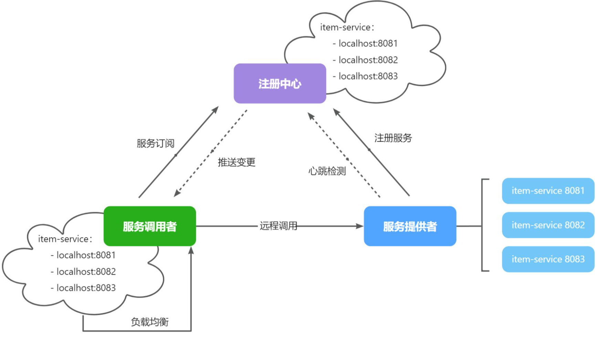
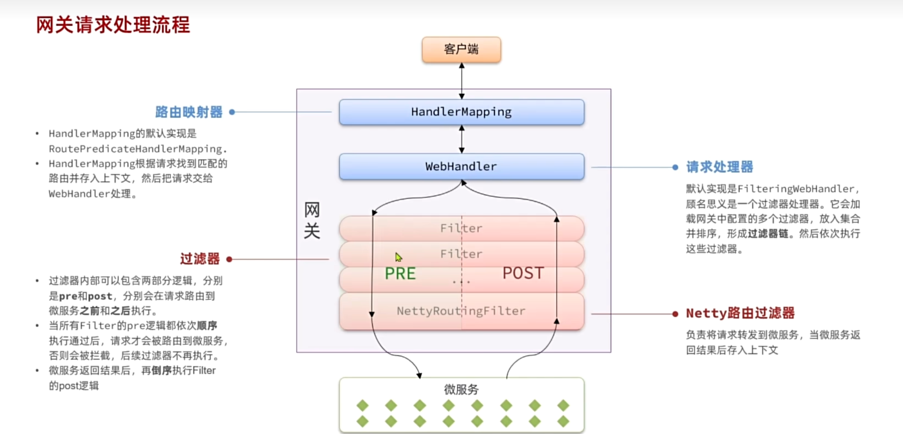

# SpringCloud微服务

我们在做服务拆分时一般有两种方式：

- 纵向拆分：按照项目的功能模块来拆分
- 横向拆分：各个功能模块之间有没有公共的业务部分，如果有将其抽取出来作为通用服务

微服务项目有两种不同的工程结构：

- 完全解耦：每一个微服务都创建为一个独立的工程，甚至可以使用不同的开发语言来开发，项目完全解耦。
- Maven聚合：整个项目为一个Project，然后每个微服务是其中的一个Module

这里介绍Maven聚合的方式

## 模块

Maven聚合的微服务项目包括个大的根项目，有自己的POM，配置了子微服务项目可能的依赖

在根项目的模块下还可以新建模块，一个模块就是一个微服务单体项目，也有自己的POM，用\<parent>指定

    <parent>
        <groupId>com.xxxxxx</groupId>
        <artifactId>xxxxx</artifactId>
        <version>1.0.0</version>
    </parent>

根项目的POM配置了自己的groupId，artificialId，version，还列出了其子模块列表

    <groupId>com.xxxxxx</groupId>
    <artifactId>xxxxx</artifactId>
    <packaging>pom</packaging>
    <version>1.0.0</version>
    <modules>
        <module>common</module>
        <module>item-service</module>
        <module>cart-service</module>
        ...
    </modules>

常见问题

Unable to make field private final java.lang.Class java.lang.invoke.SerializedLambda.capturingClass accessible: module java.base does not "opens java.lang.invoke" to unnamed module @34123d65

JDK 16 以后，对 setAccessible(true) 做了严格限制，不能随便反射访问 JDK 内部类/字段。在 JDK 21 上，这类反射默认被禁止，必须显式开放模块才能访问

如果不想改动代码，在JVM启动参数上加上--add-opens java.base/java.lang.invoke=ALL-UNNAMED

如果可以修改依赖版本，保证

- MyBatis-Plus → 升级到 3.5.3.2+
- Lombok → 升级到 1.18.30+
- Spring Boot → 至少 2.7.18

如果指定了父项目\<parent>，版本是直接继承的，请修改父项目的POM的依赖版本

## 远程调用RPC

不同微服务直接可能需要互相调用对方的服务，比如购物车服务需要调用商品服务。在单体项目中只需要注入对应的service类即可

而在微服务项目上另一个服务甚至可能运行在另一台物理主机上。因此想要调用相关服务应该通过网络通信，例如发送HTTP请求给商品服务的API

Spring给我们提供了一个RestTemplate的API用于发送各种HTTP请求（同步），

常见方法有：

- getForObject：发送Get请求并返回指定类型对象
- PostForObject：发送Post请求并返回指定类型对象
- put：发送PUT请求
- delete：发送Delete请求
- exchange：发送任意类型请求，返回ResponseEntity

对于复杂的请求，可以使用`exchange()`方法

    ResponseEntity<T> exchange(String url, HttpMethod method, @Nullable HttpEntity<?> requestEntity, ParameterizedTypeReference<T> responseType, Map<String, ?> uriVariables)

示例，其中请求参数是Map，这里只有一条ids到1,2,3...等id集合形成的字符串的映射

     ResponseEntity<List<ItemDTO>> response = restTemplate.exchange(
            "http://localhost:8081/items?ids={ids}",
            HttpMethod.GET,
            null,
            new ParameterizedTypeReference<List<ItemDTO>>() {
            },
            Map.of("ids", CollUtil.join(itemIds, ","))
    );

## 注册中心

上述RPC只是一个很简单的实现，实际运行的项目可能遇到诸多问题，比如一个服务可能有多个实例，服务消费者不知道调用哪个。再比如该服务不知道其调用的哪台服务是否正常运行

方便对多个微服务进行相互调用的配置和管理，引入注册中心的概念

包括两个角色：

- 服务提供者：提供接口供其它微服务访问
- 服务消费者：调用其它微服务提供的接口

流程如下：

- 服务启动时就会注册自己的服务信息（服务名、IP、端口）到注册中心
- 调用者可以从注册中心订阅想要的服务，获取服务对应的实例列表（1个服务可能多实例部署）
- 调用者自己对实例列表负载均衡，挑选一个实例
- 调用者向该实例发起远程调用

当服务提供者的实例宕机或者启动新实例时，调用者如何得知呢？

- 服务提供者会定期向注册中心发送请求，报告自己的健康状态（心跳请求）
- 当注册中心长时间收不到提供者的心跳时，会认为该实例宕机，将其从服务的实例列表中剔除
- 当服务有新实例启动时，会发送注册服务请求，其信息会被记录在注册中心的服务实例列表
- 当注册中心服务列表变更时，会主动通知微服务，更新本地服务列表

常见注册中心框架有Eureka，Nacos，Consul等，都遵循SpringCloud中的API规范，没有太大差异，这里介绍Nacos

### Nacos

使用docker配置Nacos环境

1. 在数据库里配置Nacos的database，SQL可以在<https://github.com/alibaba/nacos/blob/master/distribution/conf/mysql-schema.sql?spm=5238cd80.2ef5001f.0.0.3f613b7cSxKGLW&file=mysql-schema.sql>下载

2. 在nacos目录下编写custom.env，MYSQL_SERVICE_HOST是MySQL主机地址，如果在同一个网络下，直接使用容器名称

    PREFER_HOST_MODE=hostname
    MODE=standalone
    SPRING_DATASOURCE_PLATFORM=mysql
    MYSQL_SERVICE_HOST=mysql-mall
    MYSQL_SERVICE_DB_NAME=nacos
    MYSQL_SERVICE_PORT=3306
    MYSQL_SERVICE_USER=root
    MYSQL_SERVICE_PASSWORD=123
    MYSQL_SERVICE_DB_PARAM=characterEncoding=utf8&connectTimeout=1000&socketTimeout=3000&autoReconnect=true&useSSL=false&allowPublicKeyRetrieval=true&serverTimezone=Asia/Shanghai

3. docker run创建Nacos容器

    docker run -d \
    --name nacos \
    --env-file ./nacos/custom.env \
    -p 8848:8848 \
    -p 9848:9848 \
    -p 9849:9849 \
    --restart=always \
    --network mallnet \
    nacos/nacos-server:v2.1.0-slim

#### 服务注册

要把某个Java服务注册到Nacos，先引入依赖

    <!--nacos 服务注册发现-->
    <dependency>
        <groupId>com.alibaba.cloud</groupId>
        <artifactId>spring-cloud-starter-alibaba-nacos-discovery</artifactId>
    </dependency>

在application.yaml配置nacos连接信息，服务名称表示这个服务将以次名称注册到nacos

    spring:
        application:
            name: item-service # 服务名称
        cloud:
            nacos:
            server-addr: 192.168.150.101:8848 # nacos地址

配置完成后，启动服务就可以注册到Nacos

#### 服务发现

服务发现还需要多一个依赖，是SpringCloud提供的LoadBalancer依赖，用于负载均衡

    <!--nacos 服务注册发现，已包含LoadBalancer依赖-->
    <dependency>
        <groupId>com.alibaba.cloud</groupId>
        <artifactId>spring-cloud-starter-alibaba-nacos-discovery</artifactId>
    </dependency>

要使用Nacos的服务发现功能，需要获取DiscoveryClient的Bean，SpringCloud已经帮我们自动装配，可以直接注入

获取服务实例列表（列表是因为一个服务有多个实例），从中选择一个实例

    List<ServiceInstance> instances = discoveryClient.getInstances("item-service");
    ServiceInstance instance = instances.get(RandomUtil.randomInt(instances.size()));

获取服务实例类后，就可以通过各种get来获取实例的信息，例如`getUri()`获得实例的url请求地址

    ResponseEntity<List<ItemDTO>> response = restTemplate.exchange(
        instance.getUri() +  "/items?ids={ids}",
        HttpMethod.GET,
        null,
        new ParameterizedTypeReference<List<ItemDTO>>() {
        },
        Map.of("ids", CollUtil.join(itemIds, ","))
    );
    if(!response.getStatusCode().is2xxSuccessful()){
        //查询失败，直接结束
        return;
    }
    List<ItemDTO> items = response.getBody();
    if (CollUtils.isEmpty(items)) {
        return;
    }

使用实例动态获取url而不是硬编码，可以方便的获取当前可用的实例的请求地址

## RPC调用

不同服务之间的方法调用已经不是简单的Java方法调用了，它们是不同的进程，可能还运行在不同的设备上，方法的调用事实上需要保证成一个网络请求

### OpenFeign

SpringCloud提供的OpenFeign组件用于简化RPC调用的操作，先前的原始RPC需要先从Nacos拿到可用服务实例，拼接URL再手动发送请求，比较麻烦

    <!--openFeign-->
    <dependency>
        <groupId>org.springframework.cloud</groupId>
        <artifactId>spring-cloud-starter-openfeign</artifactId>
    </dependency>
    <!--负载均衡器-->
    <dependency>
        <groupId>org.springframework.cloud</groupId>
        <artifactId>spring-cloud-starter-loadbalancer</artifactId>
    </dependency>

在需要使用OpenFeign的服务的启动类加上注解`@EnableFeignClients`启动OpenFeign功能

接下来需要编写一个Feign客户端，用于指定RPC的网络路径，请求方式等，和对应微服务的Controller很类似，但是接口

    @FeignClient("item-service")
    public interface ItemClient {

        @GetMapping("/items")
        List<ItemDTO> queryItemByIds(@RequestParam("ids") Collection<Long> ids);
    }

- @FeignClient("item-service") ：声明服务名称，是在Nacos注册的名称
- @GetMapping ：声明请求方式
- @GetMapping("/items") ：声明请求路径
- @RequestParam("ids") Collection\<Long> ids ：声明请求参数，@RequestParam的value是请求的参数名称，函数的参数才是参数体
- List\<ItemDTO> ：返回值类型

OpenFeign利用动态代理帮我们实现这个接口的代理类，从Nacos拿到实例，自动发送请求，我们只需要调用ItemClient的`queryItemByIds()`方法就可以像本地调用一样进行RPC调用

**坑点**：OpenFeign的请求参数默认只支持简单类型（String/Integer/Long）作为 @RequestParam 或 @PathVariable。和SpringMVC不同当你把整个对象作为 GET 方法参数 时，Feign无法序列化对象为 URL query 参数，会自动把它改成 POST + RequestBody 来发送，导致请求方式不一致。因此，**OpenFeign不允许用对象封装多个GET请求参数**

对于RPC调用的Client接口，一个服务可以被调用的方法是固定的，如果在每个需要调用的服务都编写被调用服务的Client会造成重复，有两种最佳实践

- 单调建立一个公共的API模块，包含各个服务的Client
- 每个服务下都建立一个子模块，包含这个服务能够被RPC调用的接口的Client，要调用就直接引入该服务的这个模块即可

引用其它模块的Client还有一个问题，就是当前服务的Spring包扫描范围不包含引入的Client的接口，无法生成对应的代理类bean，解决方法有两种

- @ComponentScan的机制：在@EnableFeignClients(basePackages = com.xxx.xxx)直接指定对应Client接口的所在的包的地址，把这个作为OpenFeign生成代理类的扫描包
- @Import的机制：在@EnableFeignClients(clients = {ItemClient.class})声明要使用的Client

需要注意的是，一个Client模块可能要用到其它模块的DTO用于不同微服务通信，如果直接复制其它模块的DTO到该Client模块下，由于类的全限定名不同，实际这个模块调用对应Client方法的参数是不兼容的

DTO是用于在服务之间 / 进程之间传输数据的对象，需要共享，PO/VO之类的是服务自己私有的，可以不共享

可以在API模块中定义对应的DTO和Client，对应服务需要用到自己的/别人的DTO是就依赖对应的API模块

    order-api
        └── dto
            └── OrderDTO.java     <-- 暴露给外部的传输对象
        └── client
            └── OrderClient.java   <-- Feign Client接口
    order-service
        └── domain
            └──po
                └── OrderPO.java      <-- 数据库实体（JPA/MyBatis）
            └── vo
                └── OrderDetailVO.java <-- 返回给前端的展示对象
        └── service
            └── OrderService.java
        └── controller
            └── OrderController.java

#### 连接池

Feign底层发起http请求，依赖于其它的框架。其底层支持的http客户端实现包括：

- HttpURLConnection：默认实现，不支持连接池
- Apache HttpClient ：支持连接池
- OKHttp：支持连接池

通常会使用带有连接池的客户端来代替默认的HttpURLConnection，这里介绍OKHttp

    <!--OK http 的依赖 -->
    <dependency>
        <groupId>io.github.openfeign</groupId>
        <artifactId>feign-okhttp</artifactId>
    </dependency>

在application.yaml配置开启连接池功能

    feign:
        okhttp:
            enabled: true # 开启OKHttp功能

#### 日志级别配置

OpenFeign只会在FeignClient所在包的日志级别为DEBUG时，才会输出日志，默认为NONE，没有任何日志。其日志级别有

- NONE：不记录任何日志信息，这是默认值。
- BASIC：仅记录请求的方法，URL以及响应状态码和执行时间
- HEADERS：在BASIC的基础上，额外记录了请求和响应的头信息
- FULL：记录所有请求和响应的明细，包括头信息、请求体、元数据。

修改日志级别可以新建一个配置类

    public class DefaultFeignConfig {
        @Bean
        public Logger.Level feignLogLevel(){
            return Logger.Level.FULL;//修改为FULL
        }
    }

- 局部生效：在某个FeignClient中配置，只对当前FeignClient生效

    @FeignClient(value = "item-service", configuration = DefaultFeignConfig.class)

- 全局生效：在@EnableFeignClients中配置，针对所有FeignClient生效。

    @EnableFeignClients(defaultConfiguration = DefaultFeignConfig.class)

## 拆分服务

拆分服务需要修改配置文件的一部分内容

    spring:
        application:
            name: user-service # 这里修改为对应的服务名称，nacos使用这里的名称
        datasource:
            url: jdbc:mysql://${db.host}:${db.port}/user # url这一项要连接到正确的数据库地址
    knife4j:
        openapi:
            title: 用户服务接口文档 # 这里修改为文档名称（非必要）
            group:
      default:
        api-rule-resources:
          - com.hmall.user.controller # 这里修改为对哪个类生成文档

如果有部分vaule是通过properties注入的，配置文件也应该有对应的配置项

## 网关

- 网关路由，解决前端请求入口的问题。
- 网关鉴权，解决统一登录校验和用户信息获取的问题。
- 统一配置管理，解决微服务的配置文件重复和配置热更新问题

前端请求不能访问微服务，而是统一请求网关，再由网关转发到对应服务。由于请求统一走网关，鉴权也可以在网关上进行

SpringCloud提供了SpringCloudGateway作为网关实现方案

    <dependency>
        <groupId>org.springframework.cloud</groupId>
        <artifactId>spring-cloud-starter-gateway</artifactId>
    </dependency>

网关是一个独立的微服务，因此还需要配合Nacos和负载均衡相关的依赖

    <!--nacos discovery-->
    <dependency>
        <groupId>com.alibaba.cloud</groupId>
        <artifactId>spring-cloud-starter-alibaba-nacos-discovery</artifactId>
    </dependency>
    <!--负载均衡-->
    <dependency>
        <groupId>org.springframework.cloud</groupId>
        <artifactId>spring-cloud-starter-loadbalancer</artifactId>
    </dependency>

此微服务的application.yaml需要配置gateway的相关信息

    server:
      port: 8080
    spring:
      application:
        name: gateway
      cloud:
        nacos:
          server-addr: ${hm.nacos.host}:${hm.nacos.port}
        gateway:
          routes:
            - id: item # 路由规则id，自定义，唯一
              uri: lb://item-service # 路由的目标服务，lb代表负载均衡，会从注册中心拉取服务列表
              predicates: # 路由断言，判断当前请求是否符合当前规则，符合则路由到目标服务
                - Path=/items/**,/search/** # 这里是以请求路径作为判断规则
            - id: cart
              uri: lb://cart-service
              predicates:
                - Path=/carts/**
            - id: user
              uri: lb://user-service
              predicates:
                - Path=/users/**,/addresses/**
            - id: trade
              uri: lb://trade-service
              predicates:
                - Path=/orders/**
            - id: pay
              uri: lb://pay-service
              predicates:
                - Path=/pay-orders/**

具体的配置逻辑写在spring.cloud.gateway.routes，还需要订阅nacos获取服务

- id：路由的唯一标示
- predicates：路由断言，其实就是匹配条件
- filters：路由过滤条件，后面讲
- uri：路由目标地址，lb://代表负载均衡，从注册中心获取目标微服务的实例列表，并且负载均衡选择一个访问

路由断言predicates有以下几种

|名称|说明|示例|
|----|---|----|
|After|是某个时间点后的请求|- After=2037-01-20T17:42:47.789-07:00[America/Denver]|
|Before|是某个时间点之前的请求|- Before=2031-04-13T15:14:47.433+08:00[Asia/Shanghai]|
|Between|是某两个时间点之前的请求|- Between=2037-01-20T17:42:47.789-07:00[America/Denver], 2037-01-21T17:42:47.789-07:00[America/Denver]|
|Cookie|请求必须包含某些cookie|- Cookie=chocolate, ch.p|
|Header|请求必须包含某些header|- Header=X-Request-Id, \d+|
|Host|请求必须是访问某个host（域名）|- Host=**.somehost.org,**.anotherhost.org|
|Method|请求方式必须是指定方式|- Method=GET,POST|
|Path|请求路径必须符合指定规则|- Path=/red/{segment},/blue/**|
|Query|请求参数必须包含指定参数|- Query=name, Jack或者- Query=name|
|RemoteAddr|请求者的ip必须是指定范围|- RemoteAddr=192.168.1.1/24|
|weight|权重处理| |

这样nginx只需要请求网关，具体的路由转发到哪个微服务由网关负责

## 网关鉴权

微服务之间不共享数据，如果没有网关，每个微服务都要编写相应的鉴权功能

因为所有请求先发到网关，我们可以在网关服务做鉴权，鉴权成功的才转发到对应的微服务

在网关鉴权需要解决以下问题

- 网关路由是配置的，请求转发是Gateway内部代码，如何在转发之前做登录校验
- 网关校验JWT之后，如何将用户信息传递给微服务
- 微服务之间相互调用不经过网关，如何传递用户信息

### 添加GatewayFilter过滤器

定义一个过滤器，在其中实现登录校验逻辑，并且将过滤器执行顺序定义到NettyRoutingFilter之前的pre阶段就可以满足请求拦截的要求

网关提供了两种过滤器

- GatewayFilter：路由过滤器，作用范围比较灵活，可以是任意指定的路由Route.
- GlobalFilter：全局过滤器，作用范围是所有路由，不可配置。有对应的配置类Bean就直接生效

它们均是接口，的方法签名均是

    /**
    * 处理请求并将其传递给下一个过滤器
    * @param exchange 当前请求的上下文，其中包含request、response等各种数据
    * @param chain 过滤器链，基于它向下传递请求
    * @return 根据返回值标记当前请求是否被完成或拦截，chain.filter(exchange)是放行
    */
    Mono<Void> filter(ServerWebExchange exchange, GatewayFilterChain chain);

Gateway内置的GatewayFilter过滤器使用起来非常简单，无需编码，只要在yaml文件中简单配置即可。而且其作用范围也很灵活，配置在哪个Route下，就作用于哪个Route。配置写在application.yaml的`spring.cloud.gateway.routes.filters`下

例如，有一个过滤器叫做AddRequestHeaderGatewayFilterFacotry，是添加请求头的过滤器，给请求添加一个请求头并传递到下游微服务

    spring:
      cloud:
        gateway:
          routes:
            - id: test_route
              uri: lb://test-service
              predicates:
                -Path=/test/**
              filters:
                - AddRequestHeader=key, value # 逗号之前是请求头的key，逗号之后是value

如果所有路由想要使用同一个过滤器，可以配置`spring.cloud.gateway.default-filters`

    spring:
      cloud:
        gateway:
          default-filters: # default-filters下的过滤器可以作用于所有路由
            - AddRequestHeader=key, value

### 自定义过滤器

上面只是把过滤器添加到了网关中，没有实现我们具体逻辑的功能

#### GatewayFilter

需要过滤器进行具体的逻辑时，就需要对过滤器进行自定义。自定义过滤器需要实现`AbstractGatewayFilterFactory`类并重写其的`public GatewayFilter apply(Object config)`方法，并被IoC容器管理。
**该类的名称一定要以GatewayFilterFactory为后缀**

    @Component
    public class PrintAnyGatewayFilterFactory extends AbstractGatewayFilterFactory<Object> {
        @Override
        public GatewayFilter apply(Object config) {
            return new GatewayFilter() {
                @Override
                public Mono<Void> filter(ServerWebExchange exchange, GatewayFilterChain chain) {
                    // 获取请求
                    ServerHttpRequest request = exchange.getRequest();
                    // 编写过滤器逻辑
                    System.out.println("过滤器执行了");
                    // 放行
                    return chain.filter(exchange);
                }
            };
        }
    }

有了相应的Bean，就可以在yaml文件把这个过滤器添加到网关，注意去掉GatewayFilterFactory的后缀

    spring:
      cloud:
        gateway:
          default-filters:
            - PrintAny # 此处直接以自定义的GatewayFilterFactory类名称前缀类声明过滤器

如果过滤器的执行需要参数，则还需要再配置类内编写static的参数类Config（包含需要的每个参数成员变量），继承的`AbstractGatewayFilterFactory<?>`泛型是本过滤器类的Config，`apply()`方法的参数类型也是Config。实际的参数通过调用config的各种`get()`方法拿到

此外，还要实现`public List<String> shortcutFieldOrder()`（用于指定从配置文件读取参数的顺序）和`public Class<Config> getConfigClass()`（由过滤器工厂调用来加载过滤器类）

    @Component
    public class PrintAnyGatewayFilterFactory // 父类泛型是内部类的Config类型
                    extends AbstractGatewayFilterFactory<PrintAnyGatewayFilterFactory.Config> {

        @Override
        public GatewayFilter apply(Config config) {
            // OrderedGatewayFilter是GatewayFilter的子类，包含两个参数：
            // - GatewayFilter：过滤器
            // - int order值：值越小，过滤器执行优先级越高
            return new OrderedGatewayFilter(new GatewayFilter() {
                @Override
                public Mono<Void> filter(ServerWebExchange exchange, GatewayFilterChain chain) {
                    // 获取config值
                    String a = config.getA();
                    String b = config.getB();
                    String c = config.getC();
                    // 编写过滤器逻辑
                    System.out.println("a = " + a);
                    System.out.println("b = " + b);
                    System.out.println("c = " + c);
                    // 放行
                    return chain.filter(exchange);
                }
            }, 100);
        }

        // 自定义配置属性，成员变量名称很重要，下面会用到
        @Data
        static class Config{
            private String a;
            private String b;
            private String c;
        }
        // 将变量名称依次返回，顺序很重要，将来读取参数时需要按顺序获取
        @Override
        public List<String> shortcutFieldOrder() {
            return List.of("a", "b", "c");
        }
            // 返回当前配置类的类型，也就是内部的Config
        @Override
        public Class<Config> getConfigClass() {
            return Config.class;
        }
    }

并在yaml里用=指定参数，之间,隔开，顺序是`shortcutFieldOrder()`定义的顺序，或者不依照顺序手动指定参数名称

    spring:
      cloud:
        gateway:
          default-filters:
            - PrintAny=1,2,3 # 注意，这里多个参数以","隔开，将来会按照shortcutFieldOrder()方法返回的参数顺序依次复制

    spring:
      cloud:
        gateway:
          default-filters:
            - name: PrintAny
              args: # 手动指定参数名，无需按照参数顺序
                a: 1
                b: 2
                c: 3

#### GlobalFilter

自定义GlobalFilter只需要一个实现GlobalFilter接口的类，不需要在配置文件配置，如果要指定拦截器优先级，可以实现Ordered的`getOrder()`方法，返回值越小优先级越高

    @Component
    public class PrintAnyGlobalFilter implements GlobalFilter, Ordered {
        @Override
        public Mono<Void> filter(ServerWebExchange exchange, GatewayFilterChain chain) {
            // 编写过滤器逻辑
            System.out.println("未登录，无法访问");
            // 放行
            // return chain.filter(exchange);

            // 拦截
            ServerHttpResponse response = exchange.getResponse();
            response.setRawStatusCode(401);
            return response.setComplete();
        }

        @Override
        public int getOrder() {
            // 过滤器执行顺序，值越小，优先级越高
            return 0;
        }
    }

通过Global实现JWT拦截过滤的案例

    @Component
    @RequiredArgsConstructor
    @EnableConfigurationProperties(AuthProperties.class)//使配置注册成Bean，也可以把配置类@Component注册成Bean
    public class AuthGlobalFilter implements GlobalFilter, Ordered {

        //自定义auth配置类
        private final AuthProperties authProperties;
        //自定义jwt工具类用于解析jwt
        private final JwtTool jwtTool;
        //用于url和排除项的匹配
        private final AntPathMatcher antPathMatcher = new AntPathMatcher();//也可以手写一个配置类把AntPathMatcher注册成Bean靠Spring注入

        /**
        * 判断请求路径是否在排除的路径中
        * @param antPath 请求路径
        * @return 是否在排除的路径中
        */
        private boolean isExcluded(String antPath) {
            for (String pattern : authProperties.getExcludePaths()) {
                if (antPathMatcher.match(pattern, antPath)) {
                    return true;
                }
            }
            return false;
        }

        @Override
        public Mono<Void> filter(ServerWebExchange exchange, GatewayFilterChain chain) {
            //1. 获取请求头
            ServerHttpRequest request = exchange.getRequest();
            //2. 判断是否需要拦截
            String path = request.getPath().toString();
            if (isExcluded(path)) {
                return chain.filter(exchange);//不需要拦截，直接放行
            }
            //3. 获取token
            String token = null;
            List<String> tokens = request.getHeaders().get("authorization");
            if (!CollUtil.isEmpty(tokens)) {
                token = tokens.get(0);
            }
            //4. 解析token
            Long userId = null;
            try {
                userId = jwtTool.parseToken(token);
            } catch (UnauthorizedException e) {
                ServerHttpResponse response = exchange.getResponse();
                response.setStatusCode(HttpStatus.UNAUTHORIZED);//设置401状态码
                return response.setComplete();//拦截请求
            }
            //5. TODO 传递用户id
            System.out.println("userId = " + userId);
            //6. 放行
            return chain.filter(exchange);
        }

        @Override
        public int getOrder() {
            return 0;
        }
    }

### 把用户信息传到微服务：网关调用添加请求头

网关对微服务的调用也是HTTP请求，因此可以在网关的请求加上对应请求头把用户信息传到微服务

微服务定义拦截器取出用户ID，放入ThreadLocal

要想在网关的HTTP请求添加请求头，因为上下文ServerWebExchange类是不可变的，因此应该调用上下文的`exchange.mutate().request().build(b -> b.header())`获取新的exchange传给下级调用链

    //5. 传递用户id
    String userInfo = userId.toString();
    ServerWebExchange newExchange = exchange.mutate().request(b -> b.header("user-info", userInfo)).build();
    //6. 放行
    return chain.filter(newExchange);

对于每个微服务都要对应的拦截器获取用户ID，不妨把相关类的拦截器写在共同的依赖模块common中

    public class UserInfoInterceptor implements HandlerInterceptor {
        @Override
        public boolean preHandle(HttpServletRequest request, HttpServletResponse response, Object handler) throws Exception {
            String userInfo = request.getHeader("user-info");
            if(StrUtil.isNotBlank(userInfo)) {
                UserContext.setUser(Long.valueOf(userInfo));
            }
            return true;
        }

        @Override
        public void afterCompletion(HttpServletRequest request, HttpServletResponse response, Object handler, Exception ex) throws Exception {
            UserContext.removeUser();
        }
    }

注册拦截器

    @Configuration
    @ConditionalOnClass({DispatcherServlet.class})//SpringBoot注解，条件装配，指定在类路径中存在特定的类时才加载某个配置类或Bean
    public class MvcConfig implements WebMvcConfigurer {
        @Override
        public void addInterceptors(InterceptorRegistry registry) {
            registry.addInterceptor(new UserInfoInterceptor());
        }
    }

因为写在common模块，其它微服务虽然导入了这个模块，但它们的包扫描范围扫描不到这个MvcConfig类，导致服务内没有这个bean，拦截器不能生效。而一个个配置扫描路径很麻烦

基于SpringBoot的自动装配原理，可以将其添加到common模块的resources目录下的META-INF/spring.factories文件中

    org.springframework.boot.autoconfigure.EnableAutoConfiguration=\
        com.hmall.common.config.MvcConfig

### 微服务直接传递用户信息：OpenFeign调用添加请求头

要想在OpenFeign添加拦截器，需要使用feign.RequestInterceptor接口，实现方法`void apply(RequestTemplate template)`，并调用`template.header()`添加请求头，这个类将作为一个Bean

    @Configuration
    public class DefaultFeignConfig {
        @Bean
        public RequestInterceptor userInfoRequestInterceptor() {
            return new RequestInterceptor() {
                @Override
                public void apply(RequestTemplate requestTemplate) {
                    Long userId = UserContext.getUser();
                    if (userId == null) {
                        return;
                    }
                    requestTemplate.header("user-info", userId.toString());
                }
            };
        }
    }

这样，OpenFeign在进行调用对应微服务时就会先添加相应的请求头，从而使得对应服务的拦截器获取到userId

## 共享配置

要从配置文件读取配置到实体类Properties

可以用@ConfigurationProperties(prefix = "xxx")，代表从前缀为xxx的配置文件读取配置注入

这个类应该作为一个bean

还可以用Actuator检查配置

    <dependency> 
        <groupId>org.springframework.boot</groupId> 
        <artifactId>spring-boot-starter-actuator</artifactId> 
    </dependency>

放置env端点

    management:
      endpoints:
        web:
          exposure:
            include: env

访问`http://项目网络位置/actuator/env`可以查看实际加载的配置

注意，Actuator 会注册额外的 Endpoint如EnvironmentEndpoint、ConfigurationPropertiesReportEndpoint 等 Bean。这些 Bean 会在 ApplicationContext 初始化时 访问全部 RequestMapping 信息

而Swagger 在 Spring Boot 启动时，会扫描所有 Controller 的 RequestMappingInfo。如果扫描过程中遇到某些 Bean/接口（比如 api 模块里的 Feign 接口或带空 @RequestMapping 注解的类），因为它们是空的，会导致

    PatternsRequestCondition.getPatterns() → NullPointerException

因此默认情况下Actuator和Swagger两个依赖不能共存，错误信息显示为org.springframework.context.ApplicationContextException: Failed to start bean 'documentationPluginsBootstrapper'; nested exception is java.lang.NullPointerException: Cannot invoke "org.springframework.web.servlet.mvc.condition.PatternsRequestCondition.getPatterns()" because "this.condition" is null

可以通过限制Swagger扫描范围解决

    @Configuration
    @EnableSwagger2
    public class SwaggerConfig {

        @Bean
        public Docket api() {
            return new Docket(DocumentationType.SWAGGER_2)
                .select()
                // 只扫描 Controller 包，避免扫描 api 或 Feign 接口
                .apis(RequestHandlerSelectors.basePackage("com.hmall.cart.controller"))
                .paths(PathSelectors.any())
                .build();
        }
    }

或者直接不引入Swagger依赖

    <exclusions>
        <exclusion>
            <groupId>com.github.xiaoymin</groupId>
            <artifactId>knife4j-openapi2-spring-boot-starter</artifactId>
        </exclusion>
    </exclusions>

### 添加共享配置

每个微服务都要配置自己的application.yaml，其中一部分内容是相同的，可以抽取到Nacos中统一管理，在Nacos管理页面的配置列表编写

    <!--nacos配置管理-->
    <dependency>
        <groupId>com.alibaba.cloud</groupId>
        <artifactId>spring-cloud-starter-alibaba-nacos-config</artifactId>
    </dependency>

比如JDBC相关配置（通常只有连接地址，用户名，密码不同），命名为`shared-jdbc.yaml`其中:后跟着的是默认值

    spring:
      datasource:
        url: jdbc:mysql://${hm.db.host:192.168.150.101}:${hm.db.port:3306}/${hm.db.database}?useUnicode=true&characterEncoding=UTF-8&autoReconnect=true&serverTimezone=Asia/Shanghai
        driver-class-name: com.mysql.cj.jdbc.Driver
        username: ${hm.db.un:root}
        password: ${hm.db.pw:123}
    mybatis-plus:
      configuration:
        default-enum-type-handler: com.baomidou.mybatisplus.core.handlers.MybatisEnumTypeHandler
      global-config:
        db-config:
          update-strategy: not_null
          id-type: auto

日志配置，命名为`shared-log.yaml`

    logging:
      level:
        com.hmall: debug
      pattern:
        dateformat: HH:mm:ss:SSS
      file:
        path: "logs/${spring.application.name}"

Swagger配置，命名为`shared-swagger.yaml`

    knife4j:
      enable: true
      openapi:
        title: ${hm.swagger.title:商城接口文档}
        description: ${hm.swagger.description:商城接口文档}
        email: ${hm.swagger.email:zhanghuyi@itcast.cn}
        concat: ${hm.swagger.concat:虎哥}
        url: https://www.itcast.cn
        version: v1.0.0
        group:
          default:
            group-name: default
            api-rule: package
            api-rule-resources:
              - ${hm.swagger.package}

OpenFeign配置，命名为`shared-feign.yaml`

    feign:
      okhttp:
        enabled: true

注意，Nacos配置不能共享，因为要连接到Nacos才能拉取共享配置

### 拉取共享配置

读取Nacos配置是SpringCloud上下文（ApplicationContext）初始化时处理的，发生在项目的引导阶段。然后才会初始化SpringBoot上下文，去读取application.yaml。而没有读取application.yaml就不知道Nacos地址，无法拉取配置

SpringCloud在初始化上下文的时候会先读取一个名为bootstrap.yaml(或者bootstrap.properties)的文件，如果我们将nacos地址配置到bootstrap.yaml中，在项目引导阶段就可以读取nacos中的配置

注意，**bootstrap.yaml是最早加载的配置，不能使用${}从其它未加载的配置文件读取配置**

因此**Nacos配置写在bootstrap.yaml中**

    <!--读取bootstrap文件，配合nacos-config使用-->
    <dependency>
        <groupId>org.springframework.cloud</groupId>
        <artifactId>spring-cloud-starter-bootstrap</artifactId>
    </dependency>

然后在对应微服务的bootstrap.yaml配置nacos地址和需要拉取的配置

    spring:
      application:
        name: cart-service # 服务名称
      profiles:
        active: dev
      cloud:
        nacos:
        server-addr: 192.168.150.101 # nacos地址
        config:
            file-extension: yaml # 文件后缀名
            shared-configs: # 共享配置
              - dataId: shared-jdbc.yaml # 共享mybatis配置
              - dataId: shared-log.yaml # 共享日志配置
              - dataId: shared-swagger.yaml # 共享日志配置
              - dataId: shared-feign.yaml # 共享OpenFeign配置

而在application.yaml中，只需要配置需要修改的配置项即可

### 热更新配置

有时候需要不重启项目来修改配置

可以先在nacos新建配置

    [服务名]-[spring.active.profile].[后缀名]

文件名称由三部分组成：

- 服务名：是购物车服务，所以是cart-service
- spring.active.profile：活跃的配置文件，就是spring boot中的spring.active.profile，可以省略，则所有profile共享该配置
- 后缀名：例如yaml

以这种格式命名的配置是该服务的私有配置，因为Spring Cloud会尝试自动拉取`${spring.application.name}.${file-extension}`的文件

例如购物车服务

    hm:
      cart:
        maxAmount: 1 # 购物车商品数量上限

再在对应服务创建一个属性读取类

    @Data
    @Component
    @ConfigurationProperties(prefix = "hm.cart")
    public class CartProperties {
        private Integer maxAmount;
    }

实际的service代码使用`cartProperties.getMaxAmount()`实时获取购物车上限限额，需要修改限额只需要修改nacos的配置即可生效，不需要重启服务

另一种方法是用`@RefreshScope`标记为要动态刷新的属性类，再用`@Value`注入，这种方法不是原地更新属性值，而是销毁这个Bean实例并重新创建

    @Data
    @Component
    @RefreshScope
    public class CartProperties {
        @Value("${hm.cart.maxAmount}")
        private Integer maxAmount;
    }

还有一种方法是直接从Environment拿取最新配置，有点破坏封装性，不建议使用

    @Autowired
    private Environment environment;

    public string getAppName(){
    return environment.getProperty("hm.cart.maxAmount");
    }

## 动态路由

网关的路由配置全部是在项目启动时由org.springframework.cloud.gateway.route.CompositeRouteDefinitionLocator在项目启动的时候加载，并且一经加载就会缓存到内存中的路由表内（一个Map），不会改变，也不会监听路由变更。

因此，我们必须在网关服务中监听Nacos的配置变更，然后手动把最新的路由更新到路由表中。动态路由让我们不需要重启项目就能通过修改Nacos的配置文件来修改网关的路由规则

### 监听配置变更

希望 Nacos 推送配置变更，可以使用 Nacos 动态监听配置接口来实现

    public void addListener(String dataId, String group, Listener listener)

示例，`receiveConfigInfo(String configInfo)`是路由配置变化后的回调函数，`getExecutor()`是回调函数使用的线程池，返回null时使用默认线程池

    configService.addListener(dataId, group, new Listener() {
            @Override
            public void receiveConfigInfo(String configInfo) {
            // 配置变更的通知处理
                    System.out.println("recieve1:" + configInfo);
            }
            @Override
            public Executor getExecutor() {
                    return null;
            }
    });

|参数名|参数类型|描述|
|------|-------|----|
|dataId|string|配置 ID，保证全局唯一性，只允许英文字符和 4 种特殊字符（"."、":"、"-"、"_"）。不超过 256 字节。|
|group|string|配置分组，一般是默认的DEFAULT_GROUP。|
|listener|Listener|监听器，配置变更进入监听器的回调函数。|

这里核心的步骤有2步：

- 创建ConfigService，目的是连接到Nacos
- 添加配置监听器，编写配置变更的通知处理逻辑

spring-cloud-starter-alibaba-nacos-config自动装配了NacosConfigManager，NacosConfigManager中是负责管理Nacos的ConfigService的，拿到NacosConfigManager再调用`getConfigService()`就拿到了ConfigService，第一步就实现了

第二步因为要读取配置也要添加监听器，建议使用ConfigService的如下方法，既可以配置监听器，并且会根据dataId和group读取配置JSON并返回，后续随着配置变更通知到监听器，完成路由更新

    String getConfigAndSignListener(
        String dataId, // 配置文件id
        String group, // 配置组，走默认
        long timeoutMs, // 读取配置的超时时间
        Listener listener // 监听器
    ) throws NacosException;

### 更新路由

更新路由要用到`org.springframework.cloud.gateway.route.RouteDefinitionWriter`接口

Mono 来自 Project Reactor，是 Spring WebFlux / Spring Cloud Gateway 底层用的响应式编程库。Mono\<T>：表示 0 或 1 个元素的异步序列。在响应式编程里，Mono 或 Flux（多个元素的流）本质上是一个**声明式的数据流管道**，不是立即执行的。只有调用 subscribe() 之后，这个流才会被订阅，操作才会触发

    public interface RouteDefinitionWriter {
            /**
        * 更新路由到路由表，如果路由id重复，则会覆盖旧的路由
        */
            Mono<Void> save(Mono<RouteDefinition> route);
            /**
        * 根据路由id删除某个路由
        */
            Mono<Void> delete(Mono<String> routeId);

    }

`RouteDefinition`在之前的网关配置中介绍过，包含

- id：路由id
- predicates：路由匹配规则
- filters：路由过滤器
- uri：路由目的地

保存到Nacos的路由配置也要符合这个结构，我们可以用JSON，这个配置的名称是自定义的

    {
        "id": "item",
        "predicates": [{
            "name": "Path",
            "args": {"_genkey_0":"/items/**", "_genkey_1":"/search/**"}
        }],
        "filters": [],
        "uri": "lb://item-service"
    }

### 实现动态路由

在网关模块引入依赖

    <!--统一配置管理-->
    <dependency>
        <groupId>com.alibaba.cloud</groupId>
        <artifactId>spring-cloud-starter-alibaba-nacos-config</artifactId>
    </dependency>
    <!--加载bootstrap-->
    <dependency>
        <groupId>org.springframework.cloud</groupId>
        <artifactId>spring-cloud-starter-bootstrap</artifactId>
    </dependency>

创建bootstrap.yaml，拉取日志配置

    spring:
      application:
        name: gateway
    cloud:
      nacos:
        server-addr: 192.168.150.101
        config:
          file-extension: yaml
          shared-configs:
            - dataId: shared-log.yaml # 共享日志配置

就可以移除application.yaml文件的spring下的所有内容，包括路由配置，因为我们要使用动态路由

编写动态路由监听器的配置类，注意要在监听器中写上配置文件的名称

    @Slf4j
    @Component
    @RequiredArgsConstructor
    public class DynamicRouteLoader {

        private final NacosConfigManager nacosConfigManager;

        private final RouteDefinitionWriter writer;

        private final ApplicationEventPublisher publisher; // 注入事件发布器

        //上一次路由规则的id，用于这一次清除这些规则
        private Set<String> routesIds = new HashSet<>();

        // 路由配置文件的id和分组
        private final String dataId = "gateway-routes.json";
        private final String group = "DEFAULT_GROUP";

        /**
        * 更新网关路由规则
        * @param configInfo 新的路由规则，JSON
        */
        private void updateConfigInfo(String configInfo) {
            log.info("路由规则变更，update config info:{}", configInfo);
            //1. 反序列化
            List<RouteDefinition> routes = JSONUtil.toList(configInfo, RouteDefinition.class);
            //2. 删除旧的路由规则
            for (String routeId : routesIds) {
                writer.delete(Mono.just(routeId)).subscribe();//save拿到mono后并不会立即去执行，需要订阅，即订阅这个容器的消息，有了消息后再去处理。 响应式编程。
            }
            routesIds.clear();
            //3. 更新路由
            for (RouteDefinition route : routes) {
                writer.save(Mono.just(route)).subscribe();
                routesIds.add(route.getId());//记录新的id方便以后删除
            }
            //4. 发布路由更新事件
            publisher.publishEvent(new RefreshRoutesEvent(this));
        }

        /**
        * 注册监听器
        * @throws NacosException
        */
        @PostConstruct
        public void intiRouteConfigListener() throws NacosException {
            //1. 注册监听器，首次拉取配置
            String config = nacosConfigManager.getConfigService().getConfigAndSignListener(dataId, group, 5000, new Listener() {

                @Override
                public Executor getExecutor() {
                    return null;
                }

                @Override
                public void receiveConfigInfo(String s) {
                    updateConfigInfo(s);
                }
            });
            //2. 注册时更新配置
            updateConfigInfo(config);
        }
    }

注意：Spring Boot 2.6+ / 2.7+后，官方把路由刷新的机制变得更「显式」，RouteDefinitionWriter.save() 和 delete() 只是更新存储，网关的 RouteDefinitionLocator 并不会主动 reload，必须通过 RefreshRoutesEvent 来告诉 Gateway 刷新路由缓存，**因此需要路由发布器发布事件**
