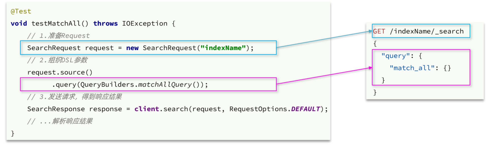
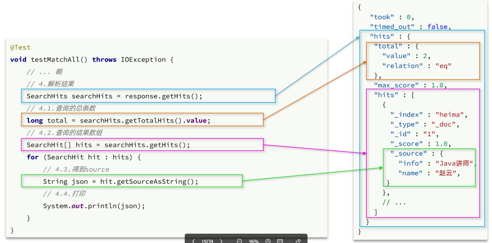
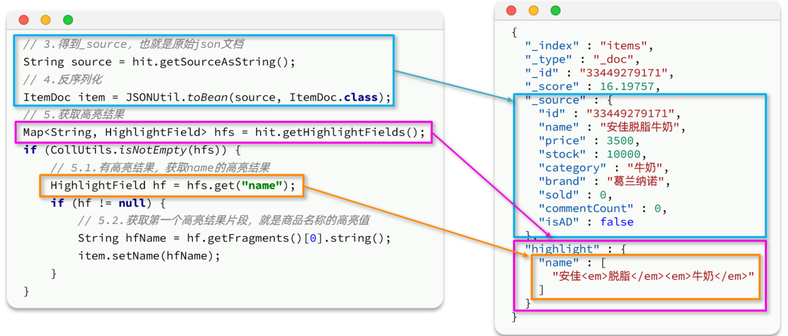

# Elasticsearch

搜索引擎技术，用于快速搜索到指定记录

其速度不仅远远快于数据库模糊查询（可能索引失效），还可以在用户输入出现个别错字，或者用拼音搜索、同义词搜索的情况，都能正确匹配到数据

## 部署

使用以下命令部署docker版本的Elasticsearch，我们采用7.12.1版本

```bash
docker run -d \
  --name es \
  -e "ES_JAVA_OPTS=-Xms512m -Xmx512m" \
  -e "discovery.type=single-node" \
  -v es-data:/usr/share/elasticsearch/data \
  -v es-plugins:/usr/share/elasticsearch/plugins \
  --privileged \
  --network mallnet \
  -p 9200:9200 \
  -p 9300:9300 \
  elasticsearch:7.12.1
```

- 9200是Elasticsearch和外部通信的HTTP请求端口，访问的完整url是<http://es:9200>
- 9300是集群内部通信端口

Elasticsearch没有管理页面，而是通过HTTP请求进行管理，如果需要方便可用的管理页面，可以部署Kibana

Kibana是Elastic公司提供的用于操作Elasticsearch的可视化控制台，使用如下命令部署docker版本的Kibana

```bash
docker run -d \
  --name kibana \
  -e ELASTICSEARCH_HOSTS=http://es:9200 \
  --network mallnet \
  -p 5601:5601  \
  kibana:7.12.1
```

- 5601是kibana管理页面端口
- ELASTICSEARCH_HOSTS是Elasticsearch的地址环境变量

## 原理

### 倒排索引

MySQL的底层存储用B+树，B+树的非叶子节点存储主键，也就是主键的正向索引，根据主键查找效率高

但如果针对某个字段做`%`开头的模糊查询，即使该字段有索引也会失效，也就是只能全表扫描，效率低

倒排索引恰好解决的就是根据部分词条模糊匹配的问题

倒排索引就是把id和行的其它值倒过来（比如名字），以名字为索引，id为值，通过名字来查找id，类似MySQL的二级索引

事实上并不直接用名字做索引，而是将每一个文档的数据利用分词算法根据语义拆分，得到一个个唯一的词条，再以这些词条为索引，以具有这些词条的行的id为值，因此可以支持模糊查询

### 文档，索引

Elasticsearch是面向文档存储的，可以是数据库中的一条商品数据，一个订单信息。文档数据会被序列化为json格式后存储在Elasticsearch，类似关系型数据库的行的概念

字段就是一条文档的某个属性，类似关系型数据库的列的概念

索引就是把相同类型的文档组织在一起，类似关系型数据库的表的概念

映射就是同一种索引的文档的字段格式，类似关系型数据库的表的结构约束

实际使用通常结合两种存储方式，写入时用MySQL，再把MySQL数据同步到Elasticsearch，复杂搜索用Elasticsearch

- Mysql：擅长事务类型操作，确保数据的安全和一致性
- Elasticsearch：擅长海量数据的搜索、分析、计算

### IK分词器

前面提到**Elasticsearch将每一个文档的数据利用分词算法根据语义拆分**，而IK分词器就是一种汉语的分词算法，可以在Elasticsearch安装这个插件

因为我们的Elasticsearch是用docker部署的，也需要用docker命令安装插件

```bash
docker exec -it es ./bin/elasticsearch-plugin install https://get.infini.cloud/elasticsearch/analysis-ik/7.12.1
```

重启容器插件才会生效

IK分词器包含两种模式：

- ik_smart：智能语义切分
- ik_max_word：最细粒度切分（默认），也就是逐字拆分

使用ik_smart模式，就在HTTP请求体带上参数`"analyzer": "ik_smart"`

```json
POST /_analyze
{
  "analyzer": "ik_smart",
  "text": "学习使用IK分词器"
}
```

想要新增自己的词典，就需要额外配置

通过下列命令找到加载字典配置的目录

```bash
docker logs es | grep -i "dictionary"
```

结果类似

```json
{"type": "server", "timestamp": "2025-10-13T14:32:49,333Z", "level": "INFO", "component": "o.w.a.d.Dictionary", "cluster.name": "docker-cluster", "node.name": "9ce3d4d1dec9", "message": "try load config from /usr/share/elasticsearch/config/analysis-ik/IKAnalyzer.cfg.xml", "cluster.uuid": "ElpsOmUNSqyV2FYhzd8Bmg", "node.id": "sTheddACQ9-8uKnla8A4ig"  }
```

其中的`"message": "try load config from /usr/share/elasticsearch/config/analysis-ik/IKAnalyzer.cfg.xml"`指的就是尝试从这个地址加载配置

可以运行`docker exec -it es bash`进入容器内的终端

在`IKAnalyzer.cfg.xml`添加配置

```xml
<properties>
        <comment>IK Analyzer 扩展配置</comment>
        <!--用户可以在这里配置自己的扩展字典 *** 添加扩展词典-->
        <entry key="ext_dict">ext.dic</entry>
</properties>
```

这里指的是我们新增了一个名为IK Analyzer 扩展配置的字典，字典内容从文件ext.dic读取

在同一个目录下新建文件ext.dic，其中每一行将被作为字典的一个词

重启Elasticsearch，新增的字典就生效了

## 索引库操作

要向es中存储数据，必须先创建Index和Mapping

一般的Mapping属性有

- type：字段数据类型，常见的简单类型有：
  - 字符串：text（可分词的文本）、keyword（精确值，例如：品牌、国家、ip地址，不分词）
  - 数值：long、integer、short、byte、double、float、
  - 布尔：boolean
  - 日期：date
  - 对象：object
- index：是否创建索引，默认为true
- analyzer：使用哪种分词器
- properties：该字段的子字段

### 创建索引库和映射

Elasticsearch采用Restful API进行操作，使用Kibana时，因为连接地址已经配置，所以我们在写请求时可以省略这部分

创建索引库和映射的格式如下

- 请求方式：PUT
- 请求路径：/{索引库名}，可以自定义
- 请求参数：请求体为mapping映射的json

```json
PUT /{索引库名称}
{
  "mappings": {
    "properties": {
      "字段名":{
        "type": "text",
        "analyzer": "ik_smart"
      },
      "字段名2":{
        "type": "keyword",
        "index": "false"
      },
      "字段名3":{
        "properties": {
          "子字段": {
            "type": "keyword"
          }
        }
      },
      // ...略
    }
  }
}
```

### 查询索引库

查询索引库不是查询文档，而是查询索引的mapping，类似MySQL的显示表结构

- 请求方式：GET
- 请求路径：/{索引库名}
- 请求参数：无

```json
GET /{索引库名}
```

### 修改索引库

和关系型数据库不同，应为变更已存在的字段会导致需要重新创建倒排索引，因此mapping中已有的字段不允许更新或删除，只允许向mapping添加新的字段

- 请求方式：GET
- 请求路径：/{索引库名}/_mapping
- 请求参数：请求体为mapping映射新增字段的json

```json
PUT /{索引库名}/_mapping
{
  "properties": {
    "新字段名":{
      "type": "integer"
    }
  }
}
```

### 删除索引库

- 请求方式：DELETE
- 请求路径：/{索引库名}
- 请求参数：无

```json
DELETE /{索引库名}
```

## 文档操作

### 新增文档

- 请求方式：POST
- 请求路径：/{索引库名}/_doc/{文档id}
- 请求参数：请求体为文档的json

```json
POST /{索引库名}/_doc/{文档id}
{
    "字段1": "值1",
    "字段2": "值2",
    "字段3": {
        "子属性1": "值3",
        "子属性2": "值4"
    },
}
```

### 查询文档

- 请求方式：GET
- 请求路径：/{索引库名称}/_doc/{id}
- 请求参数：无

```json
GET /{索引库名称}/_doc/{id}
```

### 删除文档

- 请求方式：DELETE
- 请求路径：/{索引库名}/_doc/{id}
- 请求参数：无

```json
DELETE /{索引库名}/_doc/{id}
```

### 修改文档

#### 全量修改

全量修改是覆盖原来的文档，其本质是根据指定的id删除文档，再新增一个相同id的文档

如果于没有对应id的文档，也会新增文档，也就是变成新增操作

- 请求方式：PUT
- 请求路径：/{索引库名}/_doc/{id}
- 请求参数：请求体为文档的json

```json
PUT /{索引库名}/_doc/{id}
{
    "字段1": "值1",
    "字段2": "值2",
    // ... 略
}
```

#### 局部修改

局部修改是只修改指定id匹配的文档中的部分字段

- 请求方式：POST
- 请求路径：/{索引库名}/_update/文档id
- 请求参数：请求体为要修改的字段的json

```json
POST /{索引库名}/_update/文档id
{
    "doc": {
         "字段名": "新的值",
    }
}
```

### 批处理

可以再一次请求进行多次操作

- 请求方式：POST
- 请求路径：_bulk
- 请求参数：请求体为要进行的操作的json

```json
POST _bulk
{ "index" : { "_index" : "test", "_id" : "1" } }
{ "field1" : "value1","field2" : "value2",... }
{ "delete" : { "_index" : "test", "_id" : "2" } }
{ "create" : { "_index" : "test", "_id" : "3" } }
{ "field1" : "value3" }
{ "update" : {"_id" : "1", "_index" : "test"} }
{ "doc" : {"field2" : "value2"} }
```

- index代表新增操作
  - _index：指定索引库名
  - _id指定要操作的文档id
  - { "field1" : "value1","field2" : "value2",... }：则是要新增的文档内容
- create也表新增操作，但只在原来的文档id不存在时才新增
- delete代表删除操作
  - _index：指定索引库名
  - _id指定要操作的文档id
- update代表更新操作
  - _index：指定索引库名
  - _id指定要操作的文档id
  - { "doc" : {"field2" : "value2"} }：要更新的文档字段

其中index，update等除了文档的元信息外还有文档的数据信息，它们通常另起一行，用另外的json对象表示，如`{ "field1" : "value1","field2" : "value2",... }`或`{ "doc" : {"field2" : "value2"} }`

## 在项目中使用-RestClient

### 引入依赖

在Elasticsearch提供的API中，Java服务与elasticsearch一切交互都封装在一个名为RestHighLevelClient的类

先引入依赖，我们需要的是在item-service使用Elasticsearch

```xml
<dependency>
    <groupId>org.elasticsearch.client</groupId>
    <artifactId>elasticsearch-rest-high-level-client</artifactId>
    <version>7.12.1</version>
</dependency>
```

或者在properites里配置es版本

```xml
<properties>
    <maven.compiler.source>21</maven.compiler.source>
    <maven.compiler.target>21</maven.compiler.target>
    <elasticsearch.version>7.12.1</elasticsearch.version>
</properties>
```

构造RestHighLevelClient对象的方法如下，需要配置连接地址

```java
RestHighLevelClient client = new RestHighLevelClient(RestClient.builder(
        HttpHost.create("http://192.168.150.101:9200")
));
```

### 客户端索引操作

我们的商品搜索功能要用Elasticsearch优化，但是并不是所有字段都是要搜索的，一般情况下只有这些

- 搜索过滤字段
  - 分类
  - 品牌
  - 价格
- 排序字段
  - 默认：按照更新时间降序排序
  - 销量
  - 价格
- 展示字段
  - 商品id：用于点击后跳转
  - 图片地址
  - 是否是广告推广商品
  - 名称
  - 价格
  - 评价数量
  - 销量

因此我们创建索引映射可以这样写

```json
PUT /items
{
  "mappings": {
    "properties": {
      "id": {
        "type": "keyword"
      },
      "name":{
        "type": "text",
        "analyzer": "ik_max_word"
      },
      "price":{
        "type": "integer"
      },
      "stock":{
        "type": "integer"
      },
      "image":{
        "type": "keyword",
        "index": false
      },
      "category":{
        "type": "keyword"
      },
      "brand":{
        "type": "keyword"
      },
      "sold":{
        "type": "integer"
      },
      "commentCount":{
        "type": "integer",
        "index": false
      },
      "isAD":{
        "type": "boolean"
      },
      "updateTime":{
        "type": "date"
      }
    }
  }
}
```

其中的`"index": false`表示这个字段不会被创建倒排索引，Elasticsearch7.x之后不再支持定义此属性

这是直接写HTTP请求的形式，在Java中一般使用RestClient封装的API，只需要传入参数，自动拼接请求路径，其中`request.source()`用于添加请求体，`client.indices()`用于获取发送请求的方法集合

新增索引，使用`client.indices().create()`方法发送PUT请求

```java
CreateIndexRequest request = new CreateIndexRequest("items"); // 请求路径
request.source(MAPPING_TEMPLATE,XContentType.JSON); // 添加请求体，MAPPING_TEMPLATE就是请求体的json字符串
client.indices().create(request,RequestOptions.DEFAULT); // 发送请求，create发送的是PUT请求
```

删除索引，使用`client.indices().delete()`方法发送DELETE请求

```java
// 1.创建Request对象
DeleteIndexRequest request = new DeleteIndexRequest("items");
// 2.发送请求
client.indices().delete(request, RequestOptions.DEFAULT);
```

查询索引是否存在，使用`client.indices().exists()`方法发送GET请求

```java
// 1.创建Request对象
GetIndexRequest request = new GetIndexRequest("items");
// 2.发送请求
boolean exists = client.indices().exists(request, RequestOptions.DEFAULT);
```

### 客户端文档操作

文档中的索引对应的实体类和数据库表对应的实体类有区别，我们另外定义一个实体类用于文档操作

```java
@Data
@ApiModel(description = "索引库实体")
public class ItemDoc{

    @ApiModelProperty("商品id")
    private String id;

    @ApiModelProperty("商品名称")
    private String name;

    @ApiModelProperty("价格（分）")
    private Integer price;

    @ApiModelProperty("商品图片")
    private String image;

    @ApiModelProperty("类目名称")
    private String category;

    @ApiModelProperty("品牌名称")
    private String brand;

    @ApiModelProperty("销量")
    private Integer sold;

    @ApiModelProperty("评论数")
    private Integer commentCount;

    @ApiModelProperty("是否是推广广告，true/false")
    private Boolean isAD;

    @ApiModelProperty("更新时间")
    private LocalDateTime updateTime;
}
```

新增文档使用`client.index()`方法，这里是先从数据库查出，再存到Elasticsearch

```java
// 1.根据id查询商品数据
Item item = itemService.getById(100002644680L);
// 2.转换为文档类型
ItemDoc itemDoc = BeanUtil.copyProperties(item, ItemDoc.class);
// 3.将ItemDoc转json
String doc = JSONUtil.toJsonStr(itemDoc);

// 1.准备Request对象
IndexRequest request = new IndexRequest("items").id(itemDoc.getId());
// 2.准备Json文档
request.source(doc, XContentType.JSON);
// 3.发送请求
client.index(request, RequestOptions.DEFAULT);
```

查询文档，使用`client.get()`方法

```java
// 1.准备Request对象
GetRequest request = new GetRequest("items").id("100002644680");
// 2.发送请求
GetResponse response = client.get(request, RequestOptions.DEFAULT);
// 3.获取响应结果中的source
String json = response.getSourceAsString();

ItemDoc itemDoc = JSONUtil.toBean(json, ItemDoc.class);
```

删除文档，使用`client.delete()`方法

```java
// 1.准备Request，两个参数，第一个是索引库名，第二个是文档id
DeleteRequest request = new DeleteRequest("item", "100002644680");
// 2.发送请求
client.delete(request, RequestOptions.DEFAULT);
```

修改文档，其中全量修改和新增的方法是一样的，增量修改使用`client.update()`方法，`doc()`方法的参数也可以是`Map`，不用转换成json，直接传入即可。不要再用`toJSONStr()`，这样会让结果多一个包含对象JSON字符串的字段

```java
UpdateRequest request = new UpdateRequest("items", "100002644680");
// 2.准备请求参数
request.doc(
        "price", 58800,
        "commentCount", 1
);
// 3.发送请求
client.update(request, RequestOptions.DEFAULT);
```

批量进行文档操作，只需要创建批量请求类`BulkRequest`，调用其`add()`方法添加各种请求，再用`client.bulk()`发送批量请求即可

```java
BulkRequest request = new BulkRequest();
request.add(new IndexRequest("items").id("1").source("json doc1", XContentType.JSON));
request.add(new IndexRequest("items").id("2").source("json doc2", XContentType.JSON));
client.bulk(request, RequestOptions.DEFAULT);
```

## DSL查询

Elasticsearch查询分为

- 叶子查询（Leaf query clauses）：一般是在特定的字段里查询特定值，属于简单查询，很少单独使用
- 复合查询（Compound query clauses）：以逻辑方式组合多个叶子查询或者更改叶子查询的行为方式

### 叶子查询

DSL查询的语法结构是

```json
GET /{索引库名}/_search
{
  "query": {
    "查询类型": {
      // .. 查询条件
    }
  }
}
```

类型比如有

- 无条件搜索
  -match_all：无条件匹配所有文档
- 全文检索查询（Full Text Queries）：利用分词器对用户输入搜索条件先分词，得到词条，然后再利用倒排索引搜索词条
  - match：某个字段是否含有某个词语
  - multi_match：一条文档的多个字段是否含有某个词语，指定的字段必须全部含有
- 精确查询（Term-level queries）：不对用户输入搜索条件分词，根据字段内容精确值匹配。但只能查找keyword、数值、日期、boolean类型的字段。例如：
  - ids：安装id集合查询
  - term：按字段精确查询
  - range：范围查询
- 地理坐标查询：用于搜索地理位置，搜索方式很多，如：
  - geo_bounding_box：按矩形搜索
  - geo_distance：按点和半径搜索
等

默认的查询页数是10条

全文搜索查询格式

```json
GET /{索引库名}/_search
{
  "query": {
    "match": {
      "字段名": "搜索条件"
    }
  }
}
```

```json
GET /{索引库名}/_search
{
  "query": {
    "multi_match": {
      "query": "搜索条件",
      "fields": ["字段1", "字段2"]
    }
  }
}
```

精确查询term格式

```json
GET /{索引库名}/_search
{
  "query": {
    "term": {
      "字段名": {
        "value": "搜索条件"
      }
    }
  }
}
```

精确查询range格式

对于范围筛选的关键字有

- gte：大于等于
- gt：大于
- lte：小于等于
- lt：小于

```json
GET /{索引库名}/_search
{
  "query": {
    "range": {
      "字段名": {
        "gte": {最小值},
        "lte": {最大值}
      }
    }
  }
}
```

### 复合查询

#### 算分函数

用match查询时，文档结果会根据与搜索词条的关联度打分（_score），在返回结果的score字段存储，返回的json对象数组按照分值降序排列

Elasticsearch5.1开始，采用的相关性打分算法是BM25算法，其具体公式可自行了解。当搜索词条和结果越匹配时，分值越高

要手动控制相关性算分，就需要利用elasticsearch中的function score 查询

function score 查询中包含四部分内容

- 原始查询条件：query部分，基于这个条件搜索文档，并且基于BM25算法给文档打分，原始算分（query score）
- 过滤条件：filter部分，符合该条件的文档才会重新算分
- 算分函数：符合filter条件的文档要根据这个函数做运算，得到的函数算分（function score），有四种函数
  - weight：函数结果是常量
  - field_value_factor：以文档中的某个字段值作为函数结果
  - random_score：以随机数作为函数结果
  - script_score：自定义算分函数算法
- 运算模式：算分函数的结果、原始查询的相关性算分，两者之间的运算方式，包括
  - multiply：相乘
  - replace：用function score替换query score
  - 其它，例如：sum、avg、max、min

其的执行流程是

1. 根据原始条件查询搜索文档，并且计算相关性算分，称为原始算分（query score）
2. 根据过滤条件，过滤文档
3. 符合过滤条件的文档，基于算分函数运算，得到函数算分（function score）
4. 将原始算分（query score）和函数算分（function score）基于运算模式做运算，得到最终结果，作为相关性算分

例如，要把品牌xxx的score提高十倍，就需要限制过滤条件为品牌为xxx，算分函数是weight:10，算分结果是multiply

```json
GET /hotel/_search
{
  "query": {
    "function_score": {
      "query": {  .... }, // 原始查询
      "functions": [ // 算分函数
        {
          "filter": { // 满足的条件
            "term": {
              "brand": "xxx"
            }
          },
          "weight": 10 // 算分权重为2
        }
      ],
      "boost_mode": "multipy" // 加权模式，求乘积
    }
  }
}
```

#### bool查询

利用逻辑运算来组合一个或多个查询子句的组合。bool查询支持的逻辑运算有

- must：必须匹配每个子查询，类似“与”
- should：选择性匹配子查询，类似“或”
- must_not：必须不匹配，**不参与算分**，类似“非”
- filter：必须匹配，**不参与算分**

不参与算分的意思是这个查询条件不会参与score计算，比如range查询会一定限定查询结果在指定范围，因此不应该参与score计算，应该使用filter。搜索关键字无关的查询尽量采用must_not或filter逻辑运算，避免参与相关性算分

比如搜索手机，品牌为iPhone，价格在4999~9999的示例，有多个查询条件组合，采用bool查询

其中搜索框内容用must，必须参与算分，其它用filter，不需要参与算分

```json
GET /items/_search
{
  "query": {
    "bool": {
      "must": [
        {"match": {"name": "手机"}}
      ],
      "filter": [
        {"term": {"brand": { "value": "iPhone" }}},
        {"range": {"price": {"gte": 499900, "lt": 999900}}}
      ]
    }
  }
}
```

### 排序

默认按照score排序，自定义排序能参与排序字段类型有：keyword类型、数值类型、地理坐标类型、日期类型等，格式如下

```json
GET /{索引库名}/_search
{
  "query": {
    "match_all": {}
  },
  "sort": [
    {
      "排序字段": {
        "order": "排序方式asc和desc"
      }
    }
  ]
}
```

### 分页

#### 普通分页

默认只返回前10条数据，通过修改from、size参数来控制要返回的分页结果

```json
GET /items/_search
{
  "query": {
    "match_all": {}
  },
  "from": 0, // 分页开始的位置，默认为0
  "size": 10,  // 每页文档数量，默认10
  "sort": [
    {
      "price": {
        "order": "desc"
      }
    }
  ]
}
```

一般情况下业务系统设计时会限制分页查询的最大数目量，因此普通分页就够用了

#### 深度分页

Elasticsearch禁止from+ size 超过10000的请求。因为Elasticsearch是分片存储的，搜索10000, 10，事实上是查找前10010条数据然后截取10000-10010的部分，但是其不知道这部分在哪个分片，所以必须查找每个分片的前10010条数据（也就是最坏的情况，所有数据都只在一个分片）

Elasticsearch为深度分页提供了两种解决方法

- search after：分页时需要排序，原理是从上一次的排序值开始，查询下一页数据。官方推荐使用的方式。
- scroll：原理将排序后的文档id形成快照，保存下来，基于快照做分页。官方已经不推荐使用

这里介绍search after

首先是解决一个问题？如果查询时有新的数据进来了，原来的分页就失效了，怎么办？和MySQL的ReadView一样使用快照，保证后续分页的结果和第一次一致

PIT是Elasticsearch提供的存储索引数据状态的快照，获取方法是

```json
POST {索引库名称}/_pit?keep_alive=1m
```

该请求返回PIT的id供后续使用，其中keep_alive=1m表示该快照保留一分钟，后续分页的操作应该在PIT进行

在请求查询时携带PIT的id，表示从PIT查询

```json
# Step 2: 创建基础查询
GET /_search
{
  "size":10,
  "query": {
    "match_all": {}
  },
  "pit": {
     "id":  "48myAwEXa2liYW5hX3NhbXBsZV9kYXRhX2xvZ3MWM2hGWXpxLXFSSGlfSmZIaXJWN0dxUQAWdG1TOWFMTF9UdTZHdVZDYmhoWUljZwAAAAAAAAEg5RZGOFJCMGVrZVNndTk3U1I0SG81V3R3AAEWM2hGWXpxLXFSSGlfSmZIaXJWN0dxUQAA", 
     "keep_alive": "1m"
  },
  "sort": [ 
    {"response.keyword": "asc"}
  ]
}
```

其返回结果有字段

```json
"sort" : [
    "200",
    4
]
```

“200”就是我们指定的排序方式：基于 {"response.keyword": "asc"} 升序排列。4 代表——隐含的排序值，是基于_shard_doc 的升序排序方式。官方文档把这种隐含的字段叫做：tiebreaker （决胜字段），tiebreaker 等价于_shard_doc。其本质含义是每个文档的唯一值，确保分页不会丢失或者分页结果数据出现重复（相同页重复或跨页重复）

如果需要请求下一页，就在search_after填入之前返回的sort的内容

```json
# step 3 : 开始翻页
GET /_search
{
  "size": 10,
  "query": {
    "match_all": {}
  },
  "pit": {
     "id":  "48myAwEXa2liYW5hX3NhbXBsZV9kYXRhX2xvZ3MWM2hGWXpxLXFSSGlfSmZIaXJWN0dxUQAWdG1TOWFMTF9UdTZHdVZDYmhoWUljZwAAAAAAAAEg5RZGOFJCMGVrZVNndTk3U1I0SG81V3R3AAEWM2hGWXpxLXFSSGlfSmZIaXJWN0dxUQAA", 
     "keep_alive": "1m"
  },
  "sort": [
    {"response.keyword": "asc"}
  ],
  "search_after": [                                
    "200",
    4
  ]
}
```

可以发现，因为只能带上上一次的sort才能拿到下一页，所有search after只能顺序翻页，不能随机翻页

### 高亮

前端展示搜索结果时，会高亮查询结果中和搜索框匹配的部分。这实际上是由于后端返回的数据添加了要高亮内容的html标签，前端根据约定好的html标签添加CSS样式

Elasticsearch用"highlight"来给搜索关键字添加高亮html标签，html标签是自己定义的，前端根据这个html标签添加CSS样式

```json
GET /{索引库名}/_search
{
  "query": {
    "match": {
      "搜索字段": "搜索关键字"
    }
  },
  "highlight": {
    "fields": {
      "高亮字段名称": {
        "pre_tags": "<em>",
        "post_tags": "</em>"
      }
    }
  }
}
```

上面的请求，返回的json里会多一个highlight字段，内容是搜索结果text的关键字部分（比如name）加上`<em>``</em>`的标签的text

要注意

- 搜索必须有查询条件，而且是全文检索类型的查询条件，例如match
- 参与高亮的字段必须是text类型的字段
- 默认情况下参与高亮的字段要与搜索字段一致，除非添加：required_field_match=false

### 总结

DSL是一个大的JSON对象，包含下列等属性，实现条件查询，分页，排序，前端高亮的功能

- query：查询条件
- from和size：分页条件
- sort：排序条件
- highlight：高亮条件

## 使用RestClient进行DLS查询

在Java访问调用Elasticsearch进行DLS查询仍然需要RestHighLevelClient对象，查询的基本步骤如下：

- 1）创建request对象，搜索是SearchRequest
- 2）准备请求参数，也就是查询DSL对应的JSON参数
- 3）发起请求
- 4）解析响应，响应结果相对复杂，需要逐层解析

### 发送查询请求



以match_all为例，这里利用`source().query(QueryBuilders.matchAllQuery())`直接构建match_mall形式的DSL请求体

```java
SearchRequest request = new SearchRequest("items");
request.source().query(QueryBuilders.matchAllQuery());
SearchResponse response = client.search(request,RequestOptions.DEFAULT);
```

request.source()构建的就是DSL中的完整JSON参数。其中包含了query、sort、from、size、highlight等功能

注意和普通查询是`get()`方法不同，DSL查询用的是`search()`方法

注意`request.source().query()`的调用是直接设置查询条件，多次调用会替换而不是添加查询条件，需要多个条件请用符合查询如`BoolQueryBuilder`

### 解析响应结果

Elasticsearch返回的查询结果都是json



它的结构包含

- hits：命中的结果
  - total：总条数，其中的value是具体的总条数值
  - max_score：所有结果中得分最高的文档的相关性算分
  - hits：搜索结果的文档数组，其中的每个文档都是一个json对象
    - _source：文档中的原始数据，也是json对象

如

```json
{
    "took" : 0,
    "timed_out" : false,
    "hits" : {
        "total" : {
            "value" : 2,
            "relation" : "eq"
        },
        "max_score" : 1.0,
        "hits" : [
            {
                "_index" : "item",
                "_type" : "_doc",
                "_id" : "1",
                "_score" : 1.0,
                "_source" : {
                "info" : "265G",
                "name" : "iPhone 17"
                }
            }
        ]
    }
}
```

解析响应结果，就是逐层解析JSON字符串

- SearchHits：通过response.getHits()获取，就是JSON中的最外层的hits，代表命中的结果
  - SearchHits.getTotalHits().value：获取总条数信息
  - SearchHits.getHits()：获取SearchHit数组，也就是文档数组
    - SearchHit#getSourceAsString()：获取文档结果中的_source，也就是原始的json文档数据，可以通过json库反序列化

如

```java
SearchHits searchHits = response.getHits();
long value = searchHits.getTotalHits().value;
SearchHit[] hits = searchHits.getHits();
Arrays.stream(hits).forEach(hit -> {
    System.out.println(hit.getSourceAsString());
});
```

### Client进行叶子查询

只需要改变`QueryBuilder`即可

- match:  `QueryBuilders.matchQuery("name", "脱脂牛奶")`
- multi-match: `QueryBuilders.multiMatchQuery("脱脂牛奶", "name", "category")`
- range:  `QueryBuilders.rangeQuery("price").gte(10000).lte(30000)`
- term（不分词精确查询）: `QueryBuilders.termQuery("brand", "苹果")`

### Client进行复合查询

对应bool类型的符合查询，通过`QueryBuilders.boolQuery()`，获取`BoolQueryBuilder`后再用同样方法添加叶子查询条件即可，需要什么样的bool条件就调用什么方法添加

```java
// 1.创建Request
SearchRequest request = new SearchRequest("items");
// 2.组织请求参数
// 2.1.准备bool查询
BoolQueryBuilder bool = QueryBuilders.boolQuery();
// 2.2.关键字搜索
bool.must(QueryBuilders.matchQuery("name", "脱脂牛奶"));
// 2.3.品牌过滤
bool.filter(QueryBuilders.termQuery("brand", "光明"));
// 2.4.价格过滤
bool.filter(QueryBuilders.rangeQuery("price").lte(30000));
request.source().query(bool);
```

### 排序，分页

都调用`request.source()`拿到的对象的`sort()`方法和`from()`，`size()`方法

```java
// 排序参数
request.source().sort("price", SortOrder.ASC);
// 分页参数
request.source().from((pageNo - 1) * pageSize).size(pageSize);
```

### 高亮查询

通过`HighlightBuilder`表示高亮查询条件

```java
HighlightBuilder highlightBuilder = SearchSourceBuilder.highlight()
        .field("name")
        .preTags("<em>")
        .postTags("</em>");
```

通过`request.source().highlighter()`加入这个条件

```java
request.source().highlighter(highlightBuilder);
```

反序列化时，可以用高亮的结果替换原本的内容



```java
// 获取高亮结果
Map<String, HighlightField> hfs = hit.getHighlightFields();
if (CollUtils.isNotEmpty(hfs)) {
    // 有高亮结果，获取name的高亮结果
    HighlightField hf = hfs.get("name");
    if (hf != null) {
        // 获取第一个高亮结果片段，就是商品名称的高亮值
        String hfName = hf.getFragments()[0].string();
        item.setName(hfName);
    }
}
```

## 数据聚合

Elasticsearch提供的聚合方法有三类

- 桶（Bucket）聚合：用来对文档做分组
  - Term：按照文档字段值分组，例如按照品牌值分组、按照国家分组
  - Date Histogram：按照日期阶梯分组，例如一周为一组，或者一月为一组
- 度量（Metric）聚合：用以计算一些值，比如：最大值、最小值、平均值等
  - Avg：求平均值
  - Max：求最大值
  - Min：求最小值
  - Stats：同时求max、min、avg、sum等
- 管道（pipeline）聚合：其它聚合的结果为基础做进一步运算

### Bucket

Bucket聚合的请求体包括以下字段

- size：设置size为0，就是每页查0条，则结果中就不包含文档，只包含聚合
- aggs：定义聚合
  - category_agg：聚合名称，自定义，但不能重复
    - terms：聚合的类型，按分类聚合，所以用term
      - field：参与聚合的字段名称
      - size：希望返回的聚合结果的最大数量

按照文档的category字段聚合，最大20条结果

```json
GET /items/_search
{
  "size": 0, 
  "aggs": {
    "category_agg": {
      "terms": {
        "field": "category",
        "size": 20
      }
    }
  }
}
```

返回结果里的`bucket`字段是一个json数组，包含了相同的category字段的计数的key value

### 带条件的Bucket

正常情况下，一般不是对所有文档聚合，而是先根据用户的要求进行查询，再根据查询的结果聚合

写法也很简单，因为`aggs`这个字段就是聚合部分，我们只需要在查询的请求体加上`query`字段也就是查询条件部分即可，`size`字段依然为0，表示我们不需要查询结果，只需要聚合结果

```json
GET /items/_search
{
  "query": {
    "bool": {
      "filter": [
        {
          "term": {
            "category": "手机"
          }
        },
        {
          "range": {
            "price": {
              "gte": 300000
            }
          }
        }
      ]
    }
  }, 
  "size": 0, 
  "aggs": {
    "brand_agg": {
      "terms": {
        "field": "brand",
        "size": 20
      }
    }
  }
}
```

### Metric

利用Metric的stat可以求最大值，最小值，平均值，还可以和Bucket配合使用，求每个分组的stat

```json
"size": 0, 
"aggs": {
  "brand_agg": {
    "terms": {
      "field": "brand",
      "size": 20
    },
    "aggs": {
      "stats_meric": {
        "stats": {
          "field": "price"
        }
      }
    }
  }
}
```

这里在brand_agg聚合的内部新加了一个aggs参数。这个聚合就是brand_agg的子聚合，会对brand_agg形成的每个桶中的文档分别统计

- stats_meric：聚合名称
  - stats：聚合类型，stats是metric聚合的一种
    - field：聚合字段，这里选择price，统计价格

子聚合不会替换掉父聚合的信息，而是增加，因此查询的结果有count,min,max,avg,sum

### 聚合总结

聚合必须的三要素

- 聚合名称
- 聚合类型
- 聚合字段

除了field，聚合还有其他的可配置属性。聚合的可配置属性有

- size：指定聚合结果数量
- order：指定聚合结果排序方式
- field：指定聚合字段

### RestClient操作聚合

在DSL中，aggs聚合条件与query条件是同一级别，都属于查询JSON参数。因此依然利用`request.source()`的`request.source().aggregation()`方法来设置

聚合条件的要利用AggregationBuilders这个工具类来构造

`request.source().aggregation()`是可以链式调用的，多次调用会新增聚合

```java
request.source().aggregation(AggregationBuilders.terms("brand_agg").field("brand").size(5)); // terms是分类bucket聚合

// 解析聚合结果
Aggregations aggregations = response.getAggregations();
// 获取品牌聚合
Terms brandTerms = aggregations.get("brand_agg");
// 获取聚合中的桶
List<? extends Terms.Bucket> buckets = brandTerms.getBuckets();
// 遍历桶内数据
for (Terms.Bucket bucket : buckets) {
    // 获取桶内key
    String brand = bucket.getKeyAsString();
    System.out.print("brand = " + brand);
    long count = bucket.getDocCount();
    System.out.println("; count = " + count);
}
```

## RestClient注意事项

RestClient提供的API中`source()`方法会直接替换请求体对象，覆盖之间添加的条件，因此不推荐使用`source(Xxx)`来构造条件，而是通过`source().query()`，`source().size()`等一个个添加条件

有的方法是可以链式调用的，多次调用是新增条件，有的则不可以，多次调用是替换条件

| 方法 | 是否可叠加 | 说明 |
|------|-------------|------|
| `query(QueryBuilder)` | ❌ | 覆盖（只能设置一次） |
| `postFilter(QueryBuilder)` | ❌ | 覆盖（只能设置一次） |
| `aggregation(AggregationBuilder)` | ✅ | 可追加（会添加到内部列表） |
| `sort(SortBuilder<?>)` / `sort(String, SortOrder)` | ✅ | 可追加（支持多列排序） |
| `fetchField(String)` | ✅ | 可追加 |
| `fetchSource(String[], String[])` | ✅ | 可追加（指定 include/exclude 字段） |
| `highlight(HighlightBuilder)` | ❌ | 覆盖（只能有一个高亮配置对象） |
| `collapse(CollapseBuilder)` | ❌ | 覆盖（只能一个折叠规则） |
| `from(int)` / `size(int)` | ❌ | 覆盖（后面会覆盖前面的） |
| `trackTotalHits(boolean)` | ❌ | 覆盖 |
| `explain(boolean)` | ❌ | 覆盖 |
| `timeout(TimeValue)` | ❌ | 覆盖 |
| `aggregation().subAggregation()` | ✅ | 可以嵌套追加 |
