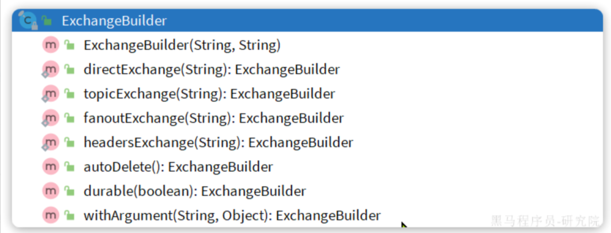
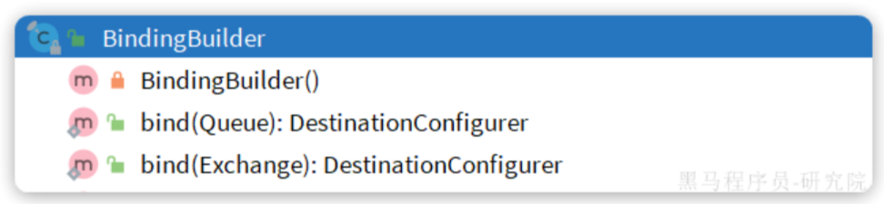

# RabbitMQ

微服务的同步RPC调用，会阻塞调用线程等待调用结果，RPC调用出现异常时如果配置了全局事务也会回滚整个事务

对于一个服务的API，并不是所有的调用都需要保持高度的实时性（同步）和一致性（事务），可以分成重要的调用和不重要的调用

比如对于订单支付的API，扣减用户余额是重要的调用，而更新订单状态，给用户发送支付消息，给用户增加支付积分等是相对不重要的调用

对于重要的调用，一般通过RPC同步调用进行，比如OpenFeign

对于不重要的调用，我们可以采用消息队列的异步形式，把调用的关系反转，原本是主服务调用其它服务，现在是主服务发送消息到消息队列，其它服务监听消息队列。这样需要添加其它的服务时就不用修改主服务的代码进行新的调用，只需要让其它服务监听这个消息队列

RabbitMQ是常见的MQ实现之一，在消息可靠性，消息延迟上表现非常好，在吞吐量方面逊于Kafka

## 部署

使用Docker部署RabbitMQ

    docker run \
    -e RABBITMQ_DEFAULT_USER=mallmq \
    -e RABBITMQ_DEFAULT_PASS=123 \
    -v mq-plugins:/plugins \
    --name mq \
    --hostname mq \
    -p 15672:15672 \
    -p 5672:5672 \
    --network mallnet\
    -d \
    rabbitmq:3.8-management

默认占用的两个端口

- 15672：RabbitMQ提供的管理控制台的端口
- 5672：RabbitMQ的消息发送处理接口

## 基础功能

RabbotMQ的架构包括

- publisher：生产者，也就是发送消息的一方
- consumer：消费者，也就是消费消息的一方
- queue：队列，存储消息。生产者投递的消息会暂存在消息队列中，等待消费者处理
- exchange：交换机，负责消息路由。生产者发送的消息由交换机决定投递到哪个队列。交换机没有存储消息的能力
- virtual host：虚拟主机，起到数据隔离的作用。每个虚拟主机相互独立，有各自的exchange、queue

消息从生产者到消费者的流程是

生产者发送消息到交换机，交换机吧消息路由到绑定的队列，队列存储消息，消费者从监听的队列读取消息

刚开始的时候没有任何队列，可以在管理页面新建队列，并在管理页面的交换机项把某个交换机绑定到某个队列

一台MQ集群可以提供给不同项目使用，显然不同项目的数据应该是不共享的。

可以利用virtual host的隔离特性，将不同项目隔离。一般会做两件事情：

- 给每个项目创建独立的运维账号，将管理权限分离。
- 给每个项目创建不同的virtual host，将每个项目的数据隔离。

## SpringAMQP:Spring项目连接RabbitMQ

RabbitMQ采用了AMQP协议，任何语言只要遵循AMQP协议收发消息，都可以与RabbitMQ交互

Spring提供了SpringAMQP用于于RabbitMQ通信<https://spring.io/projects/spring-amqp>，在SpringBoot实现了自动装配

    <!--AMQP依赖，包含RabbitMQ-->
    <dependency>
        <groupId>org.springframework.boot</groupId>
        <artifactId>spring-boot-starter-amqp</artifactId>
    </dependency>

主要有三个功能

- 自动声明队列、交换机及其绑定关系
- 基于注解的监听器模式，异步接收消息
- 封装了RabbitTemplate工具，用于发送消息

### 发送消息

第一步是配置RabbitMQ的连接信息

    spring:
      rabbitmq:
        host: 172.28.224.1 # 你的虚拟机IP
        port: 5672 # 端口
        virtual-host: /hmall # 虚拟主机
        username: hmall # 用户名
        password: 123 # 密码

引入依赖后RabbitTemplate被自动装配，用于操作RabbitMQ

    @Autowired
    private RabbitTemplate rabbitTemplate;

直接发送消息到队列，使用`convertAndSend()`方法（**实际应该发给交换机，不应该这样做**）

    // 队列名称
    String queueName = "simple.queue";
    // 消息
    String message = "hello, spring amqp!";
    // 发送消息
    rabbitTemplate.convertAndSend(queueName, message);

### 接收消息

注意接收消息是被动的行为，因此需要配置一个消息的监听器，用于监听到消息后执行指定操作

    @Component
    public class SpringRabbitListener {
        // 利用RabbitListener来声明要监听的队列信息
        // 将来一旦监听的队列中有了消息，就会推送给当前服务，调用当前方法，处理消息。
        // 可以看到方法体中接收的就是消息体的内容
        @RabbitListener(queues = "simple.queue")
        public void listenSimpleQueueMessage(String msg) throws InterruptedException {
            System.out.println("spring 消费者接收到消息：[" + msg + "]");
        }
    }

其中，以`@RabbitListener`注解的方法被视为一个消费者，可以有多个方法是消费者，他们可以消费同一个队列的消息，成为WorkQueue

默认的多消费者WorkQueue模式下，消息是平均划分发送给每个消费者的。如果需要效率高的消费者处理的消息多（能者多劳）可以配置prefetch项控制消费者预取的消息数目，只有消费完所有预取的消息才能继续读取消息

    spring:
      rabbitmq:
        listener:
          simple:
            prefetch: 1 # 每次只能获取一条消息，处理完成才能获取下一个消息

这里限制为1，就能实现能者多劳

## 交换机

交换机只负责根据路由规则转发消息，不具备存储消息的能力，有四种

- Fanout：广播，将消息交给所有绑定到交换机的队列。我们最早在控制台使用的正是Fanout交换机
- Direct：订阅，基于RoutingKey（路由key）发送给订阅了消息的队列
- Topic：通配符订阅，与Direct类似，只不过RoutingKey可以使用通配符
- Headers：头匹配，基于MQ的消息头匹配，用的较少

### Fanout

Fanout，扇出，其实就是广播，会发送给所有绑定的队列，其的特性是

- 可以有多个队列
- 每个队列都要绑定到Exchange（交换机）
- 生产者发送的消息，只能发送到交换机
- 交换机把消息发送给绑定过的所有队列
- 订阅队列的消费者都能拿到消息

创建队列，创建交换机，绑定队列到交换机可以在控制台页面完成

发送消息到交换机，同样使用使用`convertAndSend()`方法，只需要把第一个参数从队列名称改成交换机名称，第二个参数是RoutingKey，在Direct模式使用，我们这里没有所以是空字符串

    // 交换机名称
    String exchangeName = "hmall.fanout";
    // 消息
    String message = "hello, everyone!";
    rabbitTemplate.convertAndSend(exchangeName, "", message);

消费者同样以`@RabbitListener`注解

### Direct

Direct，直接，消息不是被交换机发送到全部绑定的队列，而是队列在绑定时定一个RoutingKey（路由key），消息的发送方在 向 Exchange发送消息时，也必须指定消息的 RoutingKey。Exchange不再把消息交给每一个绑定的队列，而是根据消息的Routing Key进行判断，只有队列的Routingkey与消息的 Routing key完全一致，才会把消息发到指定队列

使用`convertAndSend()`方法发送消息时，第一个参数是交换机名称，第二个参数是routeKey，第三个是要发送的消息
  
    convertAndSend(String exchange, String routingKey, Object object);

### Topic

Topic和Direct类似，都根据RoutingKey转发消息，但RoutingKey可以使用通配符匹配多个key

通配符规则：

- #：匹配一个或多个词
- *：匹配不多不少恰好1个词

举例：

- item.#：能够匹配item.spu.insert 或者 item.spu
- item.*：只能匹配item.spu

其使用方法和Direct一致，只有转发规则的不同

## 用SpringAMQP创建管理交换机和队列

SpringAMQP提供Queue类用于创建队列，直接new出来作为Bean，构造函数的参数是队列名称

    @Bean
    public Queue fanoutQueue1(){
        return new Queue("fanout.queue");
    }

也提供Exchange接口（有多个实现类）表示不同类型交换机，SpringAMQP还提供了ExchangeBuilder工厂类用于创建交换机，也可以直接new，需要传入的参数都是交换机的名称

绑定队列和交换机时，则需要使用BindingBuilder来创建Binding对象

其中`bind()`方法用来指定什么队列要绑定，`to()`方法指定要绑定到哪个交换机，参数必须要和同一个配置类之前声明对应队列/交换机的Bean的方法名称一致（或者直接方法名+()），`with()`可以用来指定绑定的RoutingKey

还可以直接在消费者的`@RabbitListener`注解创建交换机/队列，需要用到注解的bindings属性，其值应该是一个`@QueueBinding`注解，这个注解需要配置三个属性，分别是

- value：队列，值是`@Queue(name = "xxx")`，name用于指定队列名称
- exchange：交换机`@Exchange(name = "xxx", type = ExchangeTypes.xxx)`，name指定交换机名称，types指定交换机类型，是一个ExchangeTypes类型的枚举
- key：routingKey，是一个字符串数组

此外，`durable = "true"`表示这个队列/交换机会被持久化到硬盘，MQ重启也不会丢失

示例

    @RabbitListener(bindings = @QueueBinding(
        value = @Queue(name = "direct.queue1", durable = "true"),
        exchange = @Exchange(name = "hmall.direct", type = ExchangeTypes.DIRECT, durable = "true"),
        key = {"red", "blue"}
    ))
    public void listenDirectQueue1(String msg){
        System.out.println("消费者接收到direct.queue的消息：[" + msg + "]");
    }

## JSON消息转换器

发送消息时的消息参数是一个Object，默认Spring采用的序列化方式是JDK序列化，可读性比较差

可以自己配置消息转换器，采用JSON序列化

引入JSON序列化器的依赖Fast JSON

    <dependency>
        <groupId>com.fasterxml.jackson.dataformat</groupId>
        <artifactId>jackson-dataformat-xml</artifactId>
        <version>2.9.10</version>
    </dependency>

然后配置消息转换器的Bean

    @Bean
    public MessageConverter messageConverter(){
        // 1.定义消息转换器
        Jackson2JsonMessageConverter jackson2JsonMessageConverter = new Jackson2JsonMessageConverter();
        // 2.配置自动创建消息id，用于识别不同消息，也可以在业务中基于ID判断是否是重复消息
        jackson2JsonMessageConverter.setCreateMessageIds(true);
        return jackson2JsonMessageConverter;
    }

注意，生产者用什么形式发送消息被序列化，反序列化后消费者也要用相同的类获取消息，比如Map

也就是双方必须使用相同的序列化器，否则解析就会出错

## 添加消息的拦截器

通过MQ来进行业务的传递时，有的业务需要用到当前用户ID

在使用OpenFeign时，使用RequestInterceptor在请求头添加userId，使用HandlerInterceptor从请求头解析ID并放入ThreadLocal

在AMPQ中，也可以添加对应的拦截器，发送消息的拦截器利用`RabbitTemplate.setBeforePublishPostProcessors()`方法，监听消息的拦截器用`MethodInterceptor`定义，并通过`SimpleRabbitListenerContainerFactory.setAdviceChain()`方法注册

    @Slf4j
    @Configuration
    @ConditionalOnClass(RabbitTemplate.class)
    public class RabbitMQConfig {
        @Bean
        public MessageConverter messageConverter() {
            Jackson2JsonMessageConverter jsonMessageConverter = new Jackson2JsonMessageConverter();
            jsonMessageConverter.setCreateMessageIds(true);
            return jsonMessageConverter;
        }

        //发送消息时添加header
        @Bean
        public RabbitTemplate rabbitTemplate(ConnectionFactory connectionFactory, MessageConverter messageConverter) {
            RabbitTemplate rabbitTemplate = new RabbitTemplate(connectionFactory);
            rabbitTemplate.setMessageConverter(messageConverter);
            rabbitTemplate.setBeforePublishPostProcessors(message -> {
                Long userId = UserContext.getUser();
                if (userId != null) {
                    message.getMessageProperties().setHeader("user-info", userId);
                    log.info("消息设置header: user-info={}", userId);
                }
                return message;
            });
            return rabbitTemplate;
        }

        //接收消息时解析header
        @Bean
        public MethodInterceptor userIdInterceptor() {
            return invocation -> {
                Object[] args = invocation.getArguments();
                //遍历所有args，找到第一个是message的参数
                for (Object arg : args) {
                    if (arg instanceof Message) {
                        Message message = (Message) arg;
                        Long userId = message.getMessageProperties().getHeader("user-info");
                        if (userId != null) {
                            UserContext.setUser(userId);
                            log.info("从消息解析出header: user-info={}", userId);
                        }
                        break;
                    }
                }
                try {
                    return invocation.proceed();
                } finally {
                    log.info("监听器线程结束，移除userId={}", UserContext.getUser());
                    UserContext.removeUser();
                }
            };
        }

        //注册监听器拦截器
        @Bean
        public SimpleRabbitListenerContainerFactory rabbitListenerContainerFactory(
                ConnectionFactory connectionFactory,
                SimpleRabbitListenerContainerFactoryConfigurer configurer,
                @Qualifier("userIdInterceptor") MethodInterceptor interceptor) {
            SimpleRabbitListenerContainerFactory factory = new SimpleRabbitListenerContainerFactory();
            configurer.configure(factory, connectionFactory);
            //加入监听器拦截器
            factory.setAdviceChain(interceptor);
            return factory;
        }
    }
